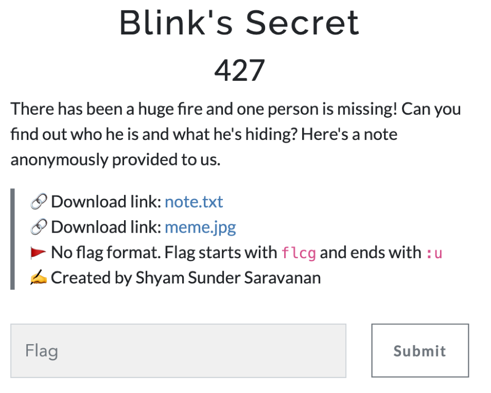
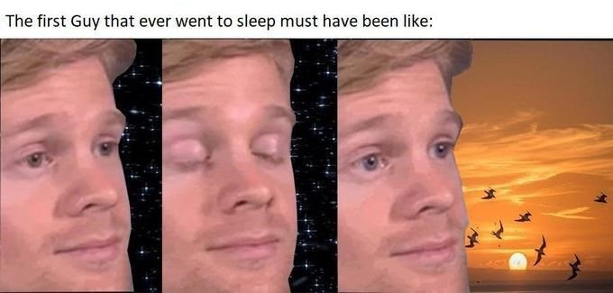
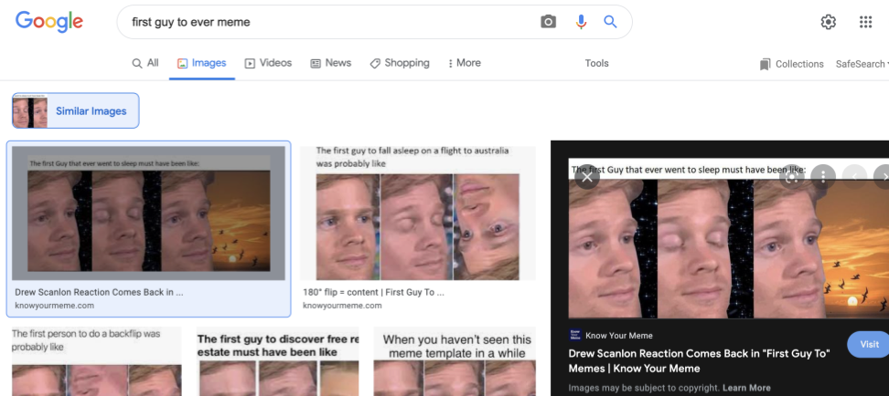
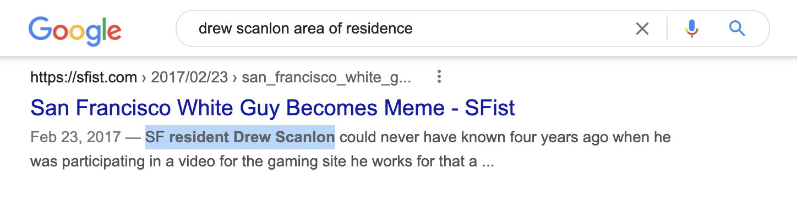
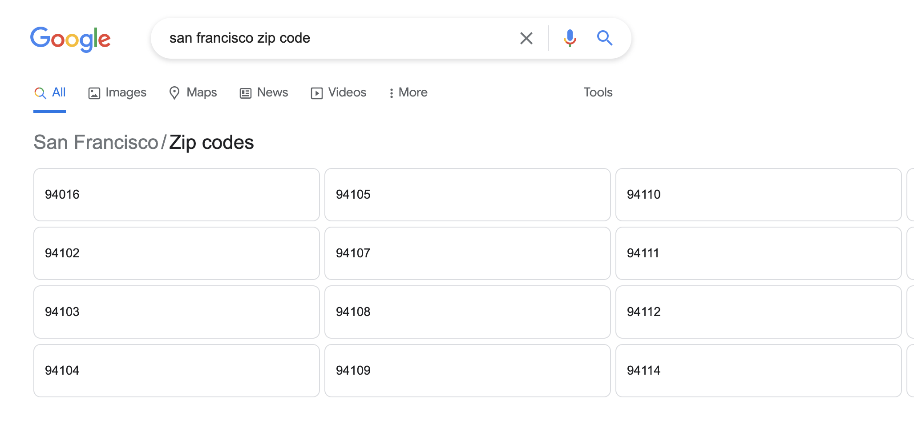
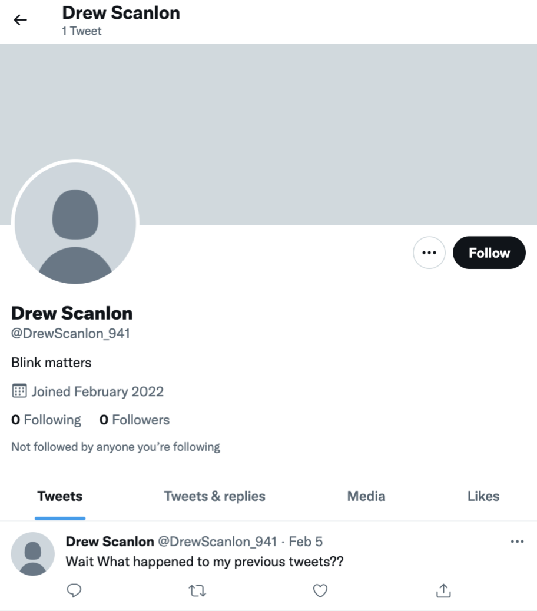
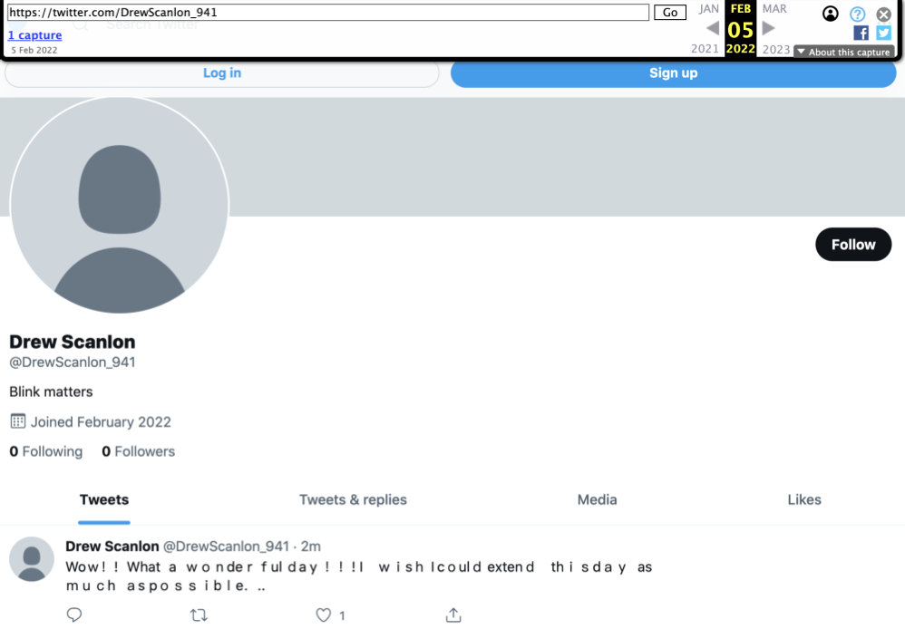
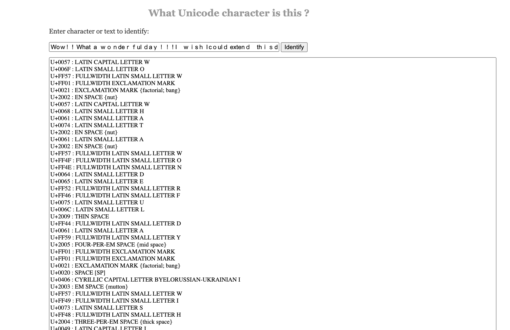
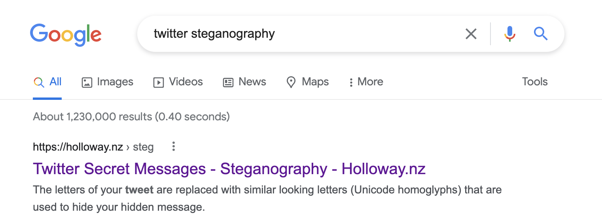
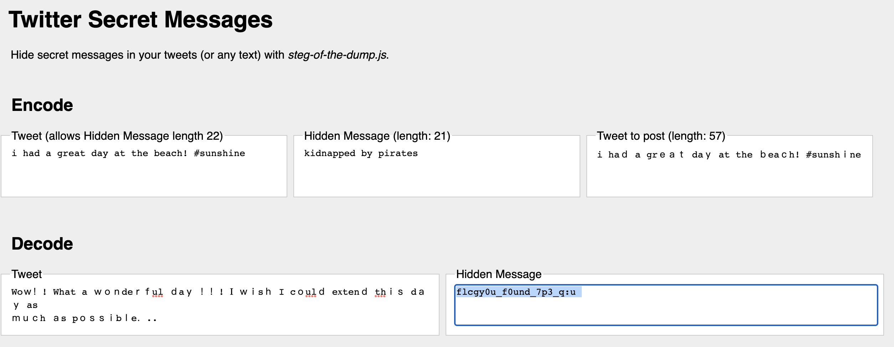

# 1337UP CTF 2022 Blink's Secret
The challenge is the following,
 

Two files are given in this challenge, which are [note.txt](./note.txt) and [meme.jpeg](./meme.jpeg).

[note.txt](./note.txt) shows the following text:

```
After
a big fire accident in mr.Blinking man’s house, we managed to collect a note with a meme with his own image on it. The note says as follows:

I
missed a secret which was posted on his social media. I want to find that secret but I don't know where it is. I have some hints regarding where the secret is..


The user name is 15 letters long

The
user name comprises of my name and zip code of my current residence

Format
Name_zipcode

If
the name is thomas mueller then write the name as ThomasMueller
```

And [meme.jpeg](./meme.jpeg) shows the following image:


 


From [note.txt](./note.txt), we can see that the man in [meme.jpeg](./meme.jpeg) is the missing person. 

By doing a Google Reverse Image search of [meme.jpeg](./meme.jpeg), the name of the meme comes up, which is `First Guy To meme". Results from [Know Your Meme](https://knowyourmeme.com/editorials/collections/drew-scanlon-reaction-comes-back-in-first-guy-to-memes) shows us the name of the man in the meme, which is Drew Scanlon. Therefore, the missing man's name is Drew Scanlon. 

 


Also from [note.txt](./note.txt), we know that the username is 15 letters long and has the form `Name_zipcode`, so we know the username would look something like  `DrewScanlon_XXX`.

We now have his name, so we can try to find his area of residence on Google. I searched up `drew scanlon area of residence` and [this website came up](https://sfist.com/2017/02/23/san_francisco_white_guy_becomes_mem/).

 

From this, we can see that Drew Scanlon lives in San Francisco. 

I wasn't too familiar with the zip code system in the US, and doing a quick Google search revealed that it had a 5-digit convention. However, the username can only be 15 letters long, and `DrewScanlon` already occupies 12 letters, so this meant that the zip code can only be 3 digits long. 

By looking up the zip code of San Francisco, we can see that they are all 5 digits long. 

 

However, all these zip codes had `941` in common, so I assumed this first 3 digits of the zip code will be used in the username. Therefore, I guessed the username would be `DrewScanlon_941`. Searching up this name on Twitter will reveal [this account](https://twitter.com/DrewScanlon_941),

 

Drew Scanlon has posted "Wait What happened to my previous tweets??", which hints to a deleted tweet. 

To see deleted tweets, [Internet Archive Wayback Machine](https://archive.org/web/) could be used. So I inputted [Drew Scanlon's twitter link on the Wayback Machine](http://web.archive.org/web/20220205061333/https://twitter.com/DrewScanlon_941), which revealed that there was a capture on Feburary 5, 2022 and showed the following tweet:

 

The deleted tweet was
```
Woｗ！! What a ｗｏｎdeｒｆul ｄaｙ ！！! І ｗｉsｈ I cｏulｄ eхtenｄ thｉｓ dａｙ as
ｍｕｃh ａs pｏｓｓｉbｌe．..
```
This mixture of full width and half width characters looked pretty suspicious and assumed this was some kind of steganography. However, I wasn't too sure what steganography it was using, so I decided to investigate the Unicode types first using [Babel Stone](https://www.babelstone.co.uk/Unicode/whatisit.html)

 


I tried looking up `half width and full width characters steganography` but nothing useful came up. So I searched `twitter steganography` and [this website](https://holloway.nz/steg/) came up.

 


I inputted the deleted tweet to the Twitter Secret Messages decoder, and got the flag, which was `flcgy0u_f0und_7p3_q:u`

