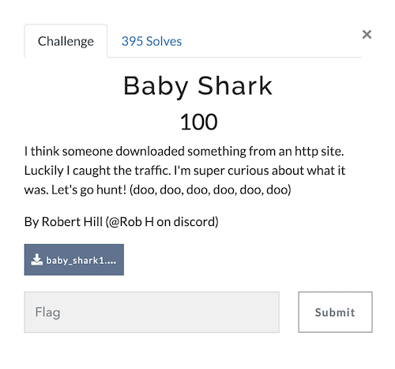
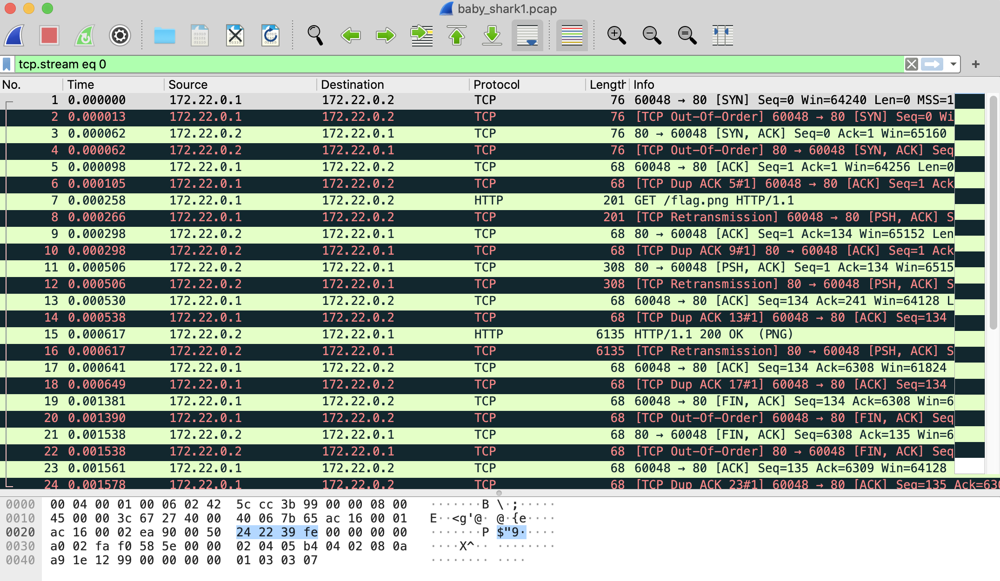
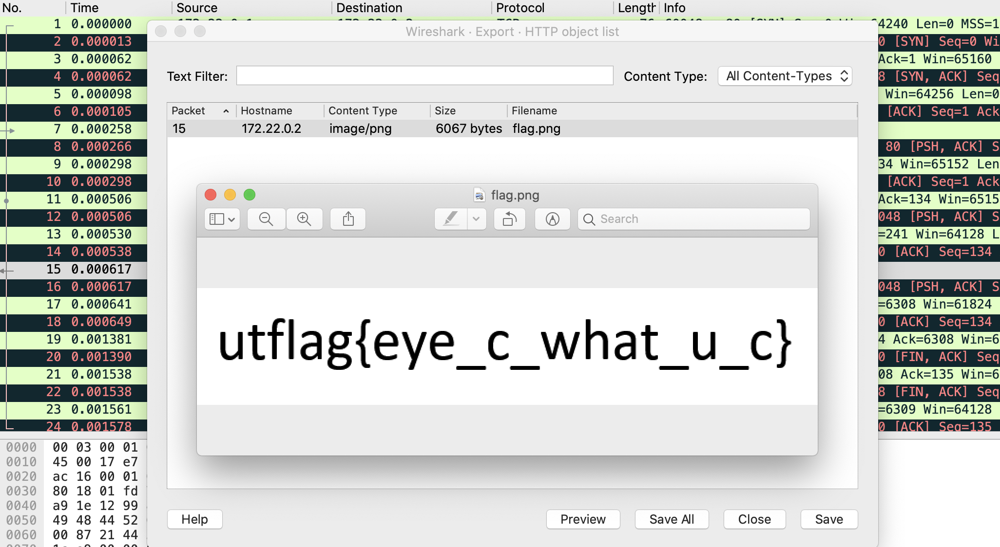

# UTCTF 2022 Baby Shark (Category: Beginner)
The challenge is the following,

 

Here, we are given the file [baby_shark1.pcap](./baby_shark1.pcap). 
The challenge description says `I think someone downloaded something from an http site.`, so we will look at the http traffic.

Opening this up on Wireshark shows the following,

 

If we go to `File > Export Objects > HTTP`, and click on `Preview` for packet 15, we can see the flag,

 

Therefore, the flag is,

`utflag{eye_c_what_u_c}`
