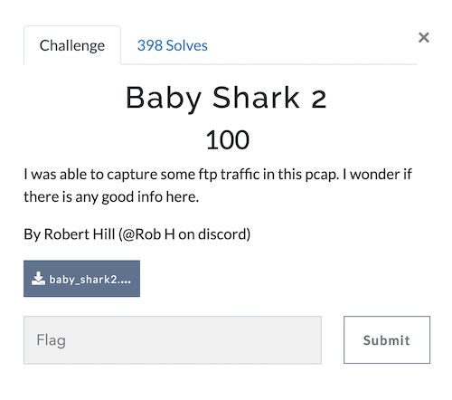
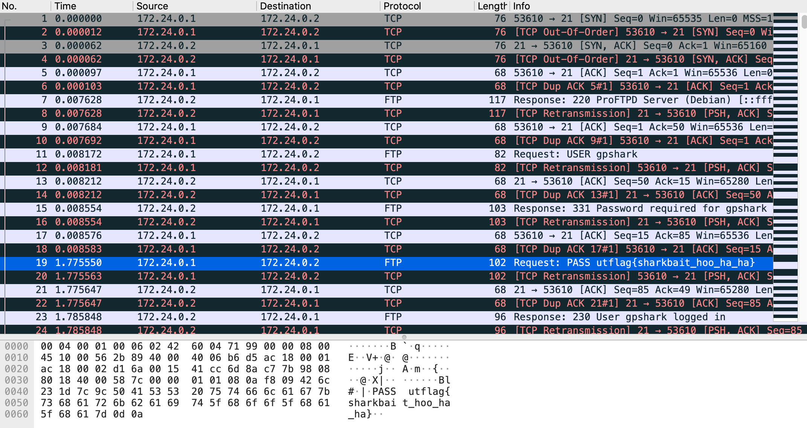

# UTCTF 2022 Baby Shark P2 (Category: Beginner)
The challenge is the following,

 

Here, we are given the file [baby_shark2.pcap](./baby_shark2.pcap). 
The challenge description says `I was able to capture some ftp traffic in this pcap. I wonder if there is any good info here.`, so we will look at the ftp traffic.

Opening this up on Wireshark shows the following,

 

FTP packet 19 shows,

`PASS utflag{sharkbait_hoo_ha_ha}`

Therefore, the flag is,

`utflag{sharkbait_hoo_ha_ha}`
