# UTCTF 2022 Scrambled (Category: Cryptography)
The challenge is the following,

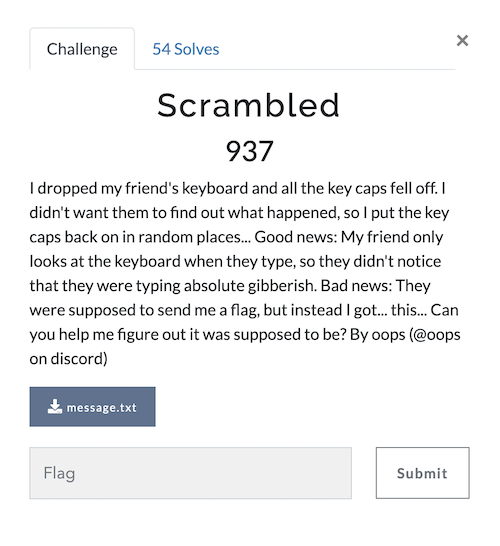 


A text file called [message.txt](./message.txt) is given, and contains the following,

```
a[qjj7ahga2gc2jjg=qf/g.7xgm[qgpjo,g2fgog=q87f/tga=7vqm[2f,gpxff.g[o11qfq/gm[7x,[ahga2g1286q/gx1gv.g6q.n7ou/bgnxmgm[qg6q.=gcquqg2fgcq2u/g1jo8q=t3a2g/7f4mg6f7cgc[omg[o11qfq/bgnxmg2m4=g76o.g=2f8qga2g=mouqgomgm[qg6q.n7ou/gof.co.=galay33aoj=7ga24-qg[o/gog8ux=[g7fg.7xgp7ug.qou=bg/7g.7xgcofmgm7g,7g7xmgc2m[gvqa0rrrrrrrrrrrrrrrrrrrrrrrrrrrrrrrrrrrrrrrrrrrrrrrrrrrrrrrrrrrrrrrrrrrrrr3aof.co.=bg[quqg2=gm[qgpjo,gai[71qpxjj.ayalgxmpjo,aza=xna=m2amxama27afa58a2a1[aqua5a2a5[aoua/aj.a56af7aca5[aqua]3
```

Based on the challenge description, it seems like this will be related to a substitution cipher, as it mentions how each key on the keyboard is replaced with a random key meaning that each character in the text file is replaced by another character. However, most automatic substitution deciphers available online only supported the alphabet and not numbers and symbols, so I guessed this would have to be deciphered manually. 

First of all, I wasn't too sure if spaces will be included because the space bar has a different shape from all the other keys, and one shouldn't be able to replace a key with a spacebar. 

However, I guessed the deciphering will be pretty hard without spaces so I assumed that the space character has also been replaced with another character.

Also, I looked at what the most commonly used words were in the English language by looking at [Wikipedia's Most common words in English
](https://en.wikipedia.org/wiki/Most_common_words_in_English).

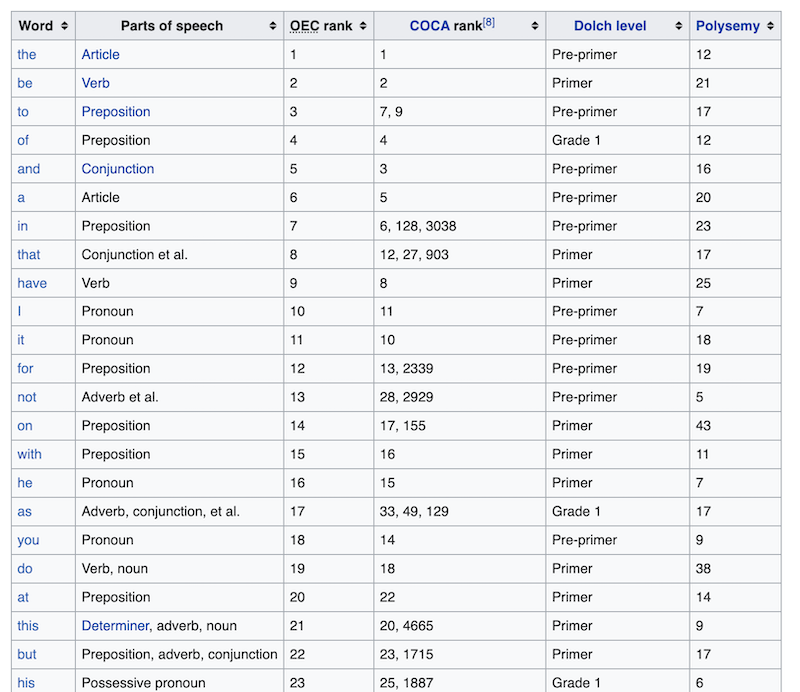 

These commonly used words are around 1-4 characters in length, so this could help us determine the location of spaces.


Thus, I made the following assumptions before starting to decipher.

1. Spaces should distributed uniformly among the text file
2. Spaces should be used to separate each word, thus should be used frequently in the message
3. There shouldn't be two or more consequtive spaces
4. The message is written in plaintext English
5. The words in the message shouldn't include typos, and should mostly be written in non-slang words
6. Most commonly used English words are 1-4 letters, and these should be used frequently
7. The flag should be of the format `utflag{xxx_xxx}`
8. It is a one-to-one substitution, meaning one character can only be replaced by exactly one character

The first step in deciphering would be to determine where the spaces would be, and assumption 1. would require me to find which character is distributed uniformly among the text file and assumption 2. would require me to find which characters were the most frequent. So I decided to do a frequency analysis first using [Dcode.fr](https://www.dcode.fr/frequency-analysis).


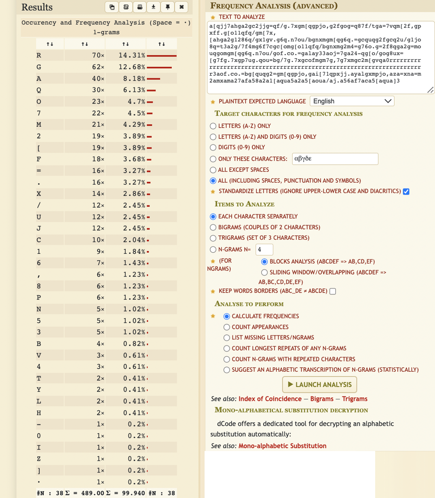 

From assumption 2, we can narrow down the possible character used for spaces, so I looked at the distribution of the top 8 frequent characters, 

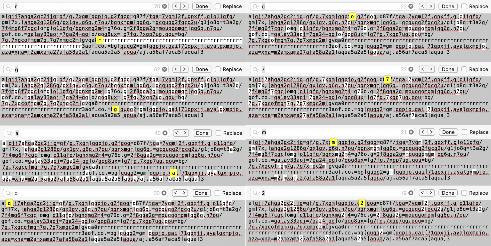 

Now I looked at which character had the most uniform distribution while being frequent. `r` is the most frequent, but all of them were grouped up together, thus ruling out the possibility that `r` is space. `g` is the second most frequent, and is distributed pretty uniformly in the first half of the text file, so this is a possible candidate for a space. `a` is the third most frequent, but the distribution is pretty concentrated towards the end of the text file. The other characters may have uniform distribution, but assumption 6 makes them an unlikely candiadate for a space because the most common words should be around 1-4 letters. 

Therefore, I assumed that `g` was the space. So I went ahead to [CyberChef](https://gchq.github.io/CyberChef/), and used the Substitute functionality and replaced:

- `g` with ` `

To make it easier to see which characters have been substituted, I used lowercase for the unsubstituted characters and uppercase for the substituted characters.

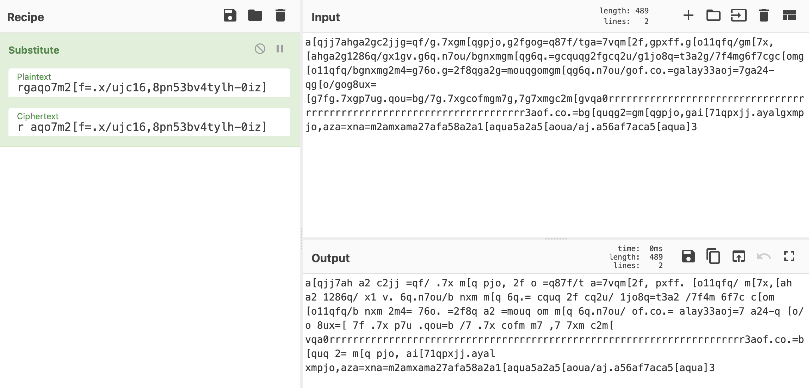 

So far, the plain text set is (most frequent to least frequent order):

`rgaqo7m2[f=.x/ujc16,8pn53bv4tylh-0iz]`

and the cipher text set is:

`r aqo7m2[f=.x/ujc16,8pn53bv4tylh-0iz]`


Now, we need to determine the words. [Crypto Corner](https://crypto.interactive-maths.com/frequency-analysis-breaking-the-code.html) shows us the frequency of each letter in the alphabet used in the English language.

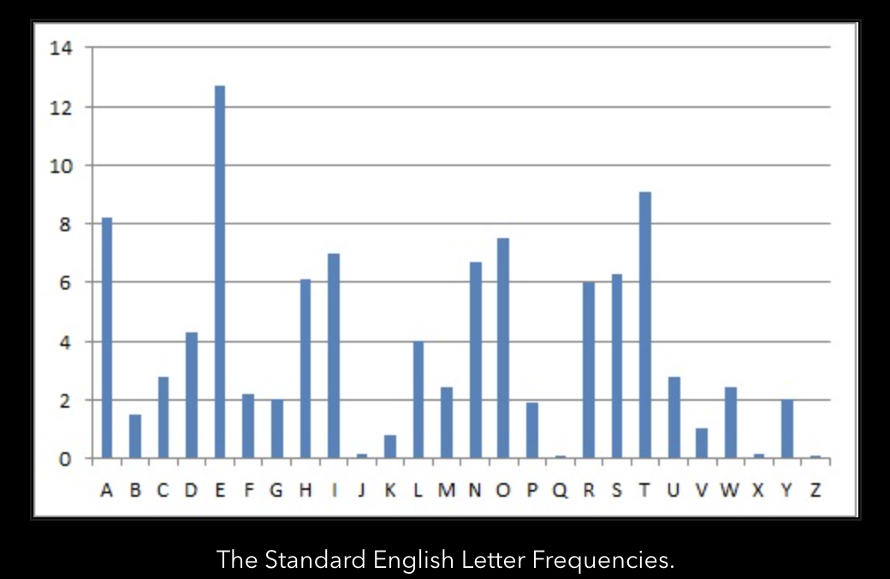 


As `E` is the most frequent letter used in the English Language, we will determine that first. From the previous analysis I did for determining whether the distributions were uniform or now, I can guess that `a` might not be `E` although it is the third most frequent, because it's concentrated towards the end. Here, `q` would be the most likely candidate for `e` because it is the fourth most frequent and has a more uniform distribution. So I went ahead and replaced:
- `q` with `E`

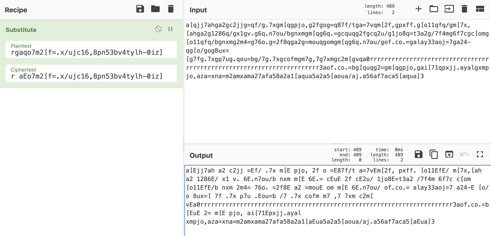 

So far, the plain text set is:

`rgaqo7m2[f=.x/ujc16,8pn53bv4tylh-0iz]`

and the cipher text set is:

`r aqo7m2[f=.x/ujc16,8pn53bv4tylh-0iz]`


After replacing, we can see multiple occurences of `m[E`.

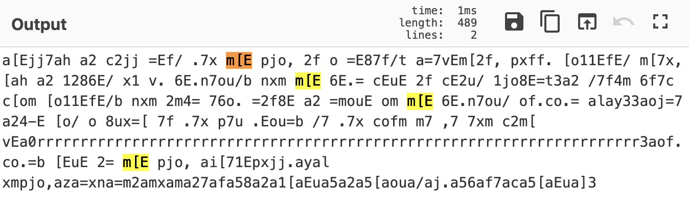 

I assumed this would correspond to `THE`, so I went ahead and replaced:
- `m` with `T`
- `[` with `H` 

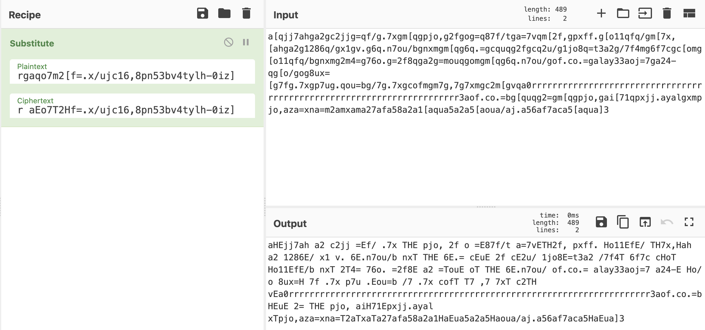 

So far, the plain text set is:

`rgaqo7m2[f=.x/ujc16,8pn53bv4tylh-0iz]`

and the cipher text set is:

`r aEo7T2Hf=.x/ujc16,8pn53bv4tylh-0iz]`


Now, we can see that `o` appears as its own word multiple times, 

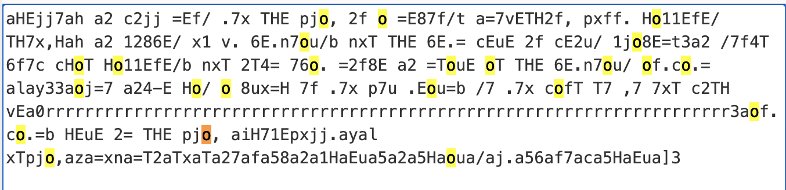 

Based on the frequently used English words and the frequency of the letters, we can assume that `o` is either `I` or `A`. By looking at the pattern `oT`, I assumed this would be `AT`, thus, `o` would be `A`.

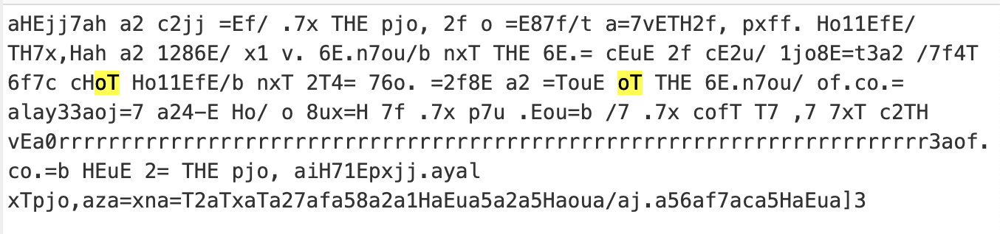 


So I repalced:

- `o` with `A`.

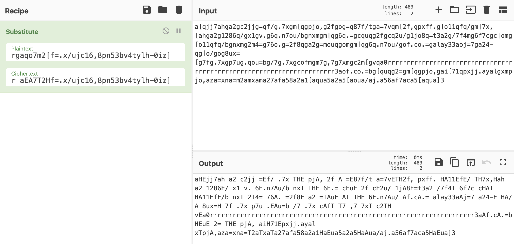 


So far, the plain text set is:

`rgaqo7m2[f=.x/ujc16,8pn53bv4tylh-0iz]`

and the cipher text set is:

`r aEA7T2Hf=.x/ujc16,8pn53bv4tylh-0iz]`


Now, we can see the string `HEuE`. I assumed that this would be `HERE`.
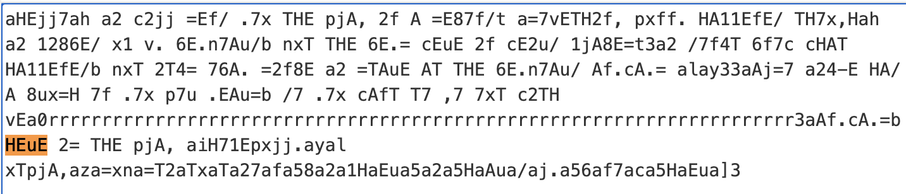 


Thus, I went ahead and replaced:
- `u` with `R`
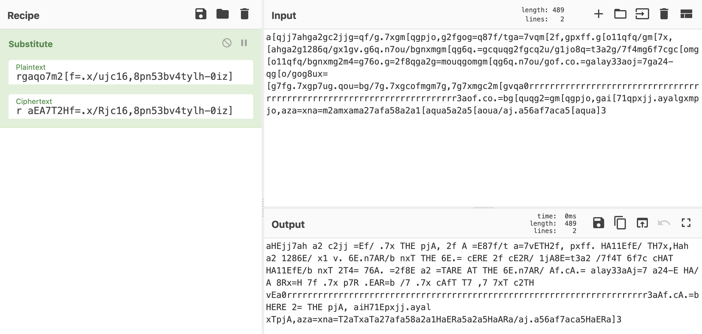 

So far, the plain text set is:

`rgaqo7m2[f=.x/ujc16,8pn53bv4tylh-0iz]`

and the cipher text set is:

`r aEA7T2Hf=.x/Rjc16,8pn53bv4tylh-0iz]`

Now, we can see strings like `cERE`, `cHAT`, and I assumed they are `WERE`, `WHAT` respectively, so I went ahead and replaced:
- `c` with `W`
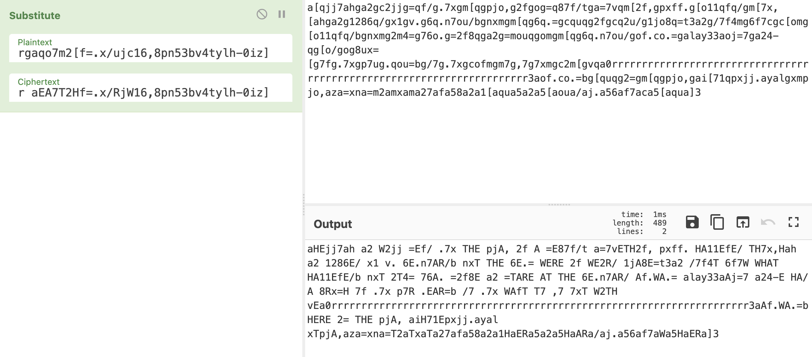 


So far, the plain text set is:

`rgaqo7m2[f=.x/ujc16,8pn53bv4tylh-0iz]`

and the cipher text set is:

`r aEA7T2Hf=.x/RjW16,8pn53bv4tylh-0iz]`

Now, we can see strings like `W2TH`, `=TARE`, and I assumed they were `WITH`, `STARE` respectively, so I went ahead and replaced:
- `2` with `I`
- `=` with `S`

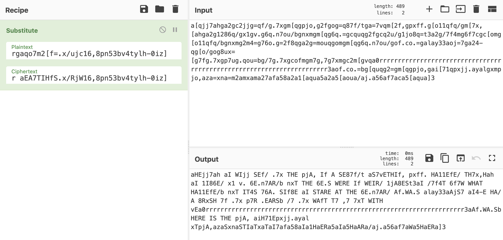 

Now, I decided to look at some patterns. I saw that `jj` appeared multiple times.

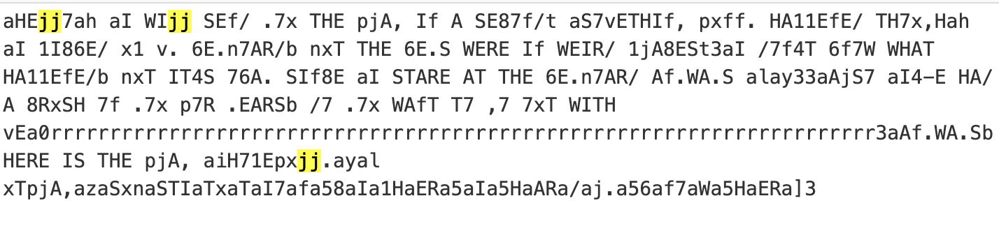 


Here, I assumed `WIjj` is `WILL`. So I went ahead and replaced:
- `j` with `L`

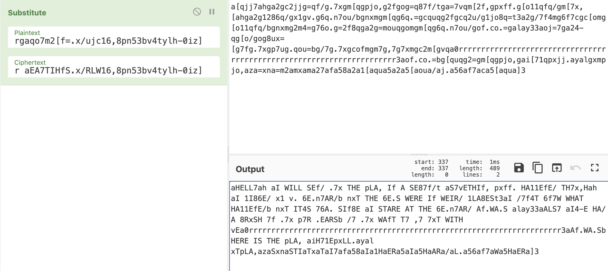 

So far, the plain text set is:

`rgaqo7m2[f=.x/ujc16,8pn53bv4tylh-0iz]`

and the cipher text set is:

`r aEA7TIHfS.x/RLW16,8pn53bv4tylh-0iz]`

Now, we can see strings like `WAfT`, `If`, and I assumed they were `WANT`, `IN`, so I went ahead and replaced:
- `f` with `N`

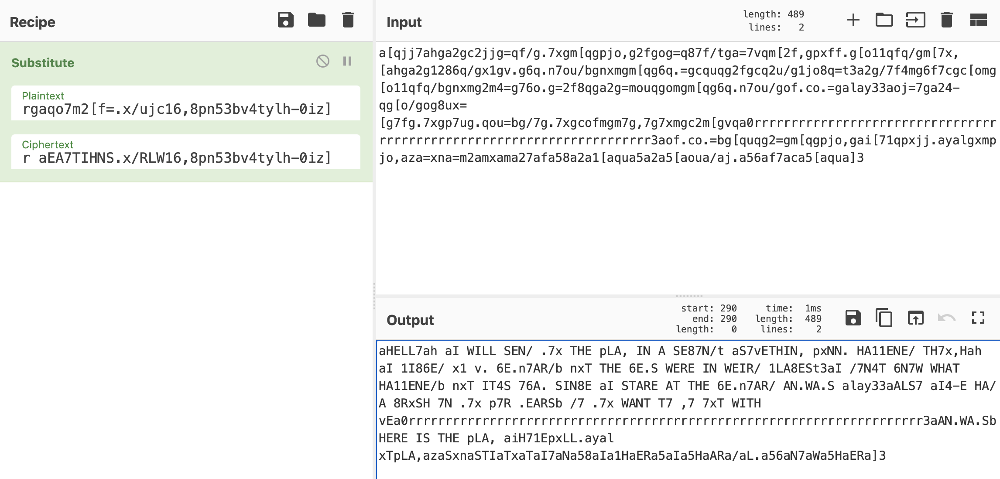 


So far, the plain text set is:

`rgaqo7m2[f=.x/ujc16,8pn53bv4tylh-0iz]`

and the cipher text set is:

`r aEA7TIHNS.x/RLW16,8pn53bv4tylh-0iz]`


Now, we can see strings like `SEN/`, `HA/`, `WEIR/`, `SIN8E`, `AN.WA.S`, `7N` so I assumed they were `SEND`, `HAD`, `WEIRD`, `SINCE`, `ANYWAYS`, `ON` respectively. 
So I went ahead and replaced:
-`/` with `D`
-`8` with `C`
-`.` with `Y`
-`7` with `O`


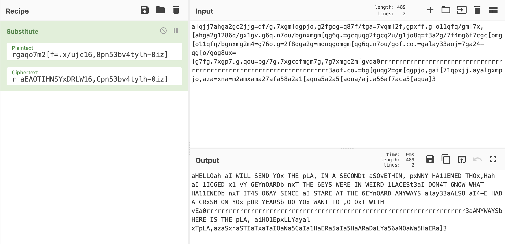 

So far, the plain text set is:

`rgaqo7m2[f=.x/ujc16,8pn53bv4tylh-0iz]`

and the cipher text set is:

`r aEAOTIHNSYxDRLW16,Cpn53bv4tylh-0iz]`


Now, we can see strings like `HA11ENED`, `6EYS`, `CRxSH`, `YOx`, `OxT`, `pOR`, `6NOW`, `O6AY`, `,O`, `vY` so I assumed they were
`HAPPENED`, `KEYS`, `CRUSH`, `YOU`, `OUT`, `FOR`, `KNOW`, `OKAY`, `GO`, `MY`.


So I went ahead and replaced:
-`1` with `P`
-`6` with `K`
-`x` with `U`
-`p` with `F`
-`6` with `K`
-`,` with `G`
-`v` with `M`


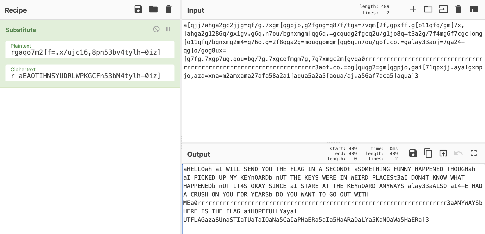 

So far, the plain text set is:

`rgaqo7m2[f=.x/ujc16,8pn53bv4tylh-0iz]`

and the cipher text set is:

`r aEAOTIHNSYUDRLWPKGCFn53bM4tylh-0iz]`

Now, we can see `UTFLAG`. 

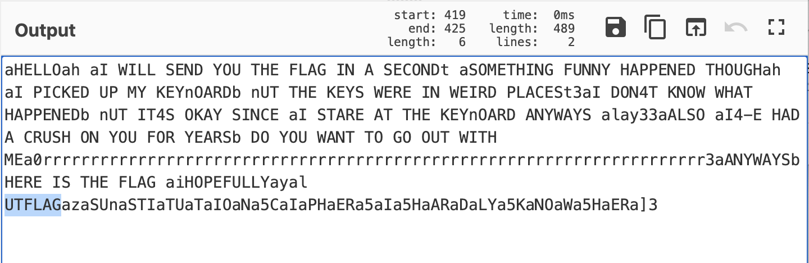 

I went ahead and replaced some punctuations and obvious words. For some characters, I just guessed because from assumption 8, it should be a one to one substitution. Here I replaced:

- `n` with `B`
- `4` with `'`
- `b` with `,`
- `t` with `;`
- `3` with `.`
- `h` with `!`
- `0` with `?`
- `i` with `:`
- `-` with `V`
- `r` with `-`
- `l` with `(`
- `y` with `)`


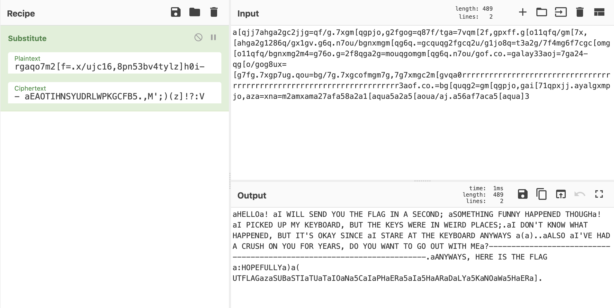 

So far, the plain text set is:

`rgaqo7m2[f=.x/ujc16,8pn53bv4tylz]h0i-`

and the cipher text set is:

`- aEAOTIHNSYUDRLWPKGCFB5.,M';)(z]!?:V`


Also, we know the flag format is `utflag{xxx_xxx}`, and I initially thought the character right after `UTFLAG` would be `{`. However, if I replace `a` with `{`, then the message looks pretty strange like this.

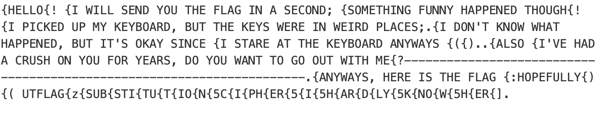 

So I thought that maybe `a` would be another space, which would violate assumption 8 since we already have `g` as the space. Therefore I replaced:
- `a` with ` `
- `z` with `{`
- `]` with `}`
- `5` with `_`


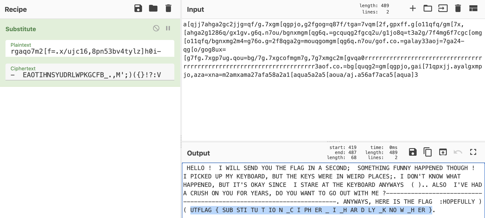 


At this point, `UTFLAG { SUB STI TU T IO N _C I PH ER _ I _H AR D LY _K NO W _H ER }` looks like the flag, but since `utflag` is in lowercase and the flag doesn't include spaces, I converted them to a more flag-like format:

`utflag{substitution_cipher_i_hardly_know_her}`.

I submitted this, but was incorrect. I learned that the flags are case-sensitive, so I decided to reinvestigate what `a` was supposed to be, as it was unlikely that will be a space as that violates assumption 8. 

Now that we've already replaced all the characters, we can reconvert them back to lower case. To make the `a` more visible, I replaced it with `+`.


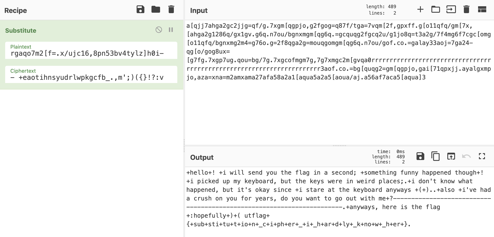 


I noticed that `+` was placed before letters that should be capitalized, such as after at the start of a sentance or `I`. Also, `+` was placed before all the symbols like `!`, `?`, `{` `}` and `_`. I realized that this `+` was supposed to be a Shift key, so every letter that follows `+` should be capitalized, and also because these symbols require the user to hold down the shift key.

Thus, replacing all the captialized letters gave me the following,


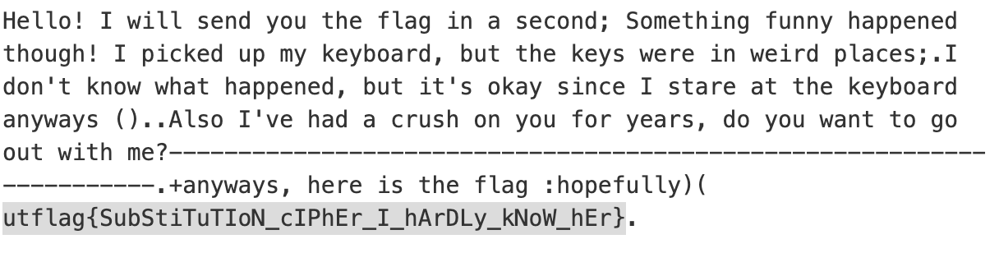 

The final plain text set is:

`rgaqo7m2[f=.x/ujc16,8pn53bv4tylz]h0i-`

and the cipher text set is:

`- +eaotihnsyudrlwpkgcfb_.,m';)({}!?:v`

Therefore, the flag is:

`utflag{SubStiTuTIoN_cIPhEr_I_hArDLy_kNoW_hEr}`

