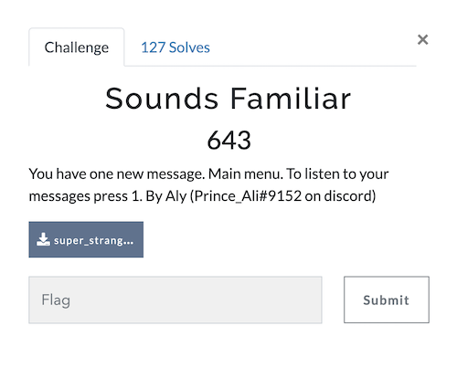
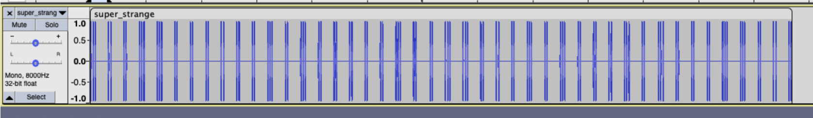
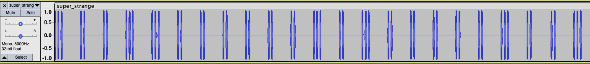
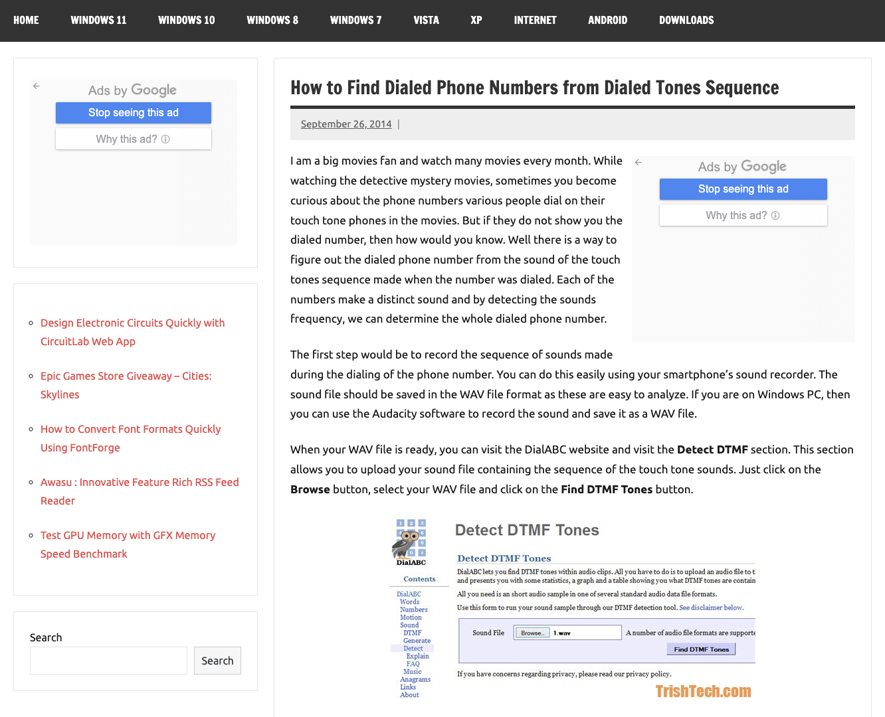
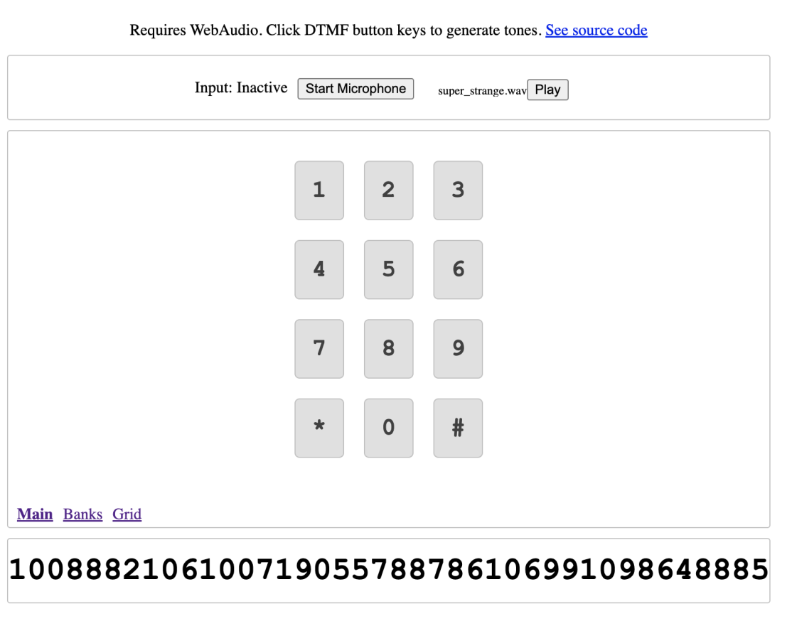
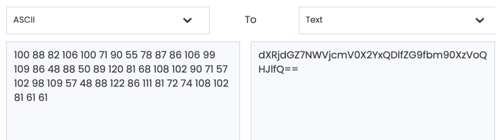
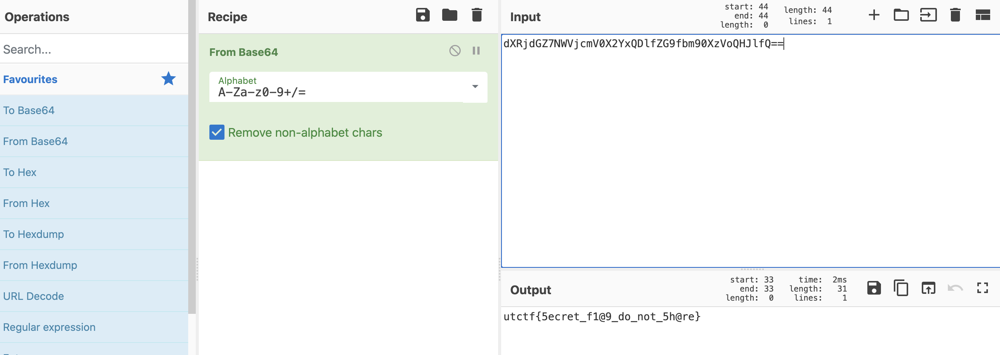

# UTCTF 2022 Sounds Familiar
The challenge is the following,

 

We are given a file called [super_strange.wav](./super_strange.wav), and the challenge says `You have one new message. Main menu. To listen to your messages press 1. ` which hints to this challenge being related to phones.

Like the challenge title, the audio does indeed sounds familiar, like the sound you hear when you dial a phone number using a dialpad.

Opening up [super_strange.wav](./super_strange.wav) on Audacity showed the following waveform,

 

Zooming in reveals that the beeps are seperated into groups of 2 or 3. 
 

Listening to the [super_strange.wav](./super_strange.wav) immediately reminded me of this [this video on Youtube](https://www.youtube.com/shorts/JKSEpJeDRBI) that plays the [Coffin Music](https://www.youtube.com/watch?v=j9V78UbdzWI) on the iPhone's dialpad which I saw long time ago. I assumed that the [super_strange.wav](./super_strange.wav) uses the tones to hide the number information as each tone has a unique number associated with it. 

However, I wasn't exactly sure how to translate the dial tones to numbers, so I looked up `how to tell number from dial tone`, and [this website](https://www.trishtech.com/2014/09/find-dialed-numbers-from-dialed-tones-sequence/) came up.

 

From this, I found out the tools used to translate dial tones to numbers can be found by searching  `Detect DTMF Tones`.

[DialABC's Detect DTMF Tones](http://www.dialabc.com/sound/detect/index.html) and [Uframework's DTMF detector](https://unframework.github.io/dtmf-detect/).

I used [Uframework's DTMF detector](https://unframework.github.io/dtmf-detect/), and noted down all the numbers by hand.

 

The numbers I obtained were,
`100 88 82 106 100 71 90 55 78 87 86 106 99 109 86 48 88 50 89 120 81 68 108 102 90 71 57 102 98 109 57 48 88 122 86 111 81 72 74 108 102 81 61 61`

I assumed that these numbers were ASCII numbers as they were all in the alpha-numeric-symbol range, so I inputted these numbers to an [ASCII convertor](https://www.duplichecker.com/ascii-to-text.php).

 

The obtained ASCII message had `=` at the end, so I immediately knew this requires Base64 conversion. So I went ahead to [Cyberchef](https://gchq.github.io/CyberChef/) and did Base64 conversion.

 

Therefore, the flag is `utctf{5ecret_f1@9_do_not_5h@re}`.
