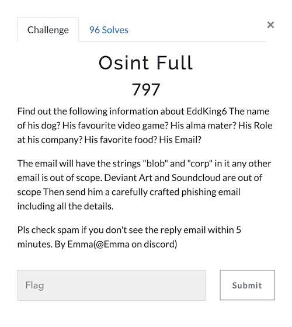
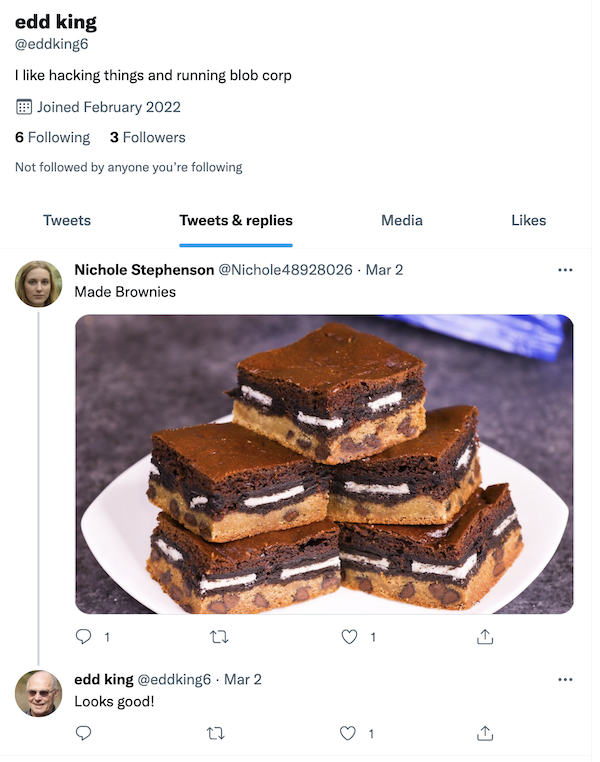

# UTCTF 2022 Osint Full
The challenge is the following,

 

We are given the username of the person we are targeting, which is `EddKing6`. It also mentions that the email should contain the strings `blob` and `corp`, so this is something we should be looking for when searching Ed King. Also, we will need to look for the following info:

- Name of his dog
- His favorite video game
- His alma master
- His role at his company
- Favorite food
- His email

It doesn't explicitly state which social media websites we are supposed to search except for DeviantArt and Soundcloud, so I started off with Twitter to get more clues about this person.

In fact, searching `EddKing6` on Twitter returned [this account](https://twitter.com/eddking6).

We can see that the account was created on `February 2022` and that he runs `blob corp`, so we can be certain that this is the Edd King we are looking for. 

 

We can see that Edd King has posted the following tweets. 
 

From the tweet `I like to play FactorIO when I'm not busy being a #CISO`, we can see that he is a `CISO` and he plays `FactorIO`. However, I wasn't too sure what `FactorIO` was, so I did a Google Search and revealed that it was in fact a video game. 

 

From the tweets alone, we have found the following so far:
- Name of his dog: ?
- His favorite video game: `FactorIO`
- His alma master: ?
- His role at his company: `CISO`
- Favorite food: ?
- His email: ?

One of his tweets includes a link to [his Github's vulnerable web app respository](https://github.com/eddking6/vulnerable-web-app).
 

 

I did some searching on this repository, but couldn't find what I was looking for, so instead, I went to [his Github profile](https://github.com/eddking6) from this vulnerable web app repository.

 

His profile bio says `I love walking my dog and eating Cacio e Pepe`. I wasn't too sure what `Cacio a Pepe` was, so I did a Google Search and revealed that it was a type of pasta. 

 

Now we have found out that `Cacio e Pepe` is his favorite food. Now on his Github, he has another repository called [DogFeedScheduler](https://github.com/eddking6/DogFeedScheduler) written in Go.

 

Digging through the files, I found the following in [quickstart.go](https://github.com/eddking6/DogFeedScheduler/blob/main/quickstart.go).

 

This shows us his email, which is `blobcorpciso@gmail.com` and his dog's name which is `Spot`. 

From the tweets and Github, we have found the following so far:
- Name of his dog: `Spot`
- His favorite video game: `FactorIO`
- His alma master: ?
- His role at his company: `CISO`
- Favorite food: `Cacio a Pepe`
- His email: `blobcorpciso@gmail.com`

Now we just need his alma master. I assumed that the most likely place someone would list their alma master would be Linkedin, so I went ahead and tried inputting his username `EddKing6` into the Linkedin link like `https://www.linkedin.com/in/eddking6/`.

This brought us to [Edd King's LinkedIn](https://www.linkedin.com/in/eddking6/). Here, we can see that his alma master is at `Texas A&M University`, and also confirms that his role at his company Blob Corp is `CISO`. 

 

From the tweets, Github and Linkedin, we have found the following:
- Name of his dog: `Spot`
- His favorite video game: `FactorIO`
- His alma master: `Texas A&M University`
- His role at his company: `CISO`
- Favorite food: `Cacio a Pepe`
- His email: `blobcorpciso@gmail.com`

Now, the challenge says we need to `send him a carefully crafted phishing email including all the details.`. I felt that just sending the information we found would be enough to get me the flag, but I decided to make it more believable by impersonating someone he might know. 

Based on his Twitter, it seemed that he was pretty close to [Nichole Stephenson](https://twitter.com/Nichole48928026). 

 

So I decided to make a Gmail account that impersonates Nichole Stephenson. 

 

I wanted to make the phishing mail as believable as possible, so I wrote an email to `blobcorpciso@gmail.com` saying that there is a company party that celebrates his achievements as a CISO, and embedded all the required information while trying to sound natural and believable. 

 

Then I received the flag after a few minutes of sending the email.

 

Here's another variation of the email I made, where Nichole requests admin access to fix up the company's password reset system. 

 
