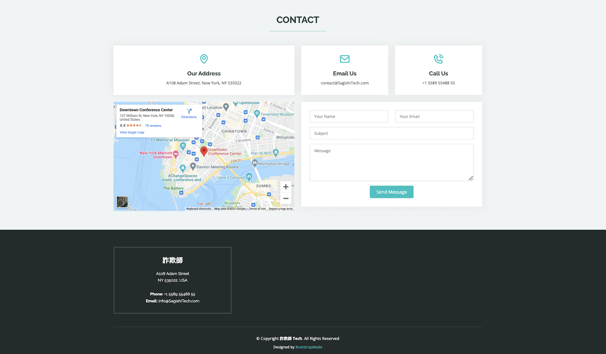
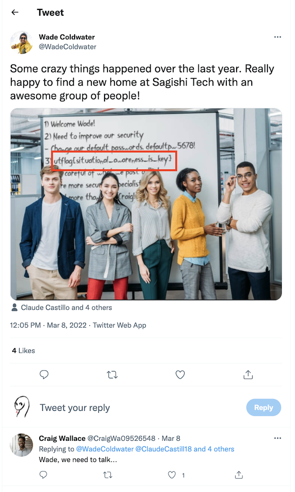

# UTCTF 2022 Public Panic (Category: Misc)
The challenge is the following,

 

Accessing `misc2.utctf.live:8756` showed us the website for `Sagishi Tech`.

 

 

 

 

This challenge tells us to use open source intelligence, and the team section of the website caught my eye, as each team member's images contained the links to their Twitter accounts.

 

Sagishi Tech team members listed on their website:

- Sherman Kern (CEO): https://twitter.com/kern_sherman
- Neil Cline (Product Manager): https://twitter.com/NeilCline9
- Britt Bryant (CTO): https://twitter.com/BrittBryant18
- Robyn Swanson (Accountant): https://twitter.com/RobynSwanson96

Their Twitter account looks like the following,

 

I've scrolled through their Tweets, but couldn't find anything interesting. So I decided to look at who they are following,  (I ignored their followers as anyone on Twitter can follow them)

 

From here, we can see that there are some members of Sagishi Tech that weren't listed on their website. 
These new employees I found from the original team member's followings list are:

- Craig Wallace (Chief Information Security Officer): https://twitter.com/CraigWa09526548
- Cliff Shackleford (Marketing): https://twitter.com/CliffShacklefo1
- Debby Uselton (Marketing): https://twitter.com/DebbyUselton

Their Twitter accounts look like the following,

 

And their following list looks like the following,

 

From here, I found more members of Sagishi Tech, who are:

- Wade Coldwater (Marketing): https://twitter.com/WadeColdwater
- Claude Castillo (Marketing): https://twitter.com/ClaudeCastill18
- Sidney Jaggers (Marketing): https://twitter.com/JaggersSidney
- Misty Booker (Marketing): https://twitter.com/MistyBooker99

And their Twitter accounts look like the following,

 

Their following list doesn't contain any new members of Sagishi Tech, so the full list of Sagishi Tech members are:
- Sherman Kern (CEO): https://twitter.com/kern_sherman
- Neil Cline (Product Manager): https://twitter.com/NeilCline9
- Britt Bryant (CTO): https://twitter.com/BrittBryant18
- Robyn Swanson (Accountant): https://twitter.com/RobynSwanson96
- Craig Wallace (Chief Information Security Officer): https://twitter.com/CraigWa09526548
- Cliff Shackleford (Marketing): https://twitter.com/CliffShacklefo1
- Debby Uselton (Marketing): https://twitter.com/DebbyUselton
- Wade Coldwater (Marketing): https://twitter.com/WadeColdwater
- Claude Castillo (Marketing): https://twitter.com/ClaudeCastill18
- Sidney Jaggers (Marketing): https://twitter.com/JaggersSidney
- Misty Booker (Marketing): https://twitter.com/MistyBooker99

In [Wade Coldwater's Twitter](https://twitter.com/WadeColdwater), there is [one interesting Tweet](https://twitter.com/WadeColdwater/status/1501031410244669446), which is 

 

We can see that  the flag is written on the whiteboard. Therefore the flag is,
`utflag{situational_awareness_is_key}`
