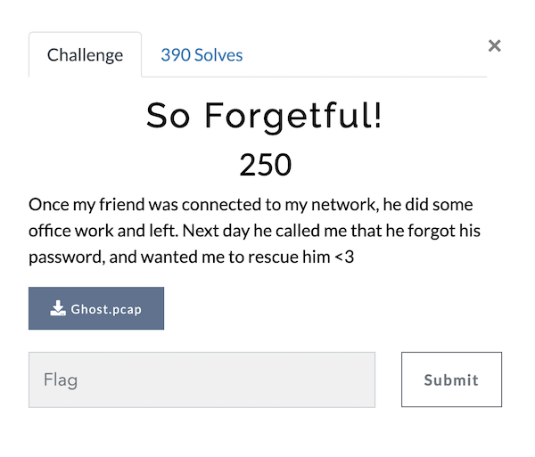
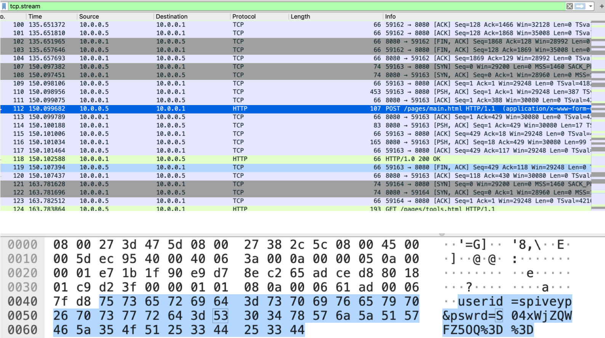
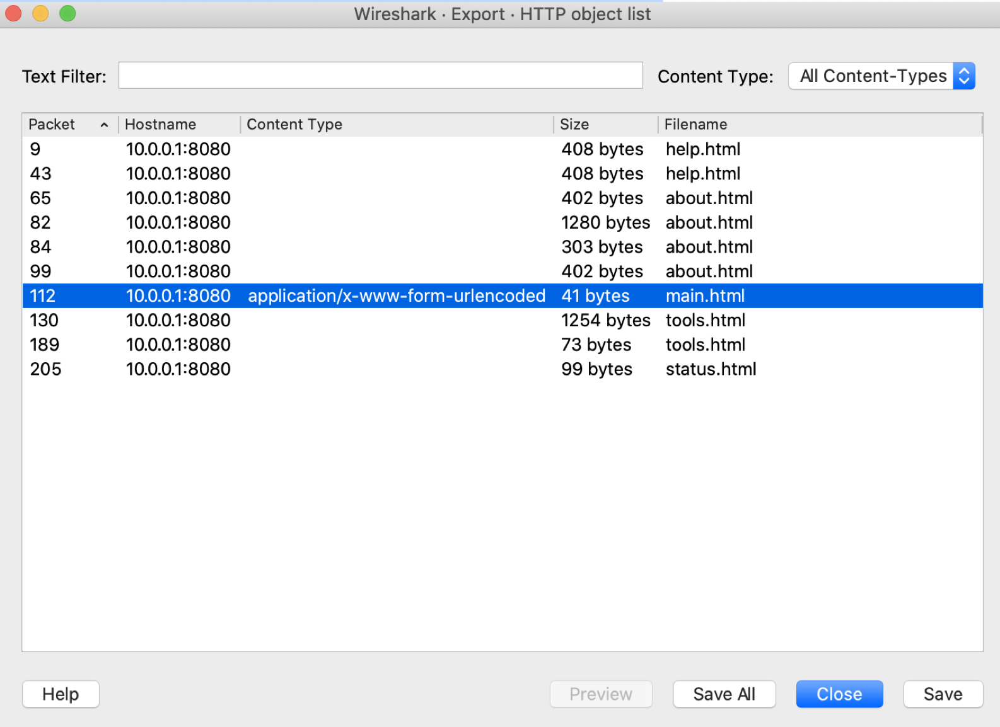
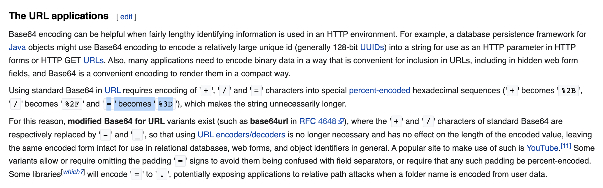

# So Forgetful! (Category: Forensic)
The challenge is the following,

 

And we are given the file [Ghost.pcap](./files/Ghost.pcap). I used `tcp.stream` in the filters, and looked at the packets. Packet 112, which uses `HTTP` caught my attention because it uses `POST`. I looked into that packet and saw the following,

 

I went to `Export Objects > HTTP` and selected packet 112, 

 

And I saved it as a .txt text file, which contained,

`userid=spiveyp&pswrd=S04xWjZQWFZ5OQ%3D%3D`

I couldn't find anything information related to the website where these credentials were used, and the challenge didn't specify any server to log in to. Therefore, I assumed that the password `S04xWjZQWFZ5OQ%3D%3D` itself would be the flag (after processing it more). The `%3D%3D` at the end of the flag looked like [Base64 in URL](https://en.wikipedia.org/wiki/Base64),

 

So I converted it to the standard Base64 format by replacing `%3d` with `=`, to give,

`S04xWjZQWFZ5OQ==`

Finally, I went to [CyberChef](https://gchq.github.io/CyberChef/#recipe=From_Base64('A-Za-z0-9%2B/%3D',true)&input=UzA0eFdqWlFXRlo1T1E9PQ) to convert it from Base64, which gave,

`KN1Z6PXVy9`

Therefore, I assumed that this would be the flag,

`vishaCTF{KN1Z6PXVy9}`

And submitting it confirmed that this was the flag.
