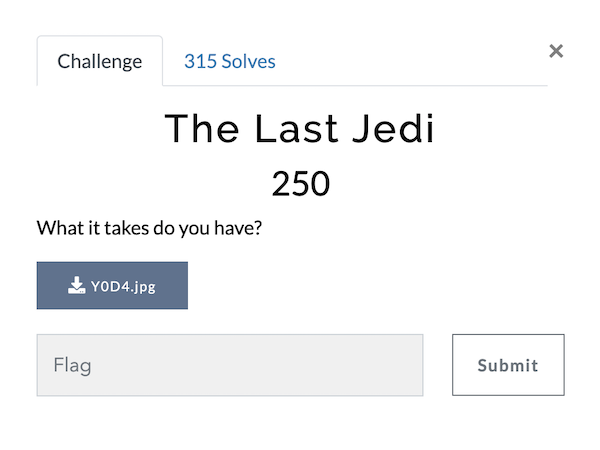

# The Last Jedi (Category: Forensic)
The challenge is the following,

 

And we are given [Y0D4.jpg](./files/Y0D4.jpg),

 

First of all, I decided to check the contents of this file by using,

`$ cat Y0D4.jpg`

 

The last section showed `Sacred archives/Dont open/Is_This_Really_It.jpg`, so I knew there was a file hidden inside [Y0D4.jpg](./files/Y0D4.jpg).

So I used [Stegextract](https://github.com/evyatarmeged/stegextract) on [Y0D4.jpg](./files/Y0D4.jpg), and it extracted a [Y0D4.rar](./files/Y0D4.rar) file.

 

[Y0D4.rar](./files/Y0D4.rar) was not password protected, and showed the following folders and files,

 

[Is_This_Really_It.jpg](./files/Is_This_Really_It.jpg) was a contained in [Y0D4.rar](./files/Y0D4.rar),

 

So I ran [Stegextract](https://github.com/evyatarmeged/stegextract) on [Is_This_Really_It.jpg](./files/Is_This_Really_It.jpg), and it extracted a ASCII text file that contained the string `flag:{H1DD3N_M34N1NG}`.

 

Therefore, the flag is

`vishwaCTF{H1DD3N_M34N1NG}`
