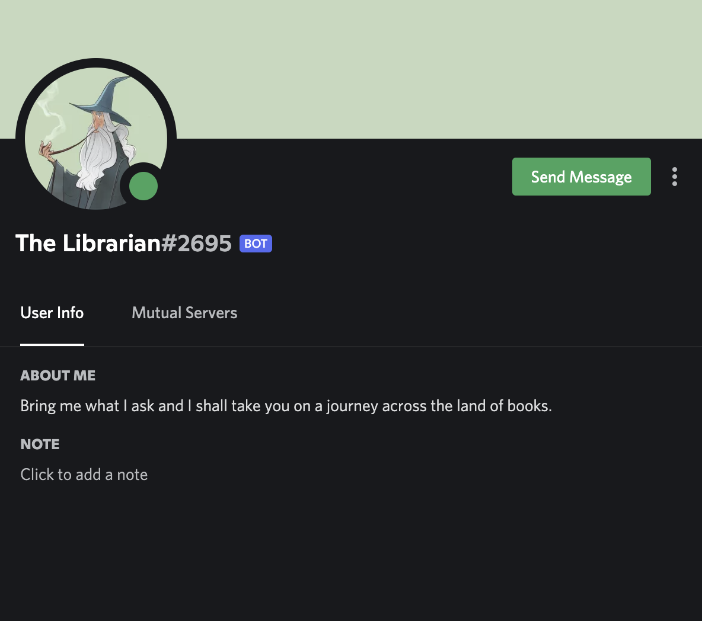

# I don't need sleep, I need answers (Category: Misc)
The challenge is the following,

 

The challenge asks `Discord profile pictures are circular. But are they?`, so I assumed that we are supposed to investigate the The Librarian's Discord profile picture. Also, it tells us to refer to [The Library challenge, which the write-up be found here. ](https://github.com/LambdaMamba/CTFwriteups/tree/main/VishwaCTF_2022/OSINT/The_Library). So I opened up Discord on Chrome, because I assumed this challenge will require us to use `Inspect element`. I right-clicked on The Librarian's profile icon to select `Profile`.

 

Clicking `Profile` showed the following, 

 

I then went to `Inspect elements`, and found the source of the profile picture which was,

`https://cdn.discordapp.com/avatars/953173381962948618/1b83941f7abbdfa15344f485e0c39677.webp?size=240`

Opening this up showed the following,

 

I saw that the flag was in the corners of the profile picture, but couldn't make out the words due to its low resolution. So, I changed `size=240` to `size=480` which revealed the flag,

 

Therefore, the flag is,

`vishwaCTF{h3h3_sn3akyy}`
