# Platypus Perry (Category: OSINT)
The challenge is the following,

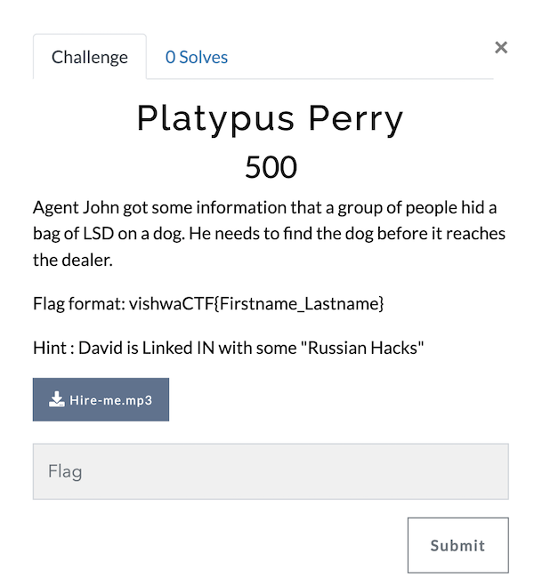 


Here, we are given the file [Hire-me.mp3](./files/Hire-me.mp3). 
The challenge description says `Agent John got some information that a group of people hid a bag of LSD on a dog. He needs to find the dog before it reaches the dealer.`, which is a pretty ambiguous challenge description but tells us that we should be looking for a `dog`.


When I listened to [Hire-me.mp3](./files/Hire-me.mp3), I couldn't make out anything meaningful, so I opened it up on Audacity.

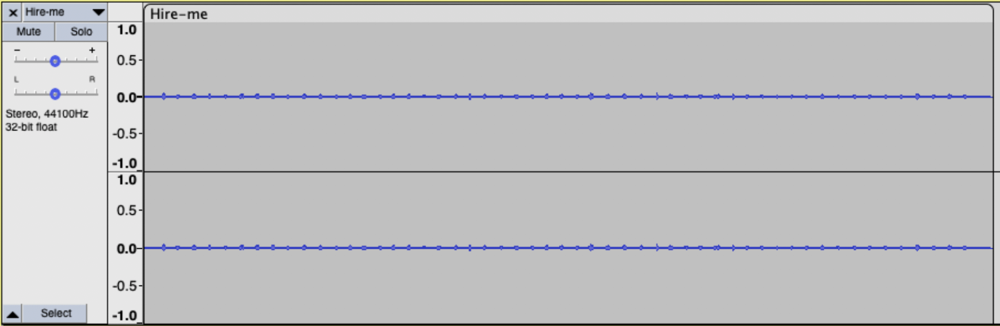 

It sounded like it was in reverse, so I reversed the audio and amplified it.

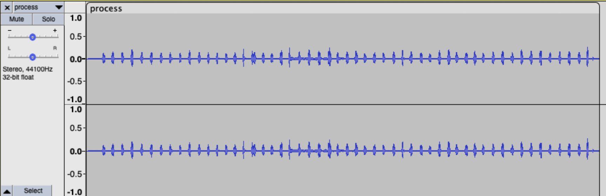 

This processed audio file can be found in [Hire-me-rev.mp3](./files/Hire-me-rev.mp3). 

I listened to the audio and wrote down the letters, which gave me,

`nierbrustiushcihwgnihtemosulletthgimlabmobdivadyugruo`

Since the audio was in reverse, I assumed this text might also be in reverse, so I went ahead and reversed the text,

`ourguydavidbombalmighttellusomethingwhichsuitsurbrein`

And I added spaces to the text,

`our guy david bombal might tell u something which suits ur brein`

Now we know the next step would involve `David Bombal`, who is a well-known guy in the infosec community and has a lot of websites and accounts associated with him.

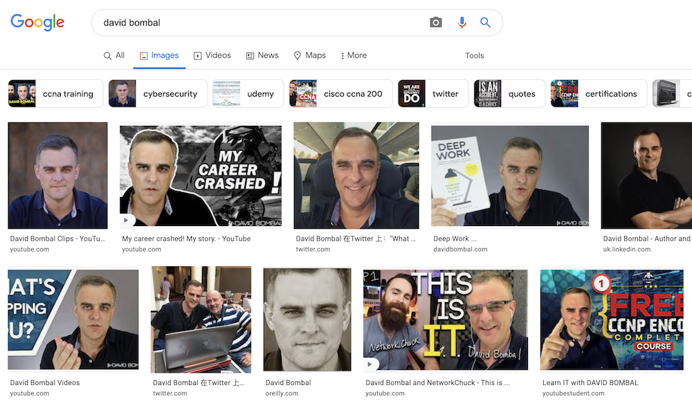 


The hint in the challenge says `Hint : David is Linked IN with some "Russian Hacks"`, which hints to looking up [his LinkedIn](https://www.linkedin.com/in/davidbombal/), and find something related to `Russian Hacks`.

His LinkedIn looks like the following,

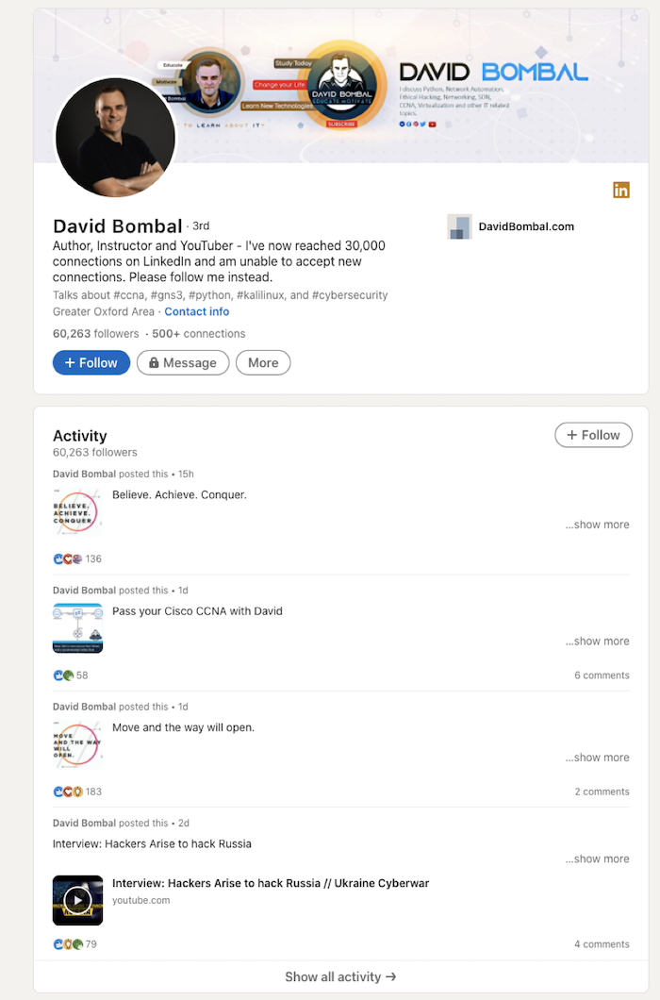 

If we look closely, there is indeed a post related to `Russian Hacks`.

 

And in the comments, I saw the following comment.

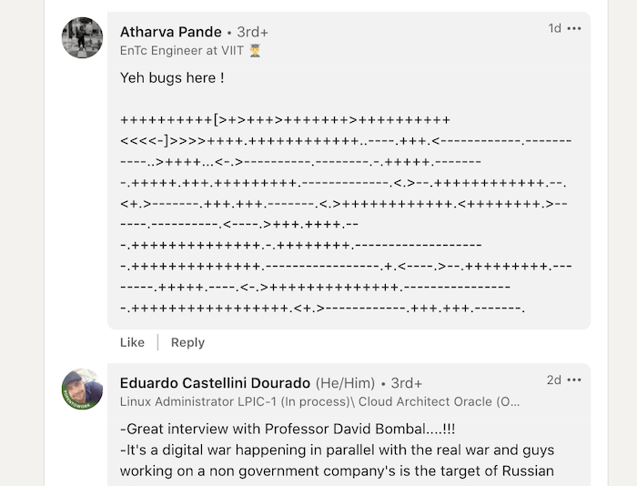 


I went ahead and checked [Atharva Pande's LinkedIn](https://www.linkedin.com/in/atharva-pande-277b58206/),


 

This person was from `Vishwakarma Institute of Information Technology`, which is a [gold sponsor for VishwaCTF](https://ctftime.org/event/1548) so I assumed the comment this person made was one of the clues to this challenge.

I isolated the cipher-like section of [Atharva Pande's](https://www.linkedin.com/in/atharva-pande-277b58206/) comment, and put it into [brainfk.txt](./files/brainfk.txt)

```
++++++++++[>+>+++>+++++++>++++++++++<<<<-]>>>>++++.++++++++++++..----.+++.<------------.-----------..>++++...<-.>----------.--------.-.+++++.--------.+++++.+++.+++++++++.-------------.<.>--.++++++++++++.--.<+.>-------.+++.+++.-------.<.>++++++++++++.<++++++++.>------.----------.<----.>+++.++++.---.++++++++++++++.-.++++++++.--------------------.++++++++++++++.-----------------.+.<----.>--.+++++++++.--------.+++++.----.<-.>++++++++++++++.-----------------.+++++++++++++++++.<+.>------------.+++.+++.-------.
```


I wasn't exactly sure what type of cipher it was using, so I copied and pasted it into Google to get some hints.

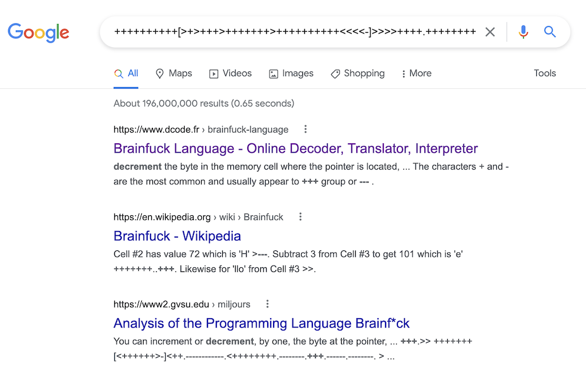 

So apparently, it was using [Brain F*ck](https://en.wikipedia.org/wiki/Brainfuck), so I went ahead to a [Brain F*ck Decoder](https://www.dcode.fr/brainfuck-language).


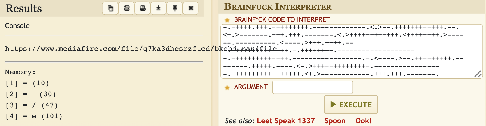 

Decoding this gave me the following URL,

`https://www.mediafire.com/file/q7ka3dhesrzftcd/bkchd.rar/file`

Accessing this [Media Fire Link](https://www.mediafire.com/file/q7ka3dhesrzftcd/bkchd.rar/file) gave me the following,

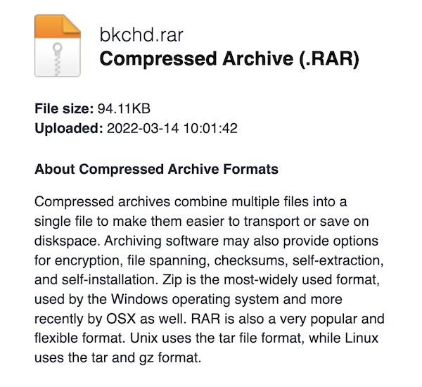 

I went ahead and downloaded [bkchd.rar](./files/bkchd.rar), but unfortunately, it was password protected.

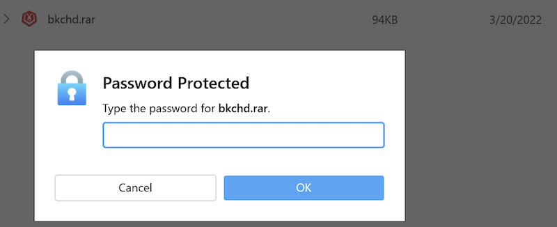 

I tried to crack this .rar file using John the Ripper. A couple of hours passed, but no password candidate was found. 

At this time, a new hint was added,

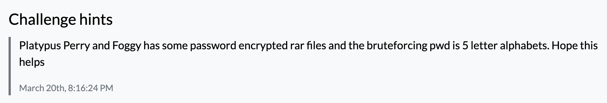 

Now I know that the password length is 5 characters, which drastically reduces the brute-forcing time.

So I downloaded rockyou.txt from [here](https://github.com/praetorian-inc/Hob0Rules/blob/master/wordlists/rockyou.txt.gz), unzipped it, and isolated all the 5 character passwords into [rock5.txt](./files/rock5.txt) with,

`$ grep -E '^.{5}$' rockyou.txt > rock5.txt`


So now I just needed to use [rock5.txt](./files/rock5.txt) as the wordlist for John the Ripper. 

I went ahead and made the hash using

`$ sudo rar2john bkchd.rar > rarhash`


And crack with John using [rock5.txt](./files/rock5.txt) as the wordlist,

`$ john --wordlist=rock5.txt rarhash `

After a few minutes, John has found the password, which is 

`idgaf`

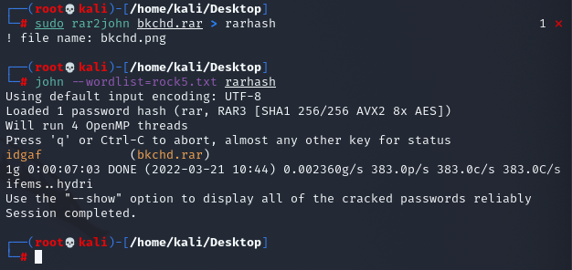 


I went ahead and opened [bkchd.rar](./files/bkchd.rar) with the password `idgaf`, and inside was the following picture. 


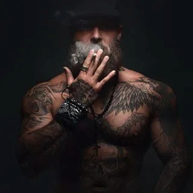 


I checked for steganographic messages using [Steganography Online
](https://stylesuxx.github.io/steganography/), 

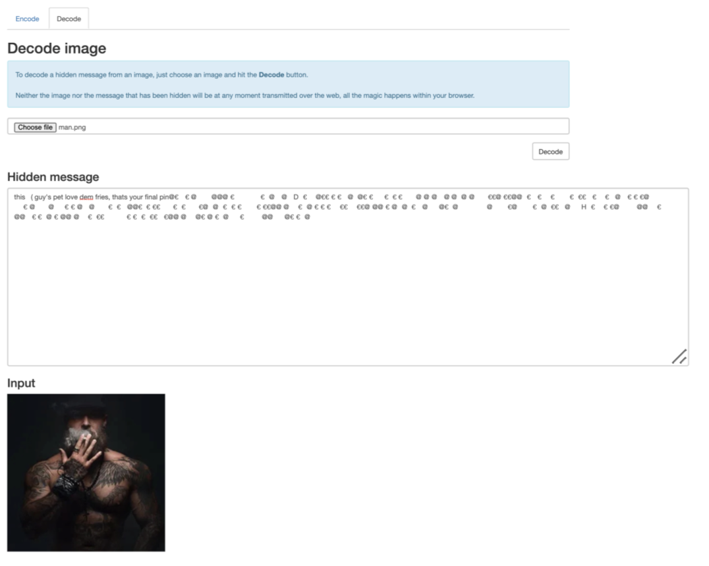 

As shown above, some text was contained in this image, which I put into [decodedsteg.txt](./files/decodedsteg.txt). 

```
this  ( guy's pet love dem fries, thats your final pin@€€ @  @@@€   €@@ D€ @€€€€ @ @€€€ € €@@@@ @ @@ €€@€€@@€€€  €€€ € € @€€€@  €@ @  €€@ @€€ @@€ €€€  €€ €@@€€€  €€€@@ @€@€€€€€€€@@@€@@ €@ @€ @  @  €@ €@ €€ @ H€ €€@  @@€ @@€ €@€@@@ €€€ €€€€€ €@@ @@€@€ @€ @@@€€@
```

I didn't know what this was supposed to mean and assumed it was saying that this guy's pet, more specifically, the dog is what we're supposed to look for.

So I did a reverse image on Google using [bkchd.png](./files/bkchd.png).

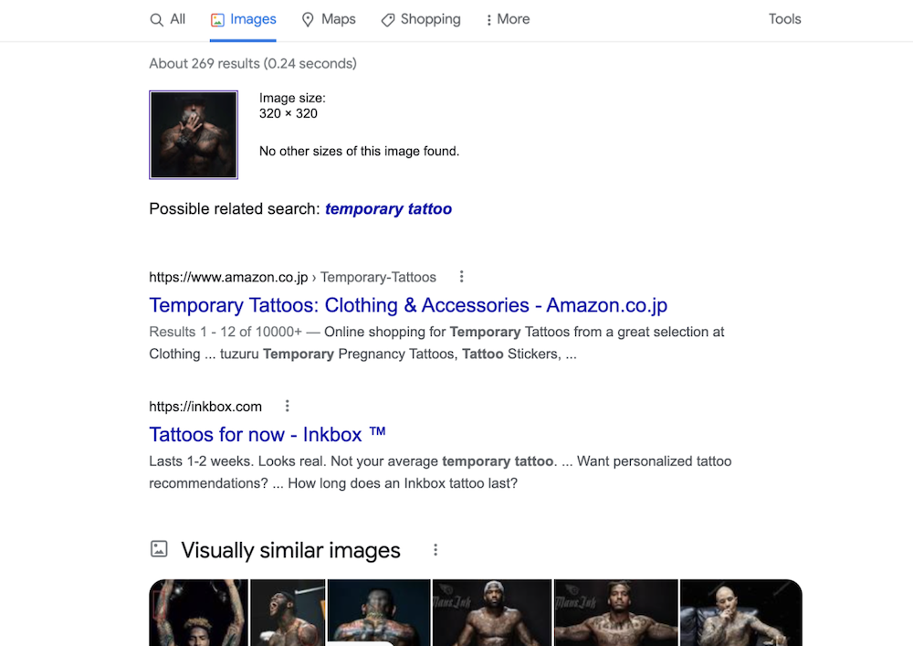 

However, nothing much came up except for other men with tattoos. So I went [Yandex](https://yandex.com/images/) to do a reverse image search.

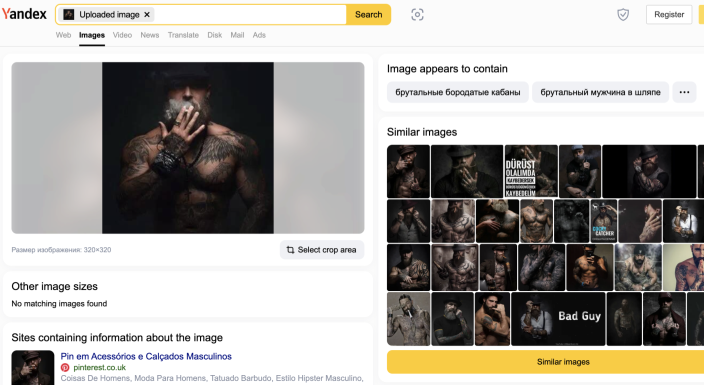 


By looking for his distinctive beard and tattoo through the reverse image search results, I noticed that most of them had the name `Polish Viking` on them, so I assumed that was his nickname.
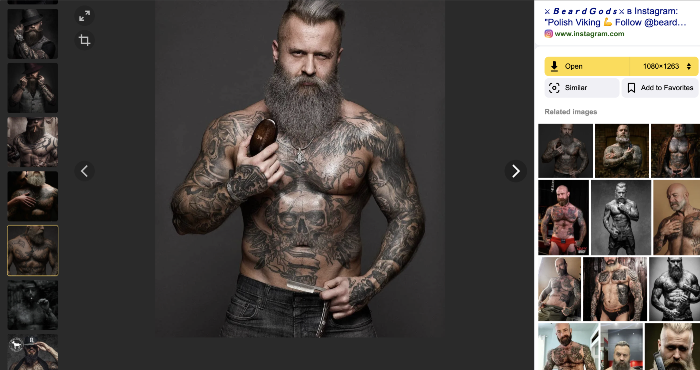 

So I looked up `Polish Viking`,


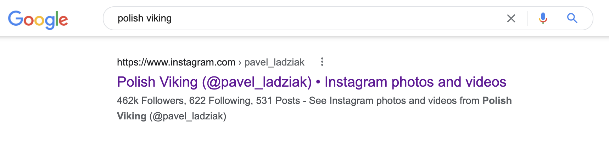 


and found [his Instagram](https://www.instagram.com/pavel_ladziak/) and name, which was `pavel_ladziak`.

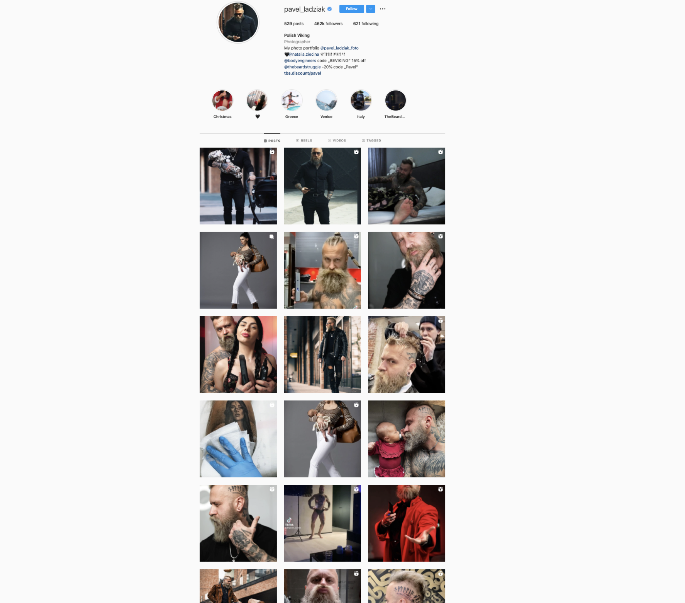 


I went to Google and changed the language settings to Polish to get the most out of the results, and looked up `pavel ladziak dog`, which showed me that his dog was a toy dog with white and beige coloration. 

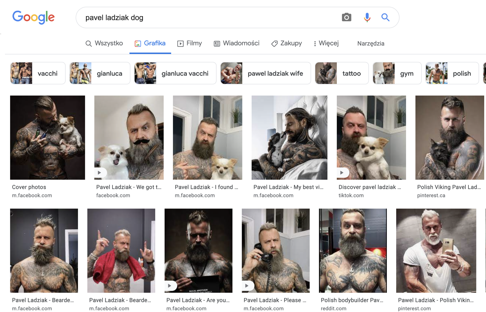 


I dug through his Instagram, and found a [few pictures with his dog](https://www.instagram.com/p/COQt4rkB5oa/),

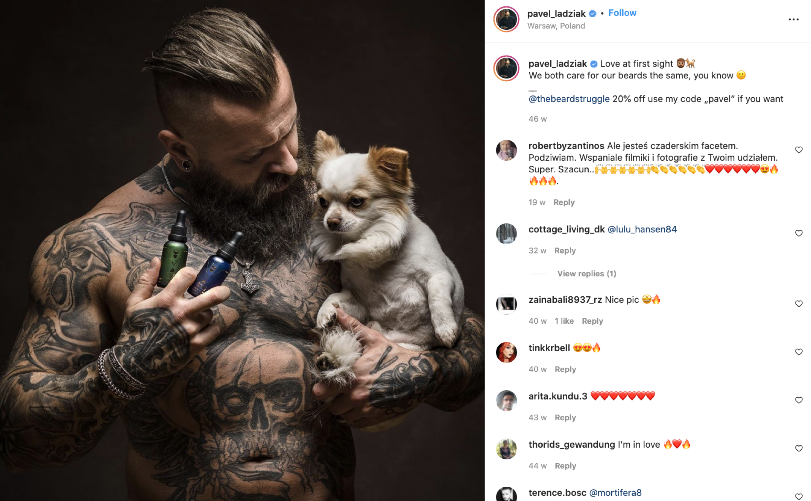 

However, I could not find the name of his dog. I was thinking to look through his followings list to find his dog, but I assumed that his wife might be more likely to tag their dog in the pictures.


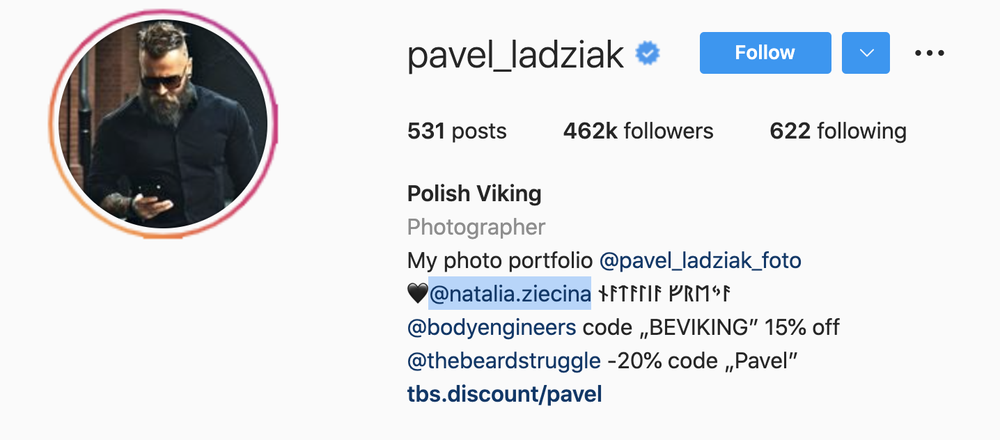 

So I went ahead to [his wife's](https://www.instagram.com/natalia.ziecina/) account.


 


So I dug through her pictures with their dog in it, and came across [this picture](https://www.instagram.com/p/CPbQ_mjrKGI/).


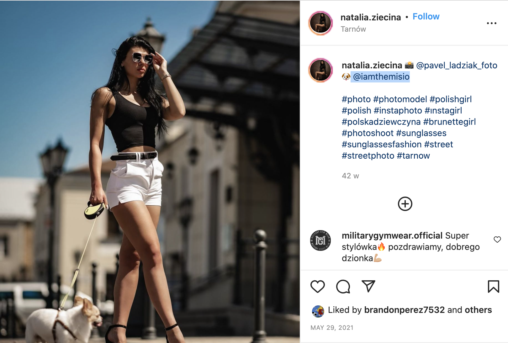 


I saw that she tagged her dog in that picture, which has the Instagram username [iamthemisio](https://www.instagram.com/iamthemisio/)


I went to the dog's account and saw the following,


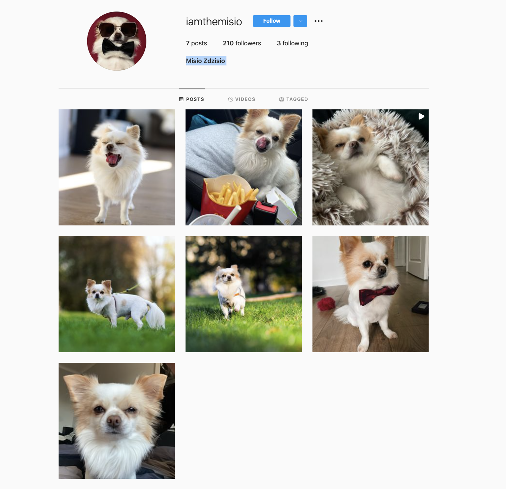 

The dog's name is `Misio Zdzisio`, and as the challenge was to find a dog and the flag format was `vishwaCTF{Firstname_Lastname}`, the flag for this challenge would be,

 `vishwaCTF{Misio_Zdzisio}`


I cried tears of joy when I inputted this flag and finally got `correct`, because I failed multiple times with flags like `vishwaCTF{David_Bombal}`, `vishwaCTF{Atharva_Pande}` and  `vishwaCTF{Pavel_Ladziak}`. 

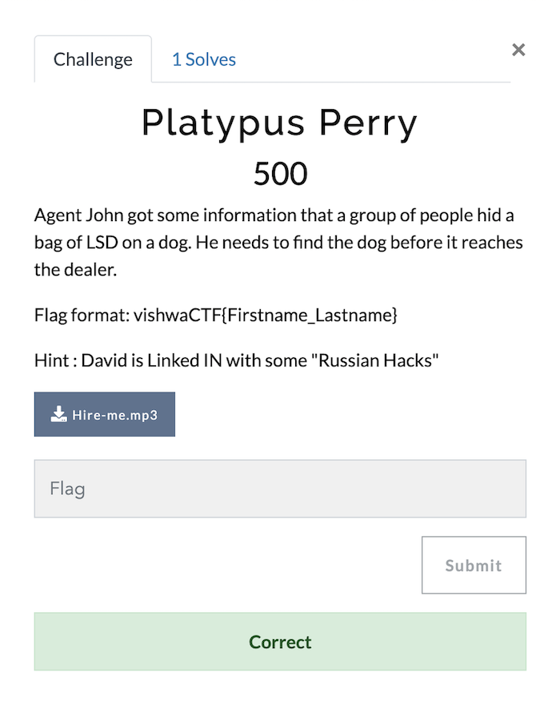 

This challenge was an emotional rollercoaster. Every time I thought I got the flag, it turns out it wasn't the flag, but rather only a step in obtaining the flag. Thus, finally getting `correct` was extremely satisfying, especially when you're the first to solve the challenge. I experienced an important life lesson while doing this challenge, which is to keep trying even if you fail because those failures will lead your way to success.

