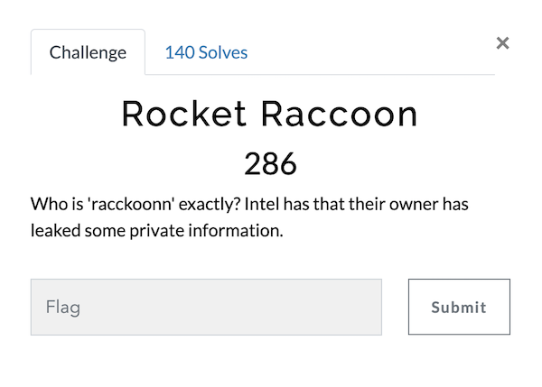
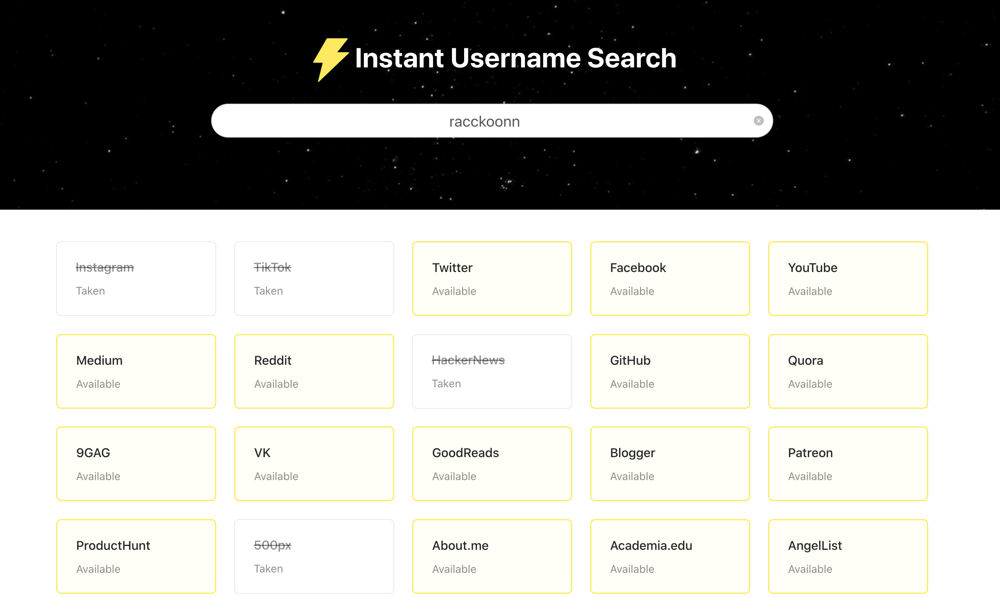
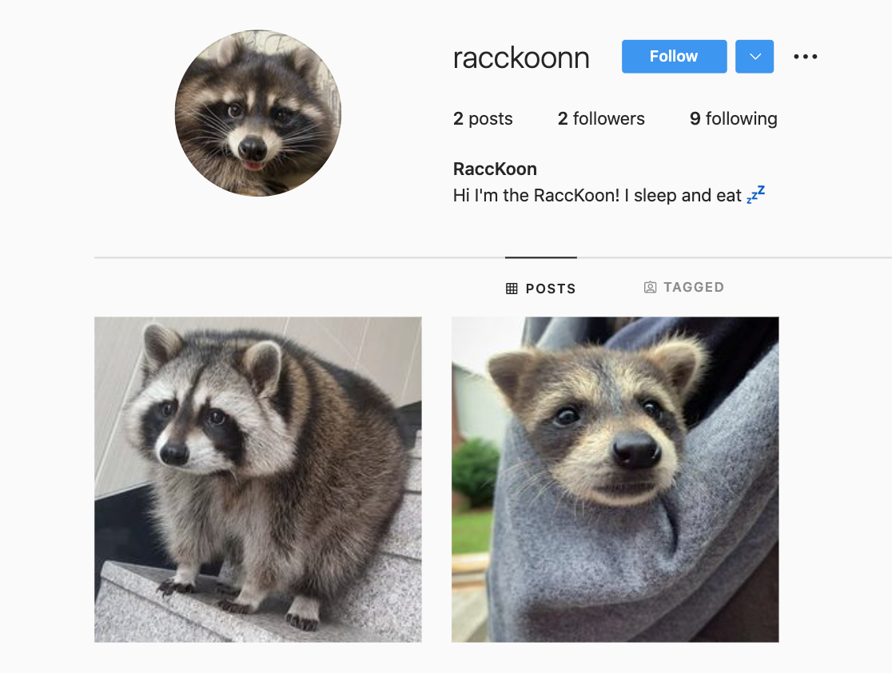
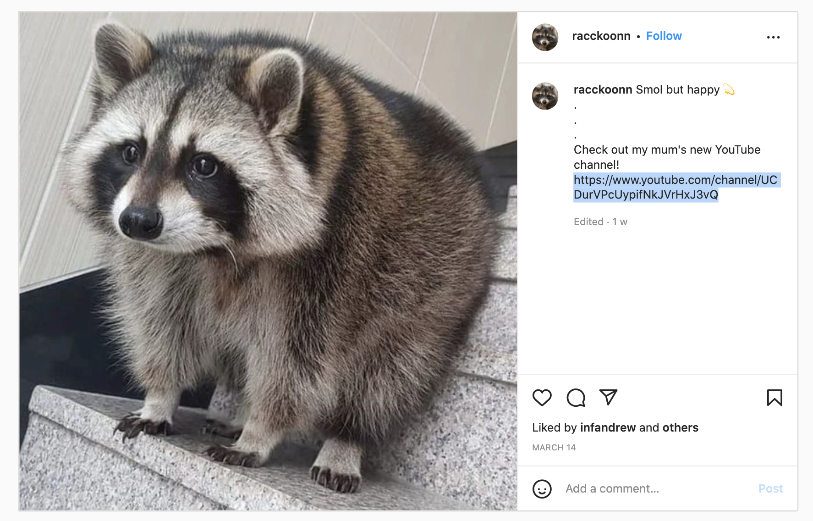
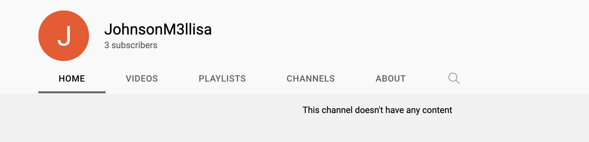
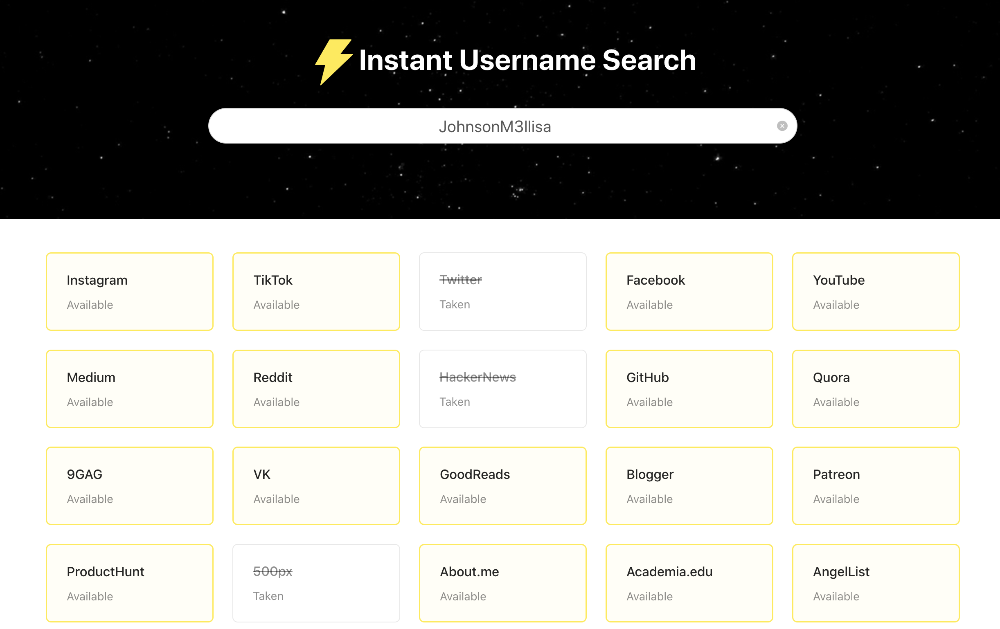
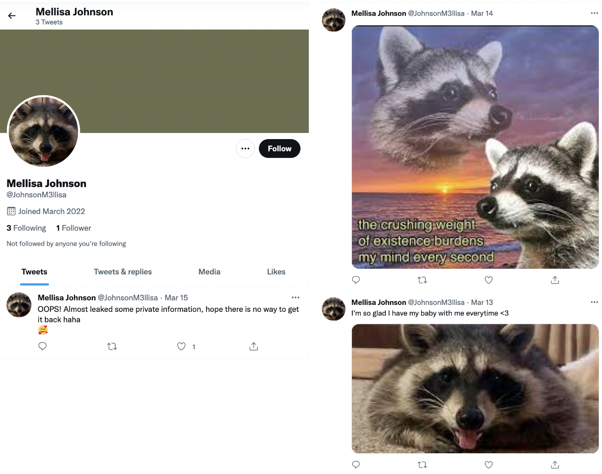
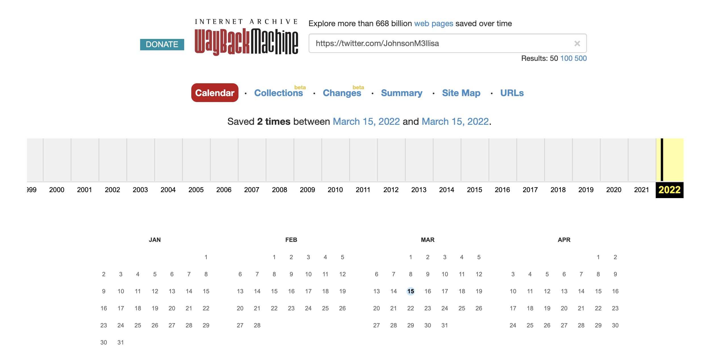
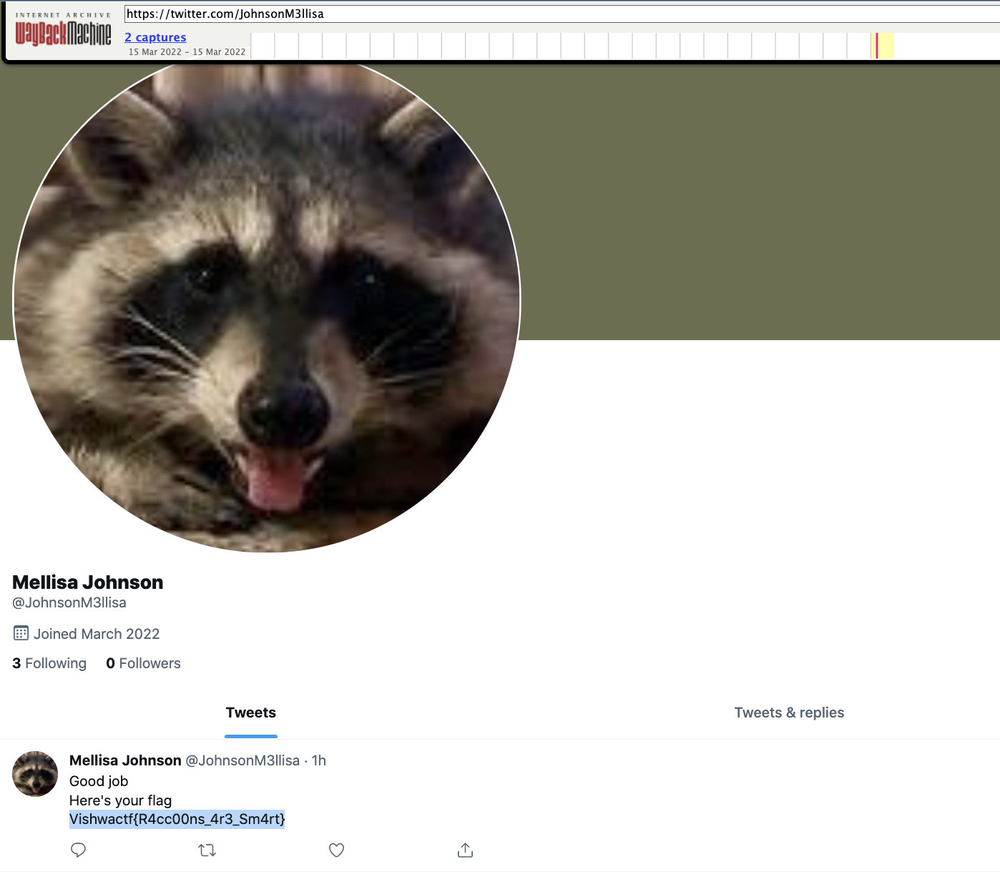

# Rocket Raccoon (Category: OSINT)
The challenge is the following,

 

We are given the username `racckoonn`, so I started by looking up this name on [InstantUsername](https://instantusername.com/),

 

I went ahead and started with [racckoonn's Instagram](https://www.instagram.com/racckoonn/)

 

I looked through their pictures, and found [this image](https://www.instagram.com/p/CbEzNo1PQ-g/).

 

So I went to the `https://www.youtube.com/channel/UCDurVPcUypifNkJVrHxJ3vQ`,

 

However, there are no videos. So I assumed that I will have to use the username `JohnsonM3llisa` for further investigation. I went to [InstantUsername](https://instantusername.com/) again, and looked that username up.

 

I went ahead and started with [JohnsonM3llisa's Twitter](https://twitter.com/JohnsonM3llisa).

 

[This tweet](https://twitter.com/JohnsonM3llisa/status/1503690182432030720) caught my eye, and I immediately assumed that I was supposed to use the [Wayback Machine](https://archive.org/web/) to look at the deleted Tweets.

So I went ahead and [searched their Twitter account on the Wayback Machine](https://web.archive.org/web/*/https://twitter.com/JohnsonM3llisa), and saw that there were snapshots on March 15, 2022.

 

I opened up [the snapshot on March 15, 2022](https://web.archive.org/web/20220315110835/https://twitter.com/JohnsonM3llisa), and saw the following,

 

Therefore, the flag is,

`Vishwactf{R4cc00ns_4r3_Sm4rt}`

