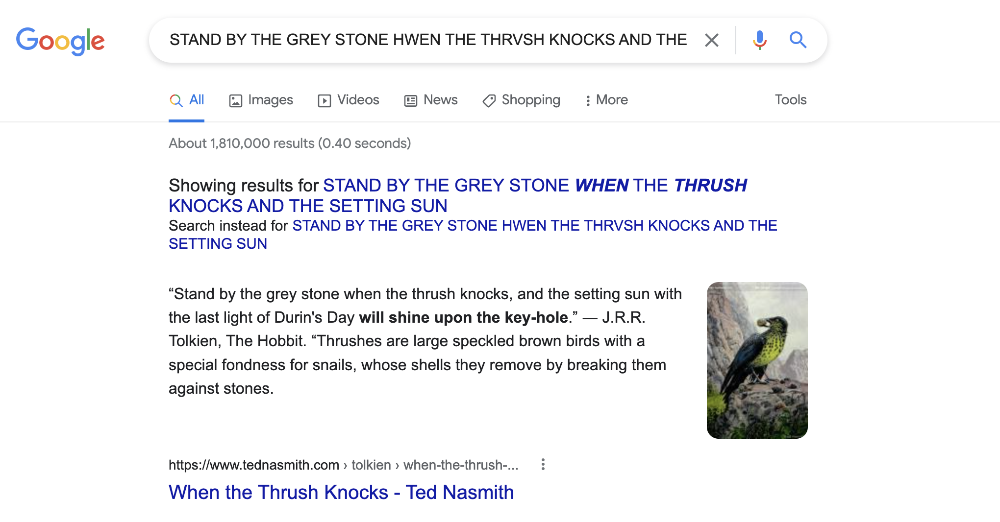
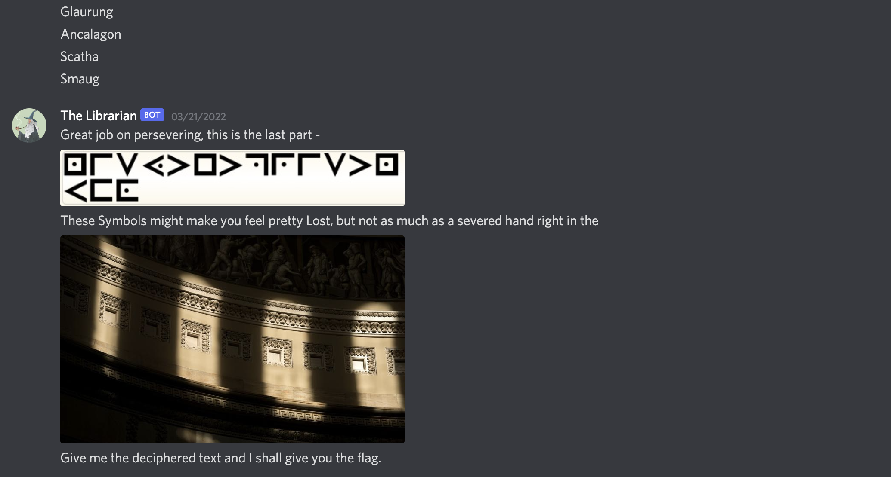

# The Library (Category: OSINT)
The challenge is the following,

 

And we are given two images files [Howtodm.jpg](./files/Howtodm.jpg) and [Troubleshoot.jpg](./files/Troubleshoot.jpg).

 

The challenge mentions `Note : The attached files are NOT hints or steps to the challenge, they are guides to message the bot and troubleshooting.`, so we know that these are simply instruction pictures. 

I DMed `Hello` to the `The Librarian`, and gave me the following reply,

 

So now I need to use OSINT to find the answer to `Tommy is to call on Miss Glen at what time?`. I searched this into Google,

 

and the top-most result is this [Partners in Crime Wikipedia](https://en.wikipedia.org/wiki/Partners_in_Crime_(short_story_collection)). Since this bot was called `The Librarian`, I automatically assumed that I am supposed to look for things related to fiction, so this `Partners in Crime` by Agatha Christie was the most likely candidate for the answer. 

 

I saw that `Tommy` is one of the main characters, and searching this name on the Wikipedia page returned many results. 

To narrow it down, I searched for `Miss Glen`, and found out that she only appears in `The Man in the Mist`. 

 

Also, the only time that is mentioned in `The Man in the Mist` was `6.10 pm`, therefore I assumed this would be the answer. The bot said to `Give me the time in 12 hr format (HH:MM) (without am/pm)`, so I tried patterns like `6:10` and `06:10`. Turns out `06:10` was the correct answer. 

 

The bot gave the next question, and when I saw `Son of Neptune`, I immediately assumed that it was related to `Rick Riordan` because I read a lot of `Percy Jackson` in my childhood and knew that the protagonist, Percy Jackson is the son of Greek god `Poseidon`, who is referred to as `Neptune` in Roman mythology. 

And searching this title up on [Wikipedia](https://en.wikipedia.org/wiki/The_Son_of_Neptune) has confirmed my assumption.

 

The question mentions `He is also acknowledged in mythology to guide a voyage to retrieve what?`, with an emphasis on the `what`, so I assumed that we're supposed to look for the object `Percy Jackson` has retrieved in his quests. 

I went ahead to [Riordan Fandom site about Percy Jackson's Quests](https://riordan.fandom.com/wiki/Quest), and saw that there were multiple objects that `Percy Jackson` had to retrieve.

 

The bot didn't say anything specific about the object, so I decided to try each possible object like `master bolt`, `golden fleece`, `flying chariot`, etc. from the [Riordan Fandom site about Percy Jackson's Quests](https://riordan.fandom.com/wiki/Quest). 

 

As the bot responded to `golden fleece`, that was the answer to this question. For the next question, the bot mentions `In this classic, the names of the creation and creator are often confused.`. I immediately assumed that the bot was talking about `Frankenstein`, because I remember in literature class that the English teacher always talked about how "Frankenstein is not the name of the monster, but it's the name of the creator, who is Victor Frankenstein."

The bot says `Give me the name of the university where the creator studied`, so I assumed that I was supposed to look for the university where `Victor Frankenstein` studied. I opened up [Victor Frankenstein on Wikipedia](https://en.wikipedia.org/wiki/Victor_Frankenstein), and searched `university`. There were multiple instances of the string `university` in this Wikipedia article, and I saw that the History section of the article was the most relevant. 

 
 
 I tried various patterns like `university at Ingolstadt`, `ingolstadt`, `ingolstadt university` and `University of Ingolstadt`, and turns out `University of Ingolstadt` was the correct answer.

 

The bot then gave me the following image.

 

Also, the bot only asks us `What is the name of the dragon?`. 

As it mentions dragon, I assumed that this would be related to fantasy fiction. So I went to Google images and searched `fantasy language`. Among the results, I found a text similar to the one the bot gave us,

 

By digging deeper into the similar images section, I found out that this language was called `Cirth`, which is a [script of runes created by Daeron from Lord of the Rings](https://lotr.fandom.com/wiki/Khuzdul). I found a [translation sheet here](https://www.learn4yourlife.com/hobbit-runes-worksheet.html),

 

And I went ahead and translated half of the text by hand,

`STAND BY THE GREY STONE HWEN THE THRVSH KNOCKS AND THE SETTING SUN`

At this point, I decided to input this text to Google and see if it can auto-complete it for me.

 

Therefore, the full decoded text should be 

`Stand by the grey stone when the thrush knocks, and the setting sun with the last light of Durin's Day will shine upon the key-hole`

I couldn't find anything related to dragons from this text, so I decided to look up `dragons in lord of the rings` instead, and came across the [Tolkien Wiki page about Dragons](http://tolkiengateway.net/wiki/Dragons).

 

I didn't know which dragon, so I decided to try them all,

 

Therefore, `smaug` was the answer to this question. Now for the final question, the following images were given.

 

 

I know that this is a [Pigpen Cipher](https://en.wikipedia.org/wiki/Pigpen_cipher), and deciphering the first picture would give,

`NISYTETPRISTNUFO`

However, the bot did not respond to that, so I thought the second image might contain more information. I did a reverse image search, and the [webpage for the Architect of the Capitol](https://www.aoc.gov/explore-capitol-campus/buildings-grounds/capitol-building/rotunda) came up.

 

So apparently, this architecture was called the `Rotunda`. The bot says `These Symbols might make you feel pretty Lost, but not as much as a severed hand right in the` before the image. Thus, I decided to look up `severed hand in rotunda` on Google, and the first result, which was a [Wikipedia page on The Lost Symbol](https://en.wikipedia.org/wiki/The_Lost_Symbol) looked pretty relevant as it says `Solomon's severed right hand in the middle of the Capitol Rotunda`. Also because the bot capitalizes `Symbols`, I knew this was referring to `The Lost Symbol`. 

 

So I looked up `the lost symbol cipher` on Google, and saw that most of them had the keyword `magic squares` in them.

 

I looked up `the lost symbol cipher magic squares`, and came across [this website](https://sites.google.com/site/lostsymbolproject/masonic-cipher) that talks in detail about the cipher used in the book. I saw that the Pig-pen part was correct, but the cipher used in The Lost Symbol uses one additional step, which was the `magic square`. 

 

So I went ahead and arranged `NISYTETPRISTNUFO` into a 4x4 square,

 

And I rearranged the letters as shown in the [website](https://sites.google.com/site/lostsymbolproject/masonic-cipher).

 

The rearranged text would be,

`OSINTISPRETTYFUN`

Which makes sense, so I went ahead and sent this text to the bot,

 

Therefore, the flag is,

`vishwaCTF{b00ks_d0_b3_1nt3r3st1ng!}`
