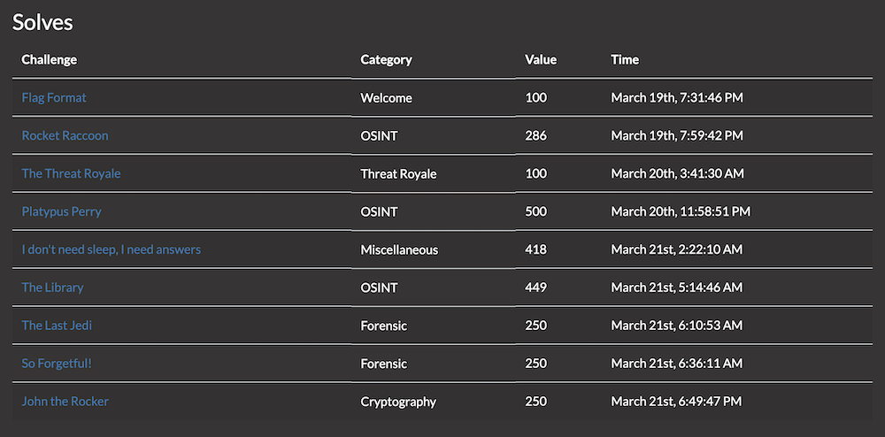

# VishwaCTF 2022 

[VishwaCTF](https://vishwactf.com/) is hosted by [Cybercell VIIT](https://www.viit.ac.in/viit-cyber-cell).

All my writeups can also be found on my [dev.to blog](https://dev.to/lambdamamba/ctf-writeup-vishwactf-2022-3me5).

The challenges I solved are:

 

Their write-ups (excluding some beginner challenges) can be found here.

## OSINT:
- [Platypus Perry](./OSINT/Platypus_Perry): 500 points
- [The Library](./OSINT/The_Library): 449 points
- [Rocket Raccoon](./OSINT/Rocket_Raccoon): 286 points

## Misc:
- [I don't need sleep, I need answers](./Misc/I_dont_need_sleep): 418 points

## Forensics:
- [So Forgetful!](./Forensic/So_Forgetful): 250 points
- [The Last Jedi](./Forensic/The_Last_Jedi): 250 points

## Cryptography:
- [John the Rocker](./Cryptography/John_the_Rocker): 250 points
