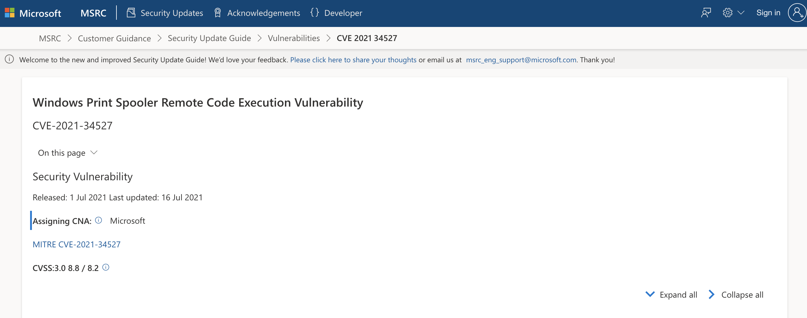

# picoCTF 2022 CVE-XXXX-XXXX (Binary Exploitation 100 points)
The challenge is the following,

 

So I looked up `remote code execution windows print spooler 2021` on Google, and found a [site from Microsoft that listed vulnerabilities](https://msrc.microsoft.com/update-guide/vulnerability/CVE-2021-34527).

 

I saw that this was the first recorded remote code execution vulnerability in 2021 in the Windows Print Spooler Service, so I knew `CVE-2021-34527` was the CVE I was looking for.

Therefore, the flag is,

`picoCTF{CVE-2021-34527}`
