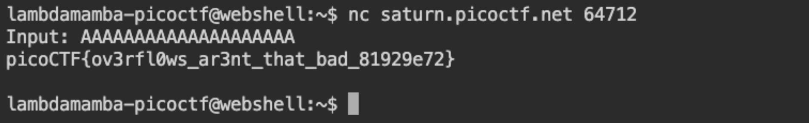

# picoCTF 2022 buffer overflow 0 (Binary Exploitation 100 points)
The challenge is the following,

 

We are also given the executable file [vuln](./vuln) and its source code [vuln.c](./vuln.c),

```
#include <stdio.h>
#include <stdlib.h>
#include <string.h>
#include <signal.h>

#define FLAGSIZE_MAX 64

char flag[FLAGSIZE_MAX];

void sigsegv_handler(int sig) {
  printf("%s\n", flag);
  fflush(stdout);
  exit(1);
}

void vuln(char *input){
  char buf2[16];
  strcpy(buf2, input);
}

int main(int argc, char **argv){
  
  FILE *f = fopen("flag.txt","r");
  if (f == NULL) {
    printf("%s %s", "Please create 'flag.txt' in this directory with your",
                    "own debugging flag.\n");
    exit(0);
  }
  
  fgets(flag,FLAGSIZE_MAX,f);
  signal(SIGSEGV, sigsegv_handler); // Set up signal handler
  
  gid_t gid = getegid();
  setresgid(gid, gid, gid);


  printf("Input: ");
  fflush(stdout);
  char buf1[100];
  gets(buf1); 
  vuln(buf1);
  printf("The program will exit now\n");
  return 0;
}

```
The buffer will overflow with 20 characters, I prepared 20 `A`, 

`AAAAAAAAAAAAAAAAAAAA`

I connected to the remote server, and inputted 20 `A`,


 


Therefore, the flag is,

`picoCTF{ov3rfl0ws_ar3nt_that_bad_81929e72}`
