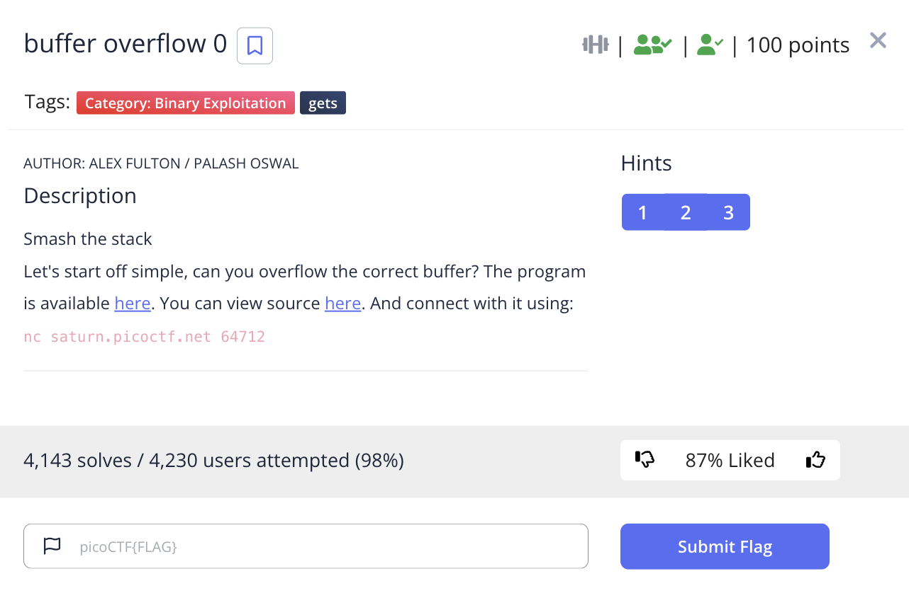

# picoCTF 2022 buffer overflow 0 (Binary Exploitation 100 points)
The challenge is the following,

 

We are also given the executable file [vuln](./vuln) and its source code [vuln.c](./vuln.c),

```
1. #include <stdio.h>
2. #include <stdlib.h>
3. #include <string.h>
4. #include <signal.h>
5. 
6. #define FLAGSIZE_MAX 64
7. 
8. char flag[FLAGSIZE_MAX];
9. 
10. void sigsegv_handler(int sig) {
11.   printf("%s\n", flag);
12.   fflush(stdout);
13.   exit(1);
14. }
15. 
16. void vuln(char *input){
17.   char buf2[16];
18.   strcpy(buf2, input);
19. }
20. 
21. int main(int argc, char **argv){
22.   
23.   FILE *f = fopen("flag.txt","r");
24.   if (f == NULL) {
25.     printf("%s %s", "Please create 'flag.txt' in this directory with your",
26.                     "own debugging flag.\n");
27.     exit(0);
28.   }
29.   
30.   fgets(flag,FLAGSIZE_MAX,f);
31.   signal(SIGSEGV, sigsegv_handler); // Set up signal handler
32.   
33.   gid_t gid = getegid();
34.   setresgid(gid, gid, gid);
35. 
36. 
37.   printf("Input: ");
38.   fflush(stdout);
39.   char buf1[100];
40.   gets(buf1); 
41.   vuln(buf1);
42.   printf("The program will exit now\n");
43.   return 0;
44. }


```

I saw that `gets(buf1)` in line 40 is used to read the user input, which does not check for the overflow, and is inputted to `vuln(buf1)` in line 41.
I saw that the `buf2[16]` buffer in line 17 in `vuln()` can be overflowed with 20 bytes into the code that reads `flag.txt` starting from line 23, so I prepared 20 `A`, 

`AAAAAAAAAAAAAAAAAAAA`

I connected to the remote server, and inputted 20 `A`,


 


Therefore, the flag is,

`picoCTF{ov3rfl0ws_ar3nt_that_bad_81929e72}`
