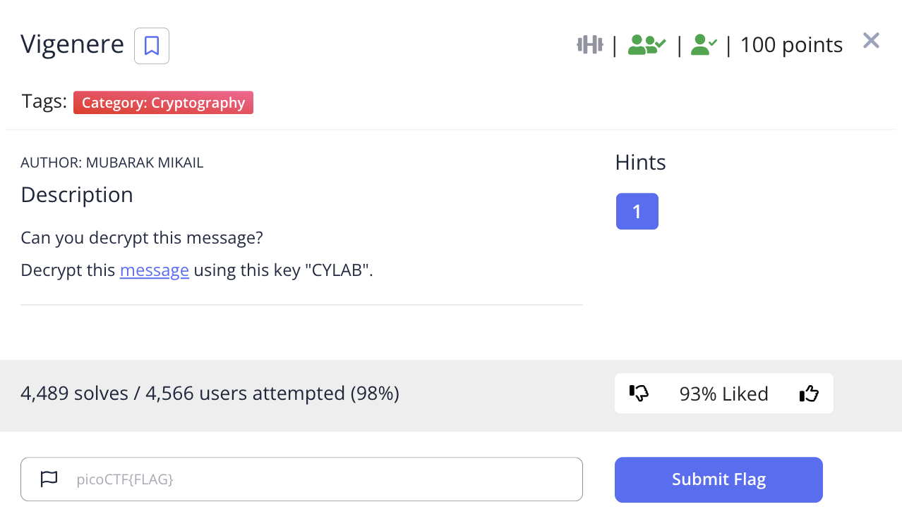
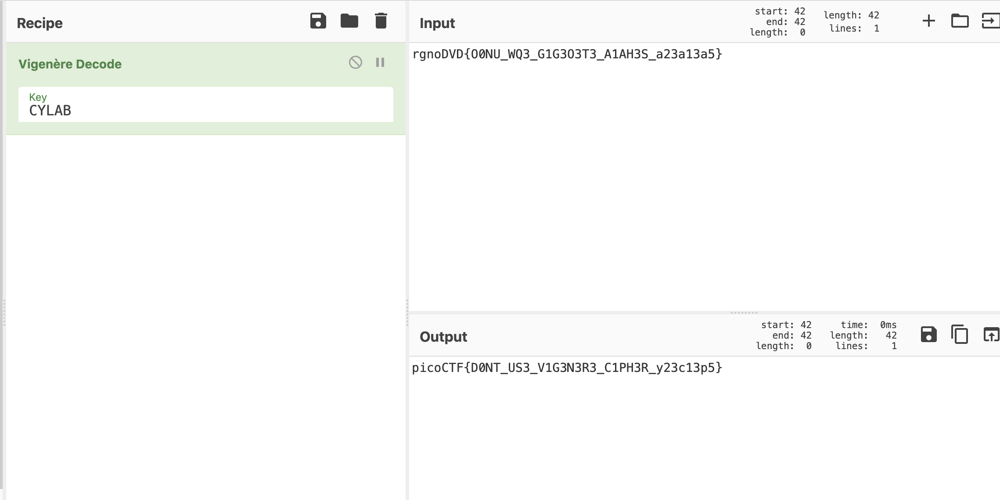

# picoCTF 2022 Vigenere (Cryptography 100 points)
The challenge is the following,

 

We are also given the file [message.txt](./files/cipher.txt) which contains,

```
rgnoDVD{O0NU_WQ3_G1G3O3T3_A1AH3S_a23a13a5}
```

I went to CyberChef and used Vigenere decode with the key `CYLAB`, which gave,

 

Therefore, the flag is,

`picoCTF{D0NT_US3_V1G3N3R3_C1PH3R_y23c13p5}`
