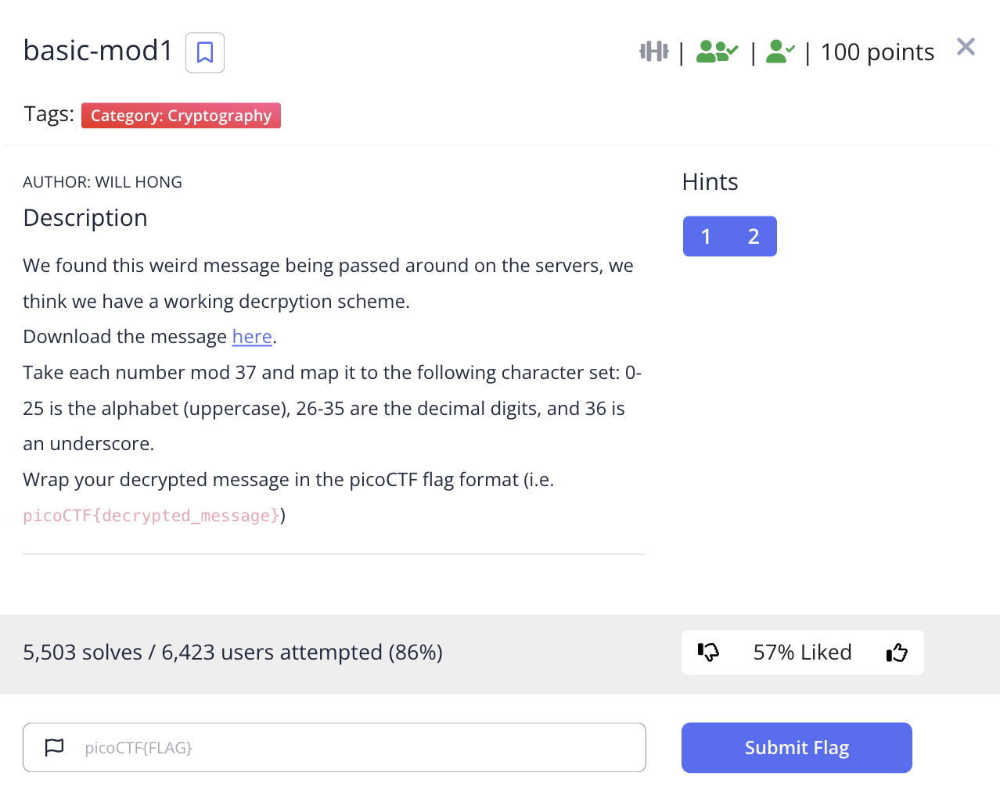

# picoCTF 2022 basic-mod1 (Cryptography 100 points)
The challenge is the following,

 

We are also given the file [message.txt](./files/message.txt) which contains,

```
54 211 168 309 262 110 272 73 54 137 131 383 188 332 39 396 370 182 328 327 366 70 
```

I followed what the challenge said, and applied mod 37 to each of the numbers,

```
17 26 20 13 3 36 13 36 17 26 20 13 3 36 2 26 0 34 32 31 33 33
```

The number to character map used here is,

```
A: 0
B: 1
C: 2
D: 3
E: 4
F: 5
G: 6
H: 7
I: 8
J: 9
K: 10
L: 11
M: 12
N: 13
O: 14
P: 15
Q: 16
R: 17
S: 18
T: 19
U: 20
V: 21
W: 22
X: 23
Y: 24
Z: 25
0: 26
1: 27
2: 28
3: 29
4: 30
5: 31
6: 32
7: 33
8: 34
9: 35
_: 36
```

After I mapped the numbers to their respective characters, I got,

`R 0 U N D _ N _ R 0 U N D _ C 0 A 8 6 5 7 7`

Therefore, the flag is,

`picoCTF{R0UND_N_R0UND_C0A86577}`

