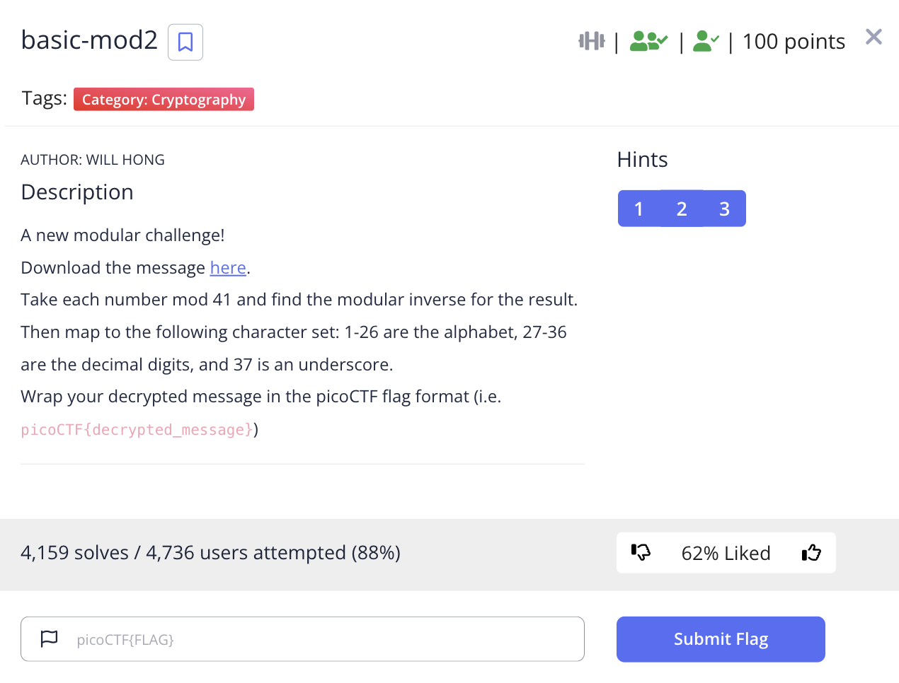

# picoCTF 2022 basic-mod2 (Cryptography 100 points)
The challenge is the following,

 

We are also given the file [message.txt](./files/message.txt) which contains,

```
145 167 233 272 344 91 395 393 433 92 77 414 344 318 420 263 87 186 96 103 91 354 161 
```

I followed what the challenge said, and applied mod 41 to each number and took the modular inverse using this [Online Modular Multiplicative Inverse Calculator](https://planetcalc.com/3311/),

```
28 14 22 30 18 32 30 12 25 37 8 31 18 4 37 29 33 28 3 2 32 30 27
```

The number to character map used here is,

```
A: 1
B: 2
C: 3
D: 4
E: 5
F: 6
G: 7
H: 8
I: 9
J: 10
K: 11
L: 12
M: 13
N: 14
O: 15
P: 16
Q: 17
R: 18
S: 19
T: 20
U: 21
V: 22
W: 23
X: 24
Y: 25
Z: 26
0: 27
1: 28
2: 29
3: 30
4: 31
5: 32
6: 33
7: 34
8: 35
9: 36
_: 37
```

After I mapped the numbers to their respective characters, I got,

`1 N V 3 R 5 3 L Y _ H 4 R D _ 2 6 1 C B 5 3 0`

Therefore, the flag is,

`picoCTF{1NV3R53LY_H4RD_261CB530}`

