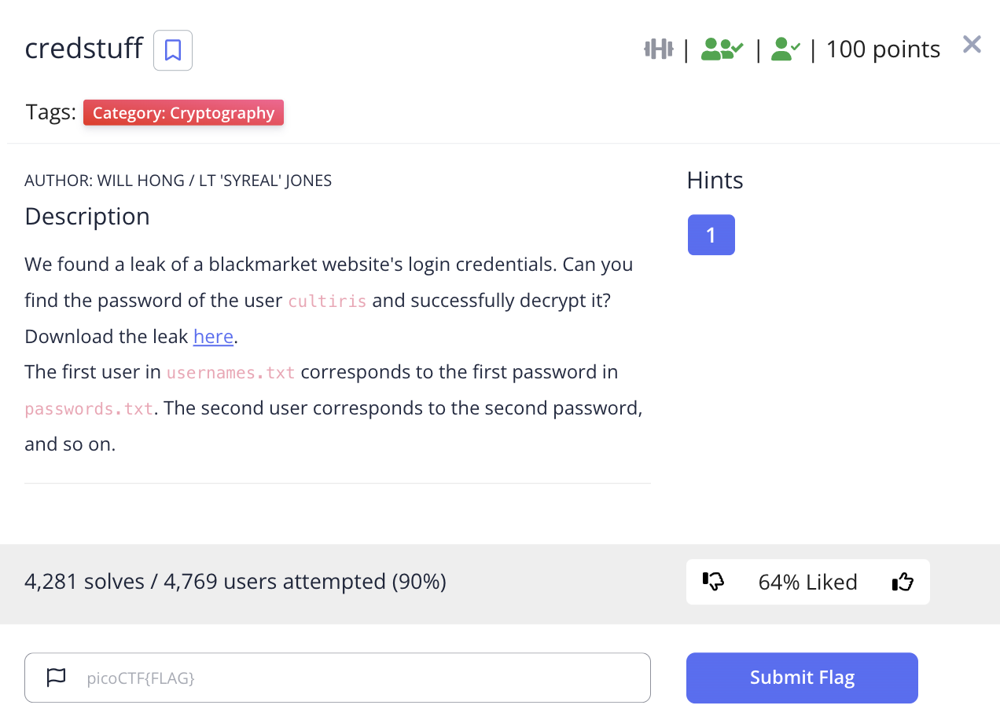

# picoCTF 2022 credstuff (Cryptography 100 points)
The challenge is the following,

 

We are also given the file [leak.tar](./files/leak.tar). I uncompressed this, and gave a text files [usernames.txt](./files/usernames.txt) and [passwords.txt](./files/passwords.txt).

The challenge told us to look for the user `cultiris`, which was on line 378 of [usernames.txt](./files/usernames.txt). I looked at line 378 of [passwords.txt](./files/passwords.txt).

 

`cultiris`'s password was `cvpbPGS{P7e1S_54I35_71Z3}`. I assumed this was a ROT cipher, so I went over to CyberChef and applied the ROT 13 cipher.

 

Therefore, the flag is,

`picoCTF{C7r1F_54V35_71M3}`.

