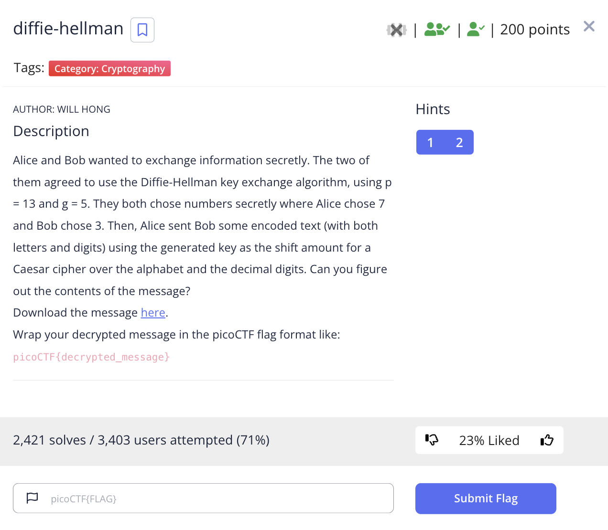
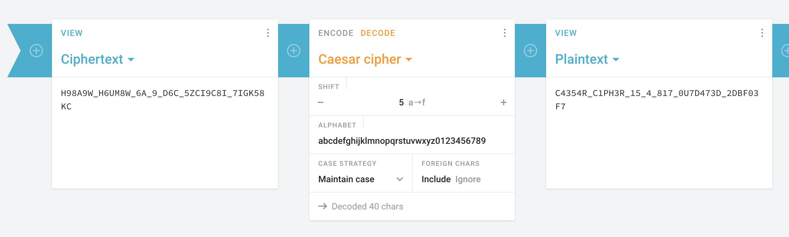

# picoCTF 2022 diffie-hellman (Cryptography 200 points)
The challenge is the following,

 

We are also given the file [message.txt](./files/message.txt) which contains,

```
H98A9W_H6UM8W_6A_9_D6C_5ZCI9C8I_7IGK58KC
```
I figured out that the shift used for the Caesar cipher is 5, so I went to [Cryptii's Caesar Decoder](https://cryptii.com/pipes/caesar-cipher), and used a shift of 5 with the alphabet,

`abcdefghijklmnopqrstuvwxyz0123456789`

Which gave me, 

 

Therefore, the flag is,

`picoCTF{C4354R_C1PH3R_15_4_817_0U7D473D_2DBF03F7}`
