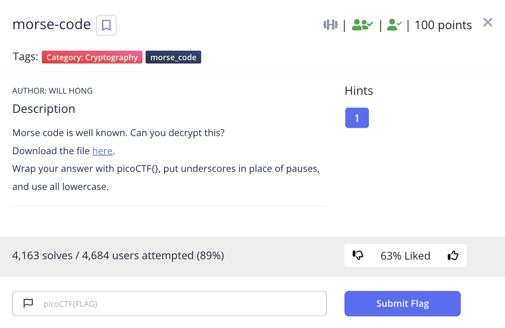
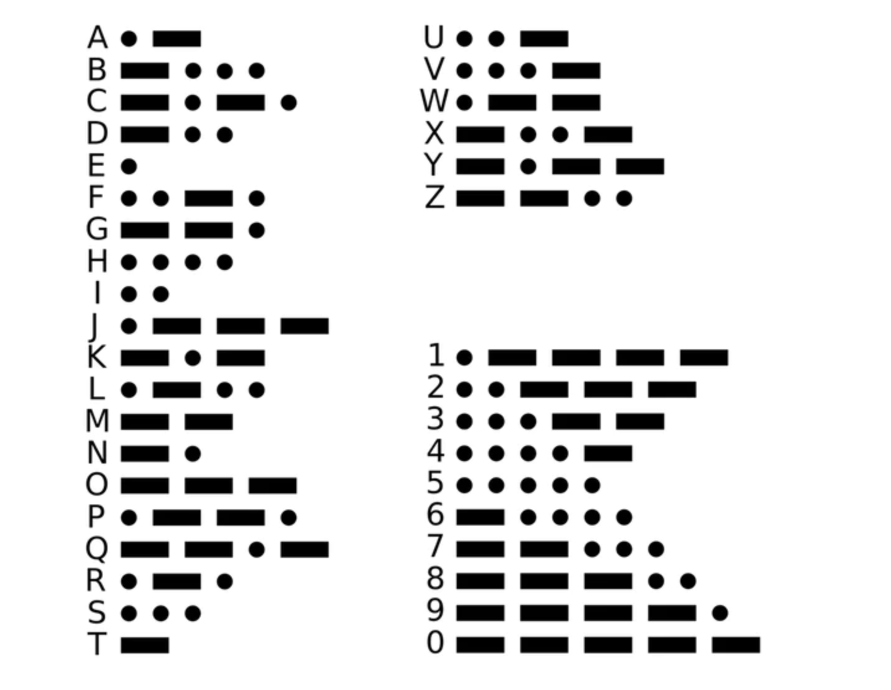

# picoCTF 2022 morse-code (Cryptography 100 points)
The challenge is the following,

 

We are also given the file [morse_chal.wav](./files/morse_chal.wav). Writing down the dot and dashes from the audio, I got the following,

` .-- .... ....- --... / .... ....- --... .... / ----. ----- -.. / .-- ..--- ----- ..- ----. .... --... `

I looked at the [Morse code table](https://modernout.com/pages/morse-code-chart),

 

I used this to translate the morse code, which gave me, 

`wh47 h47h 90d w20u9h7`

Therefore, the flag is, 

`picoCTF{wh47_h47h_90d_w20u9h7}`
