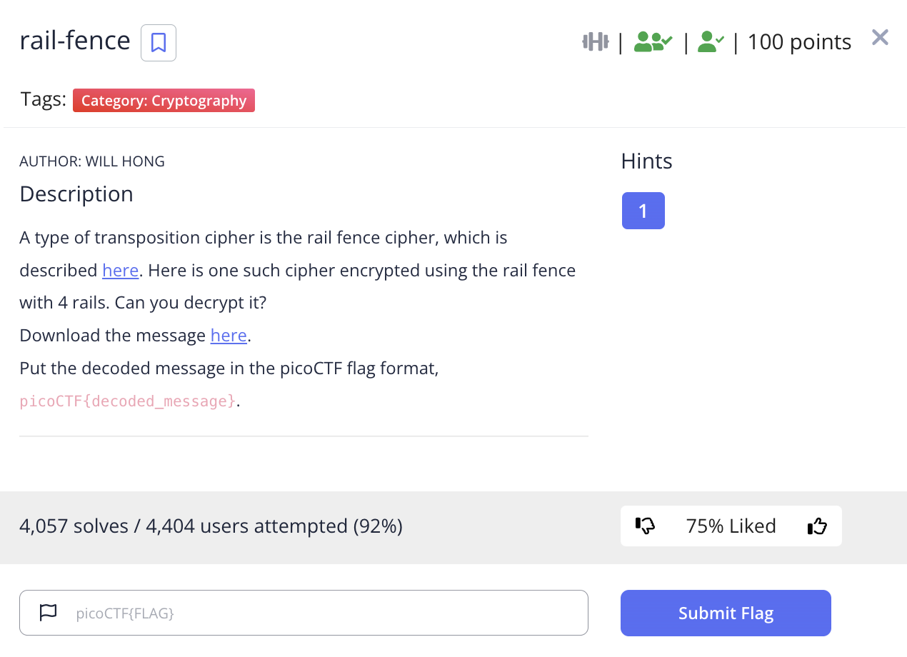
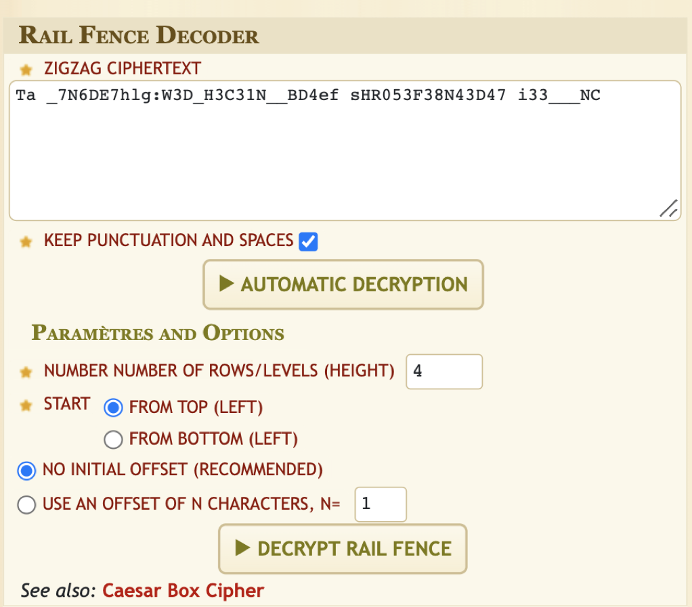
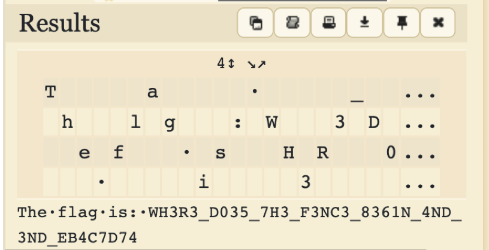

# picoCTF 2022 rail-fence (Cryptography 100 points)
The challenge is the following,

 

We are also given the file [message.txt](./files/message.txt) which contains,

```
Ta _7N6DE7hlg:W3D_H3C31N__BD4ef sHR053F38N43D47 i33___NC
```

The challenge tells us that this was encrypted using the rail fence with 4 rails, so I went to [Dcode.fr Rail Fence Cipher](https://www.dcode.fr/rail-fence-cipher) and decrypted it using 4 rails.


 

Decoding this gave me,

 

`The·flag·is:·WH3R3_D035_7H3_F3NC3_8361N_4ND_3ND_EB4C7D74`

Therefore, the flag is,
 
 `picoCTF{WH3R3_D035_7H3_F3NC3_8361N_4ND_3ND_EB4C7D74}`
