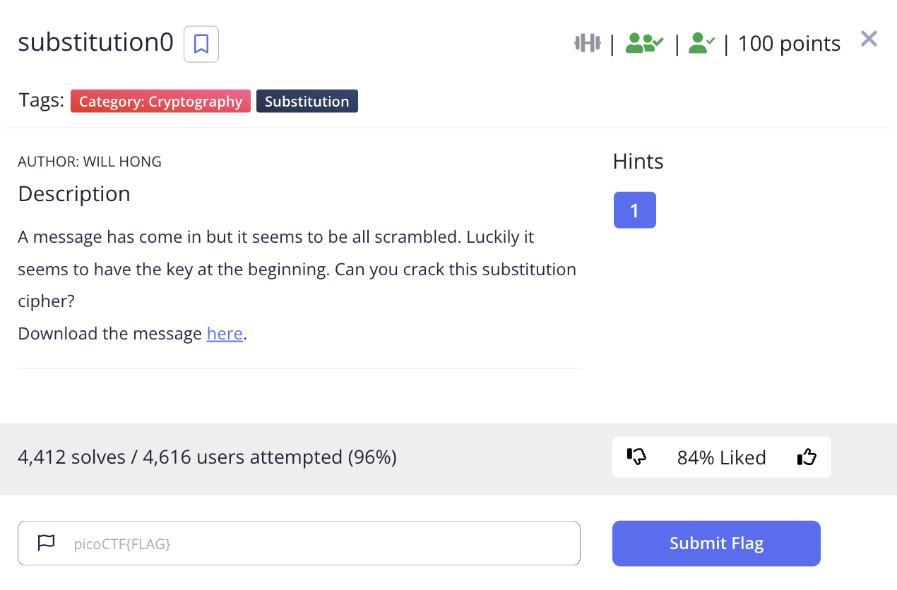

# picoCTF 2022 substitution0 (Cryptography 100 points)
The challenge is the following,

 

We are also given the file [message.txt](./files/message.txt) which contains,

```
UHQKRNWLFIYJBTODCZVAXEGSMP 

Lrzrxdot Jrwzutk uzovr, gfal u wzuer utk vauarjm ufz, utk hzoxwla br alr hrrajr
nzob u wjuvv quvr ft glfql fa guv rtqjovrk. Fa guv u hruxafnxj vquzuhurxv, utk, ua
alua afbr, xtytogt ao tuaxzujfvav—on qoxzvr u wzrua dzfpr ft u vqfrtafnfq dofta
on efrg. Alrzr grzr ago zoxtk hjuqy vdoav truz otr rsazrbfam on alr huqy, utk u
jotw otr truz alr oalrz. Alr vqujrv grzr rsqrrkftwjm luzk utk wjovvm, gfal ujj alr
uddruzutqr on hxztfvlrk wojk. Alr grfwla on alr ftvrqa guv erzm zrbuzyuhjr, utk,
auyftw ujj alftwv ftao qotvfkrzuafot, F qoxjk luzkjm hjubr Ixdfarz noz lfv odftfot
zrvdrqaftw fa.

Alr njuw fv: dfqoQAN{5XH5717X710T_3E0JX710T_7H755H1U}
```

I saw the `UHQKRNWLFIYJBTODCZVAXEGSMP`, and assumed that this maps to `ABCDEFGHIJKLMNOPQRSTUVWXYZ`, so I substituted these captial letters using [CyberChef](https://gchq.github.io/CyberChef/).

```
ABCDEFGHIJKLMNOPQRSTUVWXYZ 

Hrzrxdot Lrwzutk uzovr, gfal u wzuer utk vauarjm ufz, utk hzoxwla br alr hrrajr
nzob u wjuvv quvr ft glfql fa guv rtqjovrk. Ia guv u hruxafnxj vquzuhurxv, utk, ua
alua afbr, xtytogt ao tuaxzujfvav—on qoxzvr u wzrua dzfpr ft u vqfrtafnfq dofta
on efrg. Tlrzr grzr ago zoxtk hjuqy vdoav truz otr rsazrbfam on alr huqy, utk u
jotw otr truz alr oalrz. Tlr vqujrv grzr rsqrrkftwjm luzk utk wjovvm, gfal ujj alr
uddruzutqr on hxztfvlrk wojk. Tlr grfwla on alr ftvrqa guv erzm zrbuzyuhjr, utk,
auyftw ujj alftwv ftao qotvfkrzuafot, I qoxjk luzkjm hjubr Jxdfarz noz lfv odftfot
zrvdrqaftw fa.

Tlr njuw fv: dfqoCTF{5UB5717U710N_3V0LU710N_7B755B1A}
```

So I substituted the lower case too, so the substitution letter set was,

`UHQKRNWLFIYJBTODCZVAXEGSMPuhqkrnwlfiyjbtodczvaxegsmp`

`ABCDEFGHIJKLMNOPQRSTUVWXYZabcdefghijklmnopqrstuvwxyz`

The substituted message looked like the following,

```
ABCDEFGHIJKLMNOPQRSTUVWXYZ 

Hereupon Legrand arose, with a grave and stately air, and brought me the beetle
from a glass case in which it was enclosed. It was a beautiful scarabaeus, and, at
that time, unknown to naturalists—of course a great prize in a scientific point
of view. There were two round black spots near one extremity of the back, and a
long one near the other. The scales were exceedingly hard and glossy, with all the
appearance of burnished gold. The weight of the insect was very remarkable, and,
taking all things into consideration, I could hardly blame Jupiter for his opinion
respecting it.

The flag is: picoCTF{5UB5717U710N_3V0LU710N_7B755B1A}
```
Therefore, the flag is,

`picoCTF{5UB5717U710N_3V0LU710N_7B755B1A}`
