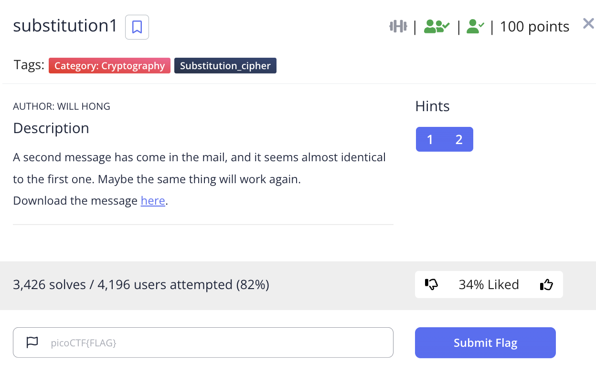

# picoCTF 2022 substitution1 (Cryptography 100 points)
The challenge is the following,

 

We are also given the file [message.txt](./files/message.txt) which contains,

```
PZKh (hbutz kut pfszatx zbx kcfd) ftx f zjsx uk puqsazxt hxpatnzj puqsxznznul. Pulzxhzflzh ftx stxhxlzxi gnzb f hxz uk pbfccxldxh gbnpb zxhz zbxnt 
ptxfznynzj, zxpblnpfc (fli duudcnld) hencch, fli stuvcxq-hucynld fvncnzj. Pbfccxldxh ahafccj puyxt f laqvxt uk pfzxdutnxh, fli gbxl hucyxi, xfpb jnxcih 
f hztnld (pfccxi f kcfd) gbnpb nh havqnzzxi zu fl ulcnlx hputnld hxtynpx. PZKh ftx f dtxfz gfj zu cxftl f gnix fttfj uk puqsazxt hxpatnzj hencch nl f 
hfkx, cxdfc xlyntulqxlz, fli ftx buhzxi fli scfjxi vj qflj hxpatnzj dtuash ftuali zbx gutci kut kal fli stfpznpx. Kut zbnh stuvcxq, zbx kcfd nh: 
snpuPZK{KT3WA3LPJ_4774PE5_4T3_P001_X57444FP}
```

I know the flag format is `picoCTF{xxx}`, so I knew I had to replace  `snpuPZK` with `picoCTF`. The lowercase/uppercase of the letter must be replaced, so I used the following character set map.

`snpuPZKSNPUpzk`

`picoCTFPICOctf`

Which gave me,


```
CTFh (hbott fot cfptatx tbx fcfd) ftx f tjpx of coqpatxt hxcatitj coqpxtitiol. Coltxhtflth ftx ptxhxltxi gitb f hxt of cbfccxldxh gbicb txht tbxit 
ctxftiyitj, txcblicfc (fli doodcild) heicch, fli ptovcxq-hocyild fvicitj. Cbfccxldxh ahafccj coyxt f laqvxt of cftxdotixh, fli gbxl hocyxi, xfcb jixcih 
f httild (cfccxi f fcfd) gbicb ih havqittxi to fl olcilx hcotild hxtyicx. CTFh ftx f dtxft gfj to cxftl f giix fttfj of coqpatxt hxcatitj heicch il f 
hffx, cxdfc xlyitolqxlt, fli ftx bohtxi fli pcfjxi vj qflj hxcatitj dtoaph ftoali tbx gotci fot fal fli ptfcticx. Fot tbih ptovcxq, tbx fcfd ih: 
picoCTF{FT3WA3LCJ_4774CE5_4T3_C001_X57444FC}
```

From this point onwards, I used a [similar method to challenge in another CTF I did, and the details can be found here.](https://github.com/LambdaMamba/CTFwriteups/tree/main/UTCTF_2022/cryptography/scrambled) I looked for words like `fot`, `tbih` and assumed they were `for`, `this` respectively. So I used the following character set map,

`snpuPZKSNPUpzktbh`

`picoCTFPICOctfrhs`

Which gave me,

```
CTFs (short for cfptarx thx fcfd) frx f tjpx of coqpatxr sxcaritj coqpxtitiol. Coltxstflts frx prxsxltxi gith f sxt of chfccxldxs ghich txst thxir 
crxftiyitj, txchlicfc (fli doodcild) seiccs, fli provcxq-socyild fvicitj. Chfccxldxs asafccj coyxr f laqvxr of cftxdorixs, fli ghxl socyxi, xfch jixcis 
f strild (cfccxi f fcfd) ghich is savqittxi to fl olcilx scorild sxryicx. CTFs frx f drxft gfj to cxfrl f giix frrfj of coqpatxr sxcaritj seiccs il f 
sffx, cxdfc xlyirolqxlt, fli frx hostxi fli pcfjxi vj qflj sxcaritj droaps froali thx gorci for fal fli prfcticx. For this provcxq, thx fcfd is: 
picoCTF{FT3WA3LCJ_4774CE5_4T3_C001_X57444FC}
```

From assuming words, I got,

```
CTFs (short for capture the flag) are a tjpe of computer securitj competitiol. Coltestalts are preseltei gith a set of challelges ghich test their 
creatiyitj, techlical (ali googlilg) seills, ali problem-solyilg abilitj. Challelges usuallj coyer a lumber of categories, ali ghel solyei, each jielis 
a strilg (callei a flag) ghich is submittei to al ollile scorilg seryice. CTFs are a great gaj to learl a giie arraj of computer securitj seills il a 
safe, legal elyirolmelt, ali are hostei ali plajei bj malj securitj groups arouli the gorli for ful ali practice. For this problem, the flag is: 
picoCTF{FT3WA3LCJ_4774CE5_4T3_C001_X57444FC}
```

The text started to make more sense, and at this point, I was using

`snpuPZKSNPUpzktbhvcxqfadjligye`

`picoCTFPICOctfrhsblemaugyndwvk`

Which gave,

```
CTFs (short for capture the flag) are a type of computer security competition. Contestants are presented with a set of challenges which test their 
creativity, technical (and googling) skills, and problem-solving ability. Challenges usually cover a number of categories, and when solved, each yields 
a string (called a flag) which is submitted to an online scoring service. CTFs are a great way to learn a wide array of computer security skills in a 
safe, legal environment, and are hosted and played by many security groups around the world for fun and practice. For this problem, the flag is: 
picoCTF{FT3WA3LCJ_4774CE5_4T3_C001_X57444FC}
```

Now, I just had to replace the capital letters, 

`snpuPZKSNPUpzktbhvcxqfadjligyeTBHVCXQFADJLIGYEW`

`picoCTFPICOctfrhsblemaugyndwvkRHSBLEMAUGYNDWVKQ`

Which gave,

```
CTFs (short for capture the flag) are a type of computer security competition. Contestants are presented with a set of challenges which test their 
creativity, technical (and googling) skills, and problem-solving ability. Challenges usually cover a number of categories, and when solved, each yields 
a string (called a flag) which is submitted to an online scoring service. CTFs are a great way to learn a wide array of computer security skills in a 
safe, legal environment, and are hosted and played by many security groups around the world for fun and practice. For this problem, the flag is: 
picoCTF{FR3QU3NCY_4774CK5_4R3_C001_E57444AC}
```

Therefore, the flag is,

`picoCTF{FR3QU3NCY_4774CK5_4R3_C001_E57444AC}`
