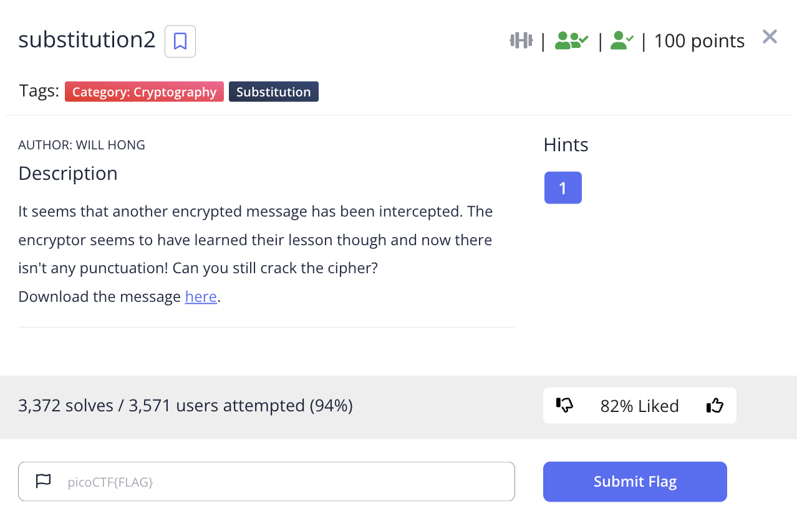
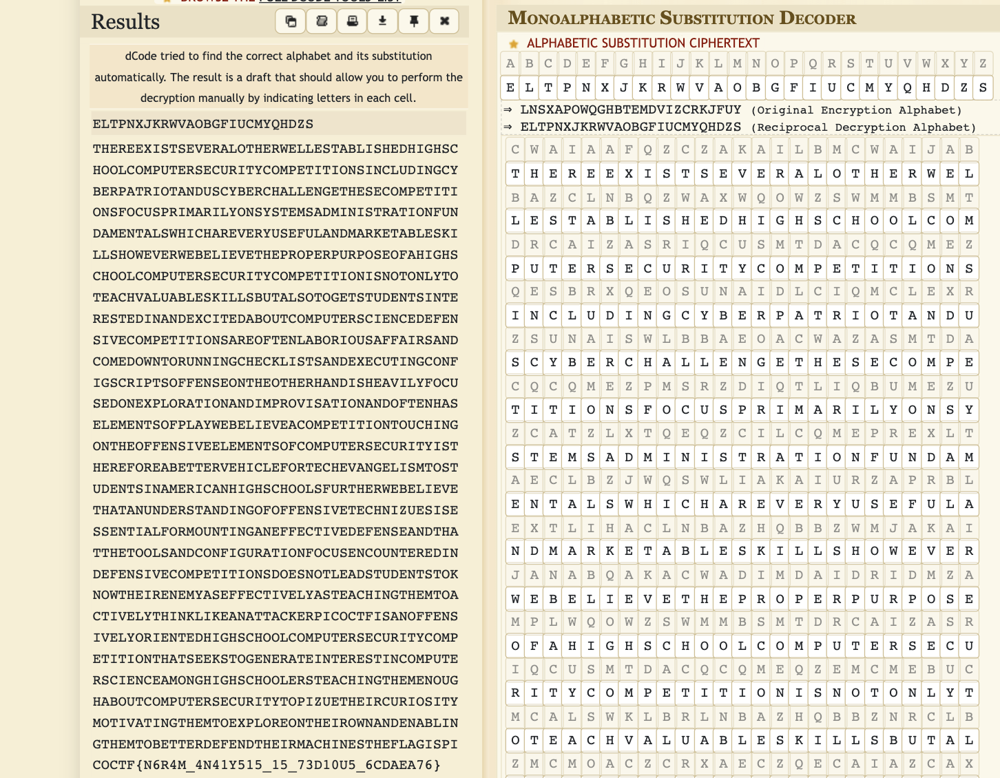

# picoCTF 2022 substitution2 (Cryptography 100 points)
The challenge is the following,

 

We are also given the file [message.txt](./files/message.txt) which contains,

```
cwaiaafqzczakailbmcwaijabbazclnbqzwaxwqowzswmmbsmtdrcaizasriqcusmtdacqcqmezqesbrxqeosunaidlciqmclexrzsunaiswlbbaeoacwazasmtdacqcqmezpmsrzdiqtliqbumezuzca
tzlxtqeqzcilcqmeprexltaeclbzjwqswliakaiurzaprblextlihaclnbazhqbbzwmjakaijanabqakacwadimdaidridmzamplwqowzswmmbsmtdrcaizasriqcusmtdacqcqmeqzemcmebucmcalsw
klbrlnbazhqbbznrclbzmcmoaczcrxaeczqecaiazcaxqelexafsqcaxlnmrcsmtdrcaizsqaesaxapaezqkasmtdacqcqmezliampcaeblnmiqmrzlpplqizlexsmtaxmjecmireeqeoswashbqzczle
xafasrcqeosmepqozsiqdczmppaezamecwamcwaiwlexqzwalkqbupmsrzaxmeafdbmilcqmelexqtdimkqzlcqmelexmpcaewlzabataeczmpdblujanabqakalsmtdacqcqmecmrswqeomecwamppae
zqkaabataeczmpsmtdrcaizasriqcuqzcwaiapmialnaccaikawqsbapmicaswakleoabqztcmzcrxaeczqeltaiqslewqowzswmmbzpricwaijanabqakacwlclerexaizclexqeompmppaezqkacasw
eqyrazqzazzaecqlbpmitmrecqeoleappascqkaxapaezalexcwlccwacmmbzlexsmepqorilcqmepmsrzaesmrecaiaxqexapaezqkasmtdacqcqmezxmazemcbalxzcrxaeczcmhemjcwaqiaeatulz
appascqkabulzcalswqeocwatcmlscqkabucwqehbqhalelcclshaidqsmscpqzlemppaezqkabumiqaecaxwqowzswmmbsmtdrcaizasriqcusmtdacqcqmecwlczaahzcmoaeailcaqecaiazcqesmt
drcaizsqaesaltmeowqowzswmmbaizcalswqeocwataemrowlnmrcsmtdrcaizasriqcucmdqyracwaqisriqmzqcutmcqklcqeocwatcmafdbmiamecwaqimjelexaelnbqeocwatcmnaccaixapaexc
waqitlswqeazcwapbloqzdqsmSCP{E6I4T_4E41U515_15_73X10R5_6SXLAL76}
```

This time, it did not have spaces so guessing the words would be more difficult. I already did manual substitution in [substitution0](https://github.com/LambdaMamba/CTFwriteups/tree/main/picoCTF_2022/Cryptography/substitution0) and [substitution1](https://github.com/LambdaMamba/CTFwriteups/tree/main/picoCTF_2022/Cryptography/substitution1) so this time I decided to use an [Automatic Monoalphabetic substitution decoder](https://www.dcode.fr/monoalphabetic-substitution), which gave me,


 

This actually already gives the flag, but I wanted to differentiate between the lowercase and uppcase so decided to do manual substitution from here.

From the automatic substitution, it showed that it uses a character map set of,

`abcdefghijklmnopqrstuvwxyz`

`eltpnxjkrwvaobgfiucmyqhdzs`

Manual substitution gave me,

```
thereexistseveralotherwellestablishedhighschoolcomputersecuritycompetitionsincludingcyberpatriotanduscyberchallengethesecompetitionsfocusprimarilyonsyste
msadministrationfundamentalswhichareveryusefulandmarketableskillshoweverwebelievetheproperpurposeofahighschoolcomputersecuritycompetitionisnotonlytoteach
valuableskillsbutalsotogetstudentsinterestedinandexcitedaboutcomputersciencedefensivecompetitionsareoftenlaboriousaffairsandcomedowntorunningchecklistsan
dexecutingconfigscriptsoffenseontheotherhandisheavilyfocusedonexplorationandimprovisationandoftenhaselementsofplaywebelieveacompetitiontouchingontheoffen
siveelementsofcomputersecurityisthereforeabettervehiclefortechevangelismtostudentsinamericanhighschoolsfurtherwebelievethatanunderstandingofoffensivetech
nizuesisessentialformountinganeffectivedefenseandthatthetoolsandconfigurationfocusencounteredindefensivecompetitionsdoesnotleadstudentstoknowtheirenemyas
effectivelyasteachingthemtoactivelythinklikeanattackerpicoctfisanoffensivelyorientedhighschoolcomputersecuritycompetitionthatseekstogenerateinterestincom
puterscienceamonghighschoolersteachingthemenoughaboutcomputersecuritytopizuetheircuriositymotivatingthemtoexploreontheirownandenablingthemtobetterdefendt
heirmachinestheflagispicoSCP{E6I4T_4E41U515_15_73X10R5_6SXLAL76}
```


Now I just needed to substitute the uppercases, 

`abcdefghijklmnopqrstuvwxyzABCDEFGHIJKLMNOPQRSTUVWXYZ`

`eltpnxjkrwvaobgfiucmyqhdzsELTPNXJKRWVAOBGFIUCMYQHDZS`

Which gave me,

```
thereexistseveralotherwellestablishedhighschoolcomputersecuritycompetitionsincludingcyberpatriotanduscyberchallengethesecompetitionsfocusprimarilyonsyste
msadministrationfundamentalswhichareveryusefulandmarketableskillshoweverwebelievetheproperpurposeofahighschoolcomputersecuritycompetitionisnotonlytoteach
valuableskillsbutalsotogetstudentsinterestedinandexcitedaboutcomputersciencedefensivecompetitionsareoftenlaboriousaffairsandcomedowntorunningchecklistsan
dexecutingconfigscriptsoffenseontheotherhandisheavilyfocusedonexplorationandimprovisationandoftenhaselementsofplaywebelieveacompetitiontouchingontheoffen
siveelementsofcomputersecurityisthereforeabettervehiclefortechevangelismtostudentsinamericanhighschoolsfurtherwebelievethatanunderstandingofoffensivetech
nizuesisessentialformountinganeffectivedefenseandthatthetoolsandconfigurationfocusencounteredindefensivecompetitionsdoesnotleadstudentstoknowtheirenemyas
effectivelyasteachingthemtoactivelythinklikeanattackerpicoctfisanoffensivelyorientedhighschoolcomputersecuritycompetitionthatseekstogenerateinterestincom
puterscienceamonghighschoolersteachingthemenoughaboutcomputersecuritytopizuetheircuriositymotivatingthemtoexploreontheirownandenablingthemtobetterdefendt
heirmachinestheflagispicoCTF{N6R4M_4N41Y515_15_73D10U5_6CDAEA76}
```

Therefore, the flag is,

`picoCTF{N6R4M_4N41Y515_15_73D10U5_6CDAEA76}`

