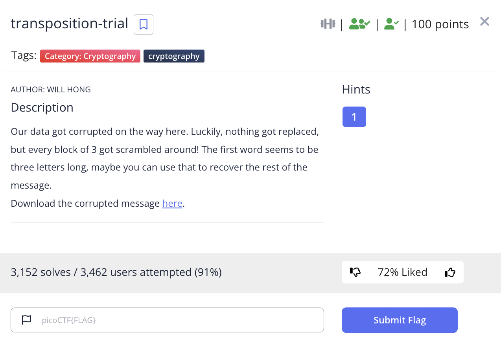
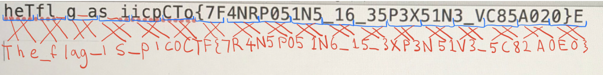

# picoCTF 2022 transposition-trial (Cryptography 100 points)
The challenge is the following,

 

We are also given the file [message.txt](./files/message.txt) which contains,

```
heTfl g as iicpCTo{7F4NRP051N5_16_35P3X51N3_VC85A020}E
```
It tells us that every block of 3 got scrambled, so I rearranged each block of 3 by hand,

 

Therefore, the flag is,

`picoCTF{7R4N5P051N6_15_3XP3N51V3_5C82A0E0}`


