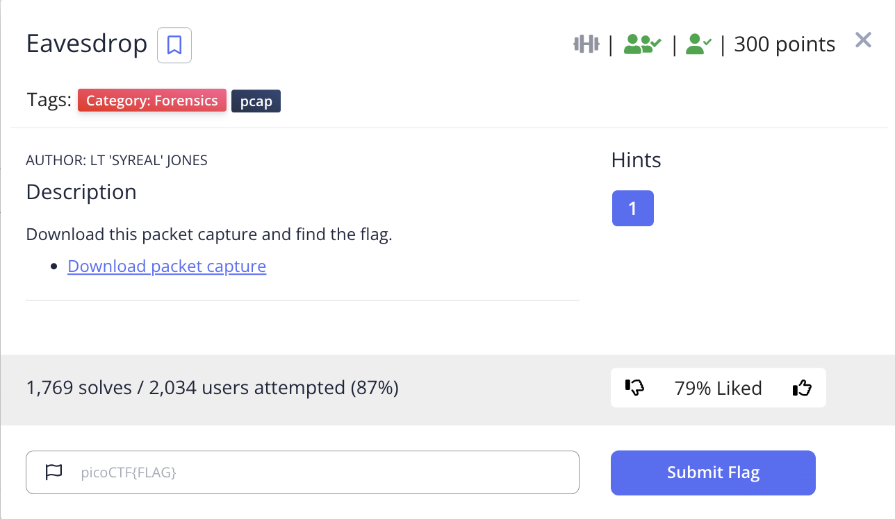
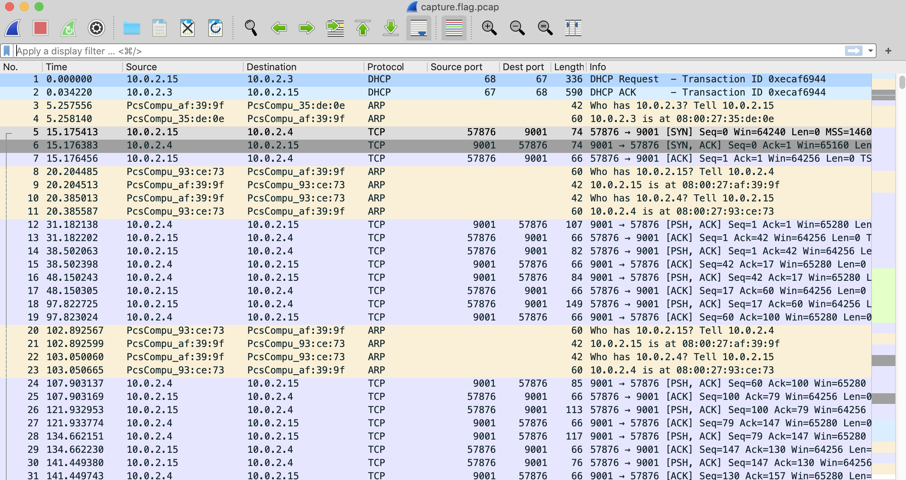
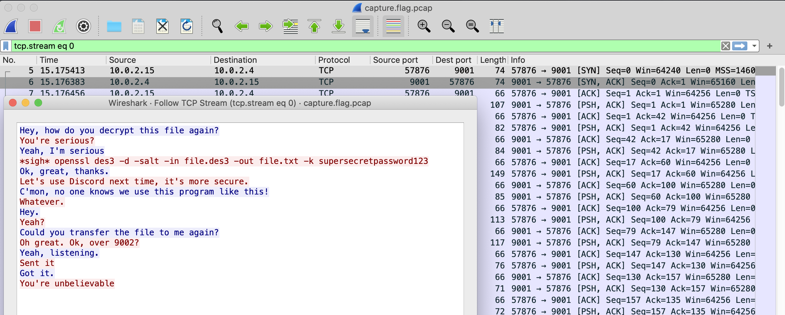
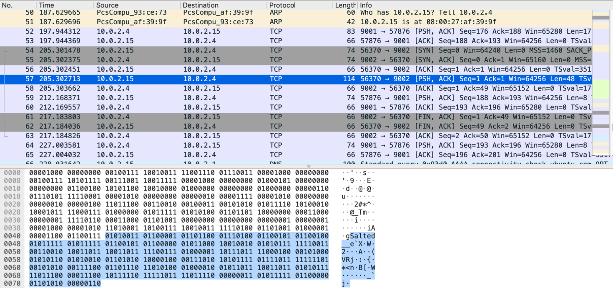
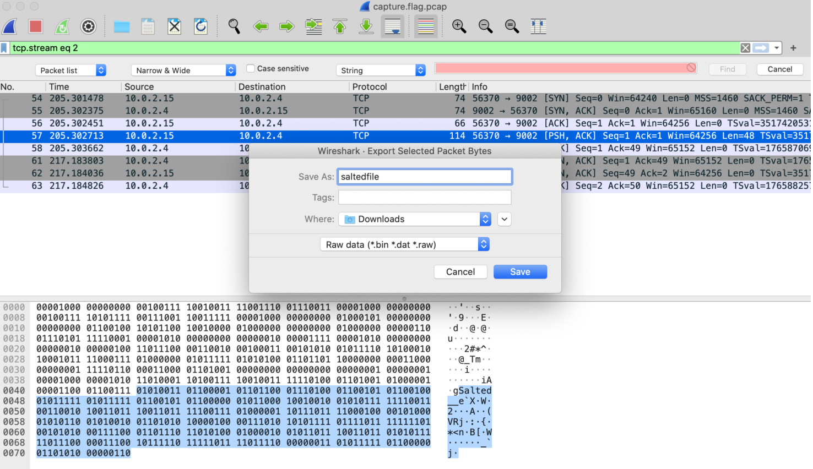
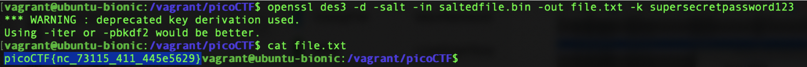

# picoCTF 2022 Eavesdrop (Forensics 300 points)
The challenge is the following,

 

We are also given the file [capture.flag.pcap](./capture.flag.pcap). Opening this up on Wireshark showed the following,

 

I did `Follow TCP stream`, which revealed a conversation between two people.

 

It seemed like these two people had been exchanging files, and one person forgot how to decrypt it, so the other person tells them to decrypt it using,

`openssl des3 -d -salt -in file.des3 -out file.txt -k supersecretpassword123`

I looked through the packets, and found the file that started with `Salted` in packet 57. I knew this was the file I was looking for, because OpenSSL with des3 salt will generate an encrypted file that starts with `Salted`. 

 

So I exported the packet as `saltedfile.bin` using `File > Export Packet Bytes`

 

I decrypted it using what was mentioned in the conversation,

`openssl des3 -d -salt -in saltedfile.bin -out file.txt -k supersecretpassword123`

After decryption succeeded, I was left with `file.txt` that contained the flag.

 

Therefore, the flag is,

`picoCTF{nc_73115_411_445e5629}`

