# picoCTF 2022 File types (Forensics 100 points)
The challenge is the following,

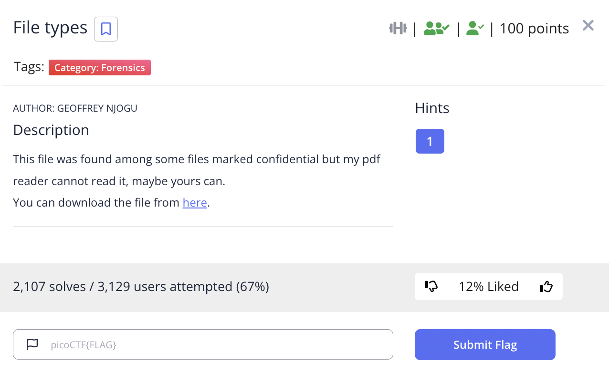 

We are also given the file [Flag.pdf](./files/Flag.pdf). I tried to open this up in my PDF reader, but it said that it cannot be opened.

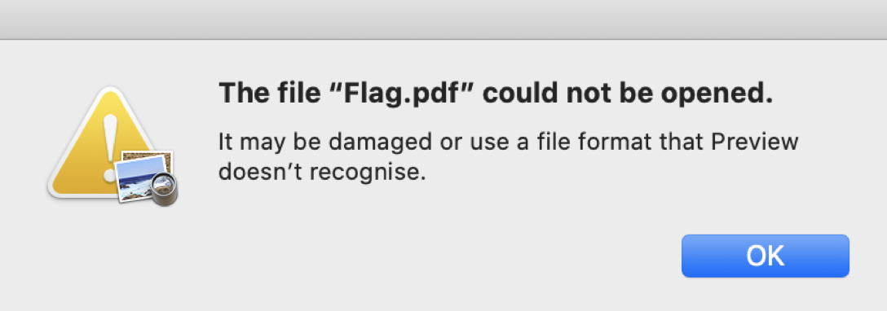 


So I checked the file type using,

`$ file Flag.pdf`

And this revealed that it was a `shell archive text`

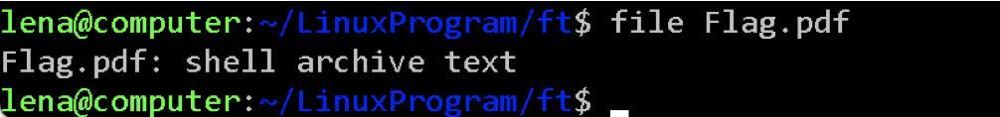 

The contents inside were,

```
#!/bin/sh
# This is a shell archive (produced by GNU sharutils 4.15.2).
# To extract the files from this archive, save it to some FILE, remove
# everything before the '#!/bin/sh' line above, then type 'sh FILE'.
#
lock_dir=_sh00048
# Made on 2022-03-15 06:50 UTC by <root@ffe9b79d238c>.
# Source directory was '/app'.
#
# Existing files will *not* be overwritten, unless '-c' is specified.
#
# This shar contains:
# length mode       name
# ------ ---------- ------------------------------------------
#   1092 -rw-r--r-- flag
#
MD5SUM=${MD5SUM-md5sum}
f=`${MD5SUM} --version | egrep '^md5sum .*(core|text)utils'`
test -n "${f}" && md5check=true || md5check=false
${md5check} || \
  echo 'Note: not verifying md5sums.  Consider installing GNU coreutils.'
if test "X$1" = "X-c"
then keep_file=''
else keep_file=true
fi
echo=echo
save_IFS="${IFS}"
IFS="${IFS}:"
gettext_dir=
locale_dir=
set_echo=false

for dir in $PATH
do
  if test -f $dir/gettext \
     && ($dir/gettext --version >/dev/null 2>&1)
  then
    case `$dir/gettext --version 2>&1 | sed 1q` in
      *GNU*) gettext_dir=$dir
      set_echo=true
      break ;;
    esac
  fi
done

if ${set_echo}
then
  set_echo=false
  for dir in $PATH
  do
    if test -f $dir/shar \
       && ($dir/shar --print-text-domain-dir >/dev/null 2>&1)
    then
      locale_dir=`$dir/shar --print-text-domain-dir`
      set_echo=true
      break
    fi
  done

  if ${set_echo}
  then
    TEXTDOMAINDIR=$locale_dir
    export TEXTDOMAINDIR
    TEXTDOMAIN=sharutils
    export TEXTDOMAIN
    echo="$gettext_dir/gettext -s"
  fi
fi
IFS="$save_IFS"
if (echo "testing\c"; echo 1,2,3) | grep c >/dev/null
then if (echo -n test; echo 1,2,3) | grep n >/dev/null
     then shar_n= shar_c='
'
     else shar_n=-n shar_c= ; fi
else shar_n= shar_c='\c' ; fi
f=shar-touch.$$
st1=200112312359.59
st2=123123592001.59
st2tr=123123592001.5 # old SysV 14-char limit
st3=1231235901

if   touch -am -t ${st1} ${f} >/dev/null 2>&1 && \
     test ! -f ${st1} && test -f ${f}; then
  shar_touch='touch -am -t $1$2$3$4$5$6.$7 "$8"'

elif touch -am ${st2} ${f} >/dev/null 2>&1 && \
     test ! -f ${st2} && test ! -f ${st2tr} && test -f ${f}; then
  shar_touch='touch -am $3$4$5$6$1$2.$7 "$8"'

elif touch -am ${st3} ${f} >/dev/null 2>&1 && \
     test ! -f ${st3} && test -f ${f}; then
  shar_touch='touch -am $3$4$5$6$2 "$8"'

else
  shar_touch=:
  echo
  ${echo} 'WARNING: not restoring timestamps.  Consider getting and
installing GNU '\''touch'\'', distributed in GNU coreutils...'
  echo
fi
rm -f ${st1} ${st2} ${st2tr} ${st3} ${f}
#
if test ! -d ${lock_dir} ; then :
else ${echo} "lock directory ${lock_dir} exists"
     exit 1
fi
if mkdir ${lock_dir}
then ${echo} "x - created lock directory ${lock_dir}."
else ${echo} "x - failed to create lock directory ${lock_dir}."
     exit 1
fi
# ============= flag ==============
if test -n "${keep_file}" && test -f 'flag'
then
${echo} "x - SKIPPING flag (file already exists)"

else
${echo} "x - extracting flag (text)"
  sed 's/^X//' << 'SHAR_EOF' | uudecode &&
begin 600 flag
M(3QA<F-H/@IF;&%G+R`@("`@("`@("`@,"`@("`@("`@("`@,"`@("`@,"`@
M("`@-C0T("`@("`Q,#(T("`@("`@8`K'<6D`)KRD@0`````!````,&)$-P4`
M``#\`69L86<``$)::#DQ05DF4UF)`)#/```E___[?]^QG];K^__EPW7_K?]K
MR^OIUNY_^^3__(Y?_\=GM3`!&U8(!D#0:/4``````T`:`!ZF@```&GJ#(`!Z
M0`#(/4::#T@8RCTF@>33U1`&F@Q`T#1D&@9&@TTT&C(&30!Z30&@R:-&(TPF
MC$R-J#0&$,0>D`:::``T`53U-1H``/4#33U``--`#R@]30T`T&@`T-#3U&@#
M$]0``T`#0-&@`#33$-`"`(`!IFX0%$'>=+$A\#.&I40R`'VYC>1:(E,*]\(N
M&BGDKO2X!L:.03&MTW`4?.<8(]E4^+TO1G_XNWE81>^<$IH`#?.>TVA>/FPA
MU9RVP</7\$0:081U`?'(\']7N#&U7?2=C!,S)6)_66H1$_%^#R#-`P**+(HQ
M3.IA'+51?)3G!=:!,4MM4+8+!)-`:C;`92&>ONSRN]Z%`GWPQC#7O/MV)YZ=
M4#0;KG6KOAA^.NURH^D[%4D"M%0M&I#+%4&J!(,3;/_)XZ&]^Q#[Q.':.0E*
M?VA'QCIAD^+7#>15$D098CQ8K.6I+_D:4DB(V`9ZM9JAGE/<0M70!PP=>%?L
M$Q,L-<YP$7B:0O`%,?"O'F42&HLUI2XPQ@Y,C=/]MN^MA*I"='%M6)=`6@)&
M-D0'Y4UL93^^#\.?XNY(IPH2$2`2&>#'<0`````````````!``````````L`
M`````%1204E,15(A(2$`````````````````````````````````````````
M````````````````````````````````````````````````````````````
M````````````````````````````````````````````````````````````
M````````````````````````````````````````````````````````````
M````````````````````````````````````````````````````````````
M````````````````````````````````````````````````````````````
M````````````````````````````````````````````````````````````
M````````````````````````````````````````````````````````````
M````````````````````````````````````````````````````````````
M````````````````````````````````````````````````````````````
,````````````````
`
end
SHAR_EOF
  (set 20 22 03 15 06 50 44 'flag'
   eval "${shar_touch}") && \
  chmod 0644 'flag'
if test $? -ne 0
then ${echo} "restore of flag failed"
fi
  if ${md5check}
  then (
       ${MD5SUM} -c >/dev/null 2>&1 || ${echo} 'flag': 'MD5 check failed'
       ) << \SHAR_EOF
eb0e2b4641ff5c18c9602a8528bccf5c  flag
SHAR_EOF

else
test `LC_ALL=C wc -c < 'flag'` -ne 1092 && \
  ${echo} "restoration warning:  size of 'flag' is not 1092"
  fi
fi
if rm -fr ${lock_dir}
then ${echo} "x - removed lock directory ${lock_dir}."
else ${echo} "x - failed to remove lock directory ${lock_dir}."
     exit 1
fi
exit 0
```

So I copied this file into a file with a .sh extension, 

`$ cp Flag.pdf Flag.sh`

And added the execution permission,

`$ chmod +x Flag.sh`

And executed this script,

`$ ./Flag.sh`

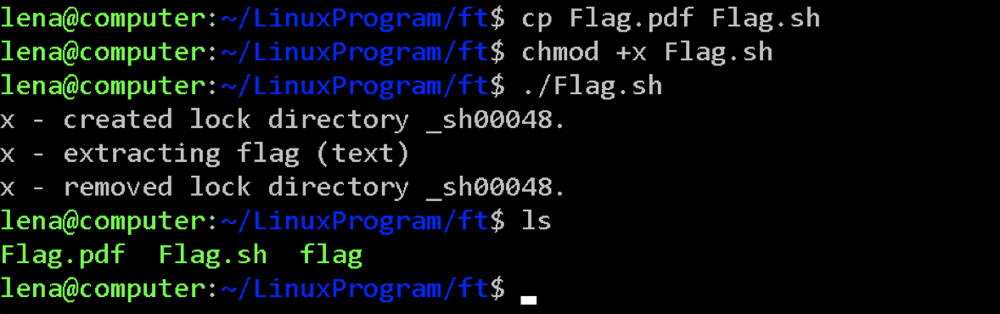 

After executing, a file called `flag` was generated, and checking the file type revealed that it was a `current ar archive`.


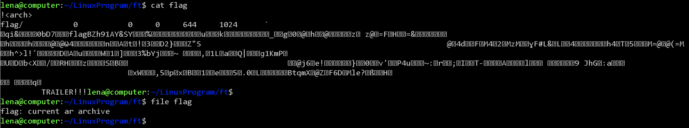 


Then I used the `binwalk` to extract the ar archive,

`$ binwalk -e flag`

Which created a new folder called `_flag.extracted`, and inside was a file called `64`.

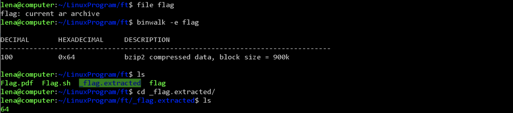 

I checked the file type of `64`, and revealed that it was a `gzip compressed data`

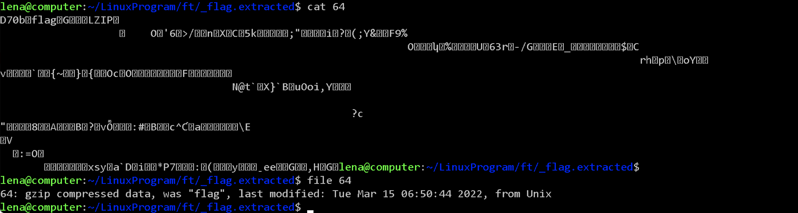 

I used `binwalk` to extract the gzip,

`$ binwalk -e 64`

The extracted folder contained a file called `flag`, 

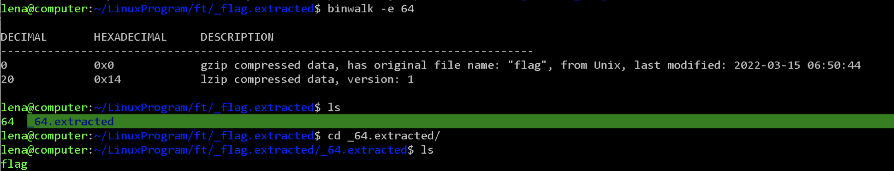 

I checked the file type of `flag`, and revealed that it was a `lzip compressed data`. Using `binwalk` did not extract it, so I extracted this using,

`$ lzip -d -k flag`

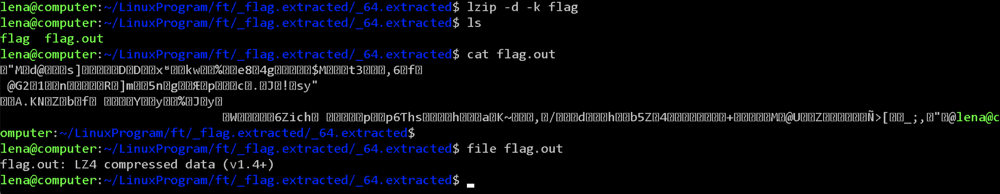 

This created a file called `flag.out`, and revealed that it was a `LZ4 compressed data`. So I extracted it using,

`$ lz4 -d flag.out flag2.out`

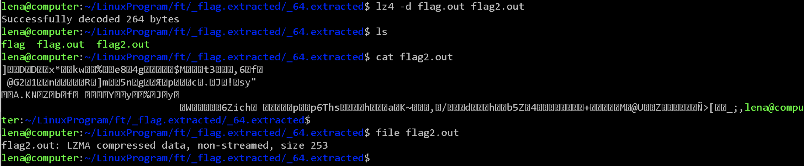 

This created a file called `flag2.out`, and revealed that it was a `LZMA compressed data`. So I extracted it using,

`$ lzma -d -k flag2.out`

However, there this returned `Filename has an unknown suffix, skipping`, so I renamed it to flag2.lzma and I extracted it using,

`$ lzma -d -k flag2.lzma`

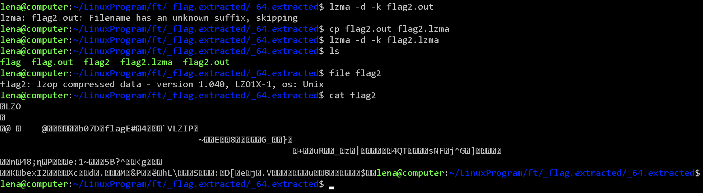 

This created a file called `flag2`, and revealed that it was a `LZOP compressed data`. Like last time, it gave `unknown suffix`, so I renamed it to `flag2.lzop`, and I extracted it using,

`$ lzop -d -k flag2.lzop -o flag3`

 

This created a file called `flag3`, and revealed that it was a `LZIP compressed data`. So I extracted it using,

`$ lzip -d -k flag3`

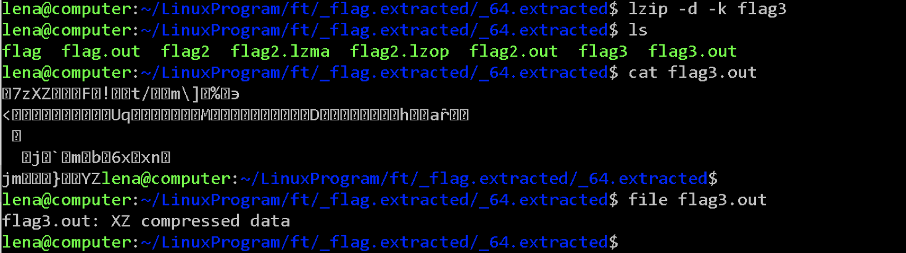 

This created a file called `flag3.out`, and revealed that it was a `XZ compressed data`. I renamed it to `flag4.xz` and I extracted it using,

`$ xz -d -k flag4.xz`

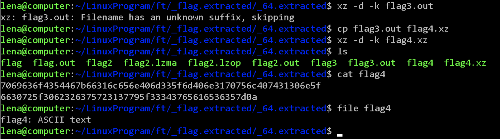 

This created a file called `flag4`, and revealed that it was a `ASCII text` and contained the following,

```
7069636f4354467b66316c656e406d335f6d406e3170756c407431306e5f
6630725f3062326375723137795f33343765616536357d0a
```

I went ahead to CyberChef and converted this from hex,

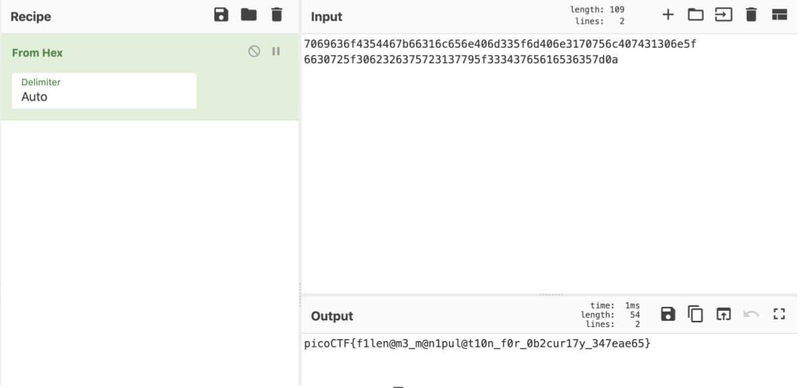 

Therefore, the flag is,

`picoCTF{f1len@m3_m@n1pul@t10n_f0r_0b2cur17y_347eae65}`


