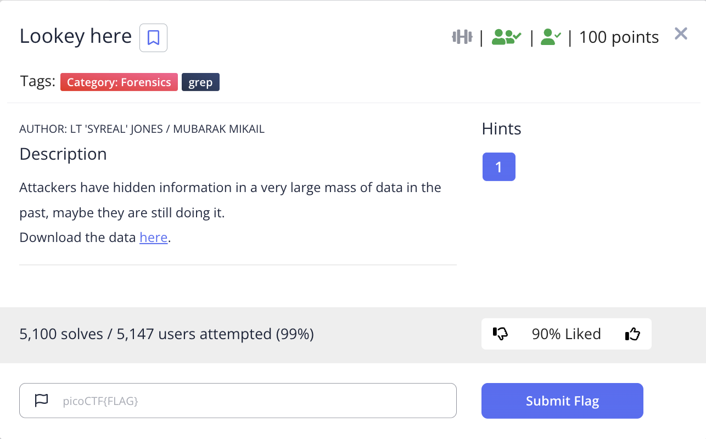
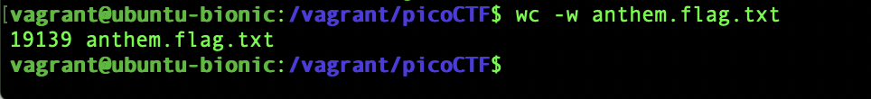

# picoCTF 2022 Lookey here (Forensics 100 points)
The challenge is the following,

 

We are also given the file [anthem.flag.txt](./files/anthem.flag.txt). 

I viewed the contents of the file, which contained a very long text.

 

I counted the words using,

`$ wc -w anthem.flag.txt `

Which showed that there was 19139 words.

 

I know the flag format is `picoCTF{xxx}`, so I decided to grep it using,

`$ cat anthem.flag.txt | grep "picoCTF"`

Which revealed the flag.

 

Therefore, the flag is, 

`picoCTF{gr3p_15_@w3s0m3_4554f5f5}`
