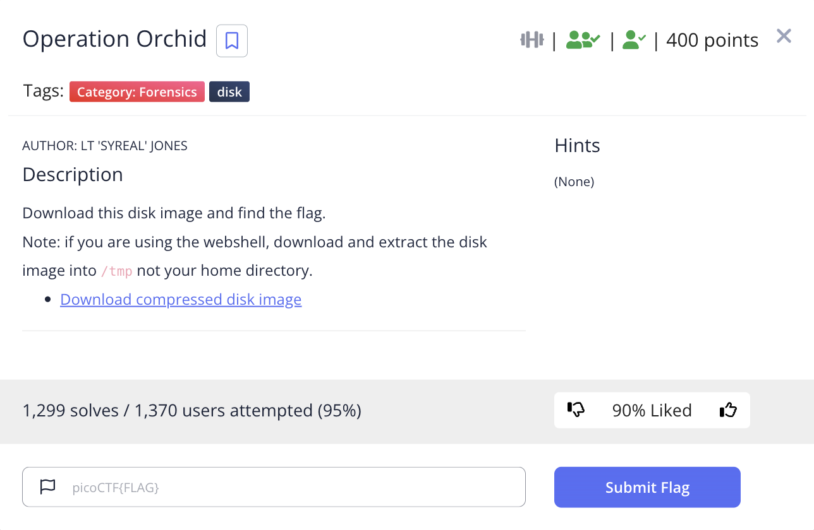

# picoCTF 2022 Operation Orchid (Forensics 400 points)
The challenge is the following,

 

We are also given the file [disk.flag.img.gz](./disk.flag.img.gz). I downloaded the file, extracted it. I did the operations in [Sleuthkit Apprentice](https://github.com/LambdaMamba/CTFwriteups/tree/main/picoCTF_2022/Forensics/Sleuthkit_Apprentice) to find the partition informations, and I decided to string search `flag.txt` using,

`$ strings -t d disk.flag.img | grep -iE "flag.txt"`

 


From this, I assumed that the flag was first written into `flag.txt`, encrypted and put into `flag.txt.enc` using OpenSSL aes256 with the salt option and a password with `unbreakablepassword1234567`, and `flag.txt` was shredded. 

As the OpenSSL with the salt option generates encrypted text that starts with `Salted`, so I decided to string search that using,

`strings -t d disk.flag.img | grep -iE "Salted"`

I also decided to find the full contents of the file that contained `Salted` using,

`$ expr 221247488 - 210763776`

`$ expr 10483712 / 1024`

`$ ifind -f ext4 -o 411648 -d 10238 disk.flag.img`

`$ icat -f ext4 -o 411648 disk.flag.img 1782`


 

It contained the encrypted file with the contents, 

```
Salted__???3[u
              :dmޠ
D-Z{z?+g?p?=?N???\??B?Ȥ7? ???؎$?'%
```

So I redirected the output to `flag.txt.enc` using,

`$ icat -f ext4 -o 411648 disk.flag.img 1782 > flag.txt.enc`

As it was encrypted using `openssl aes256 -salt -in flag.txt -out flag.txt.enc -k unbreakablepassword1234567`, I decrypted it using,

`$ openssl aes256 -d -salt -in flag.txt.enc -out flag.txt -k unbreakablepassword1234567`


 

Therefore, the flag is, 

`picoCTF{h4un71ng_p457_c512004e}`
