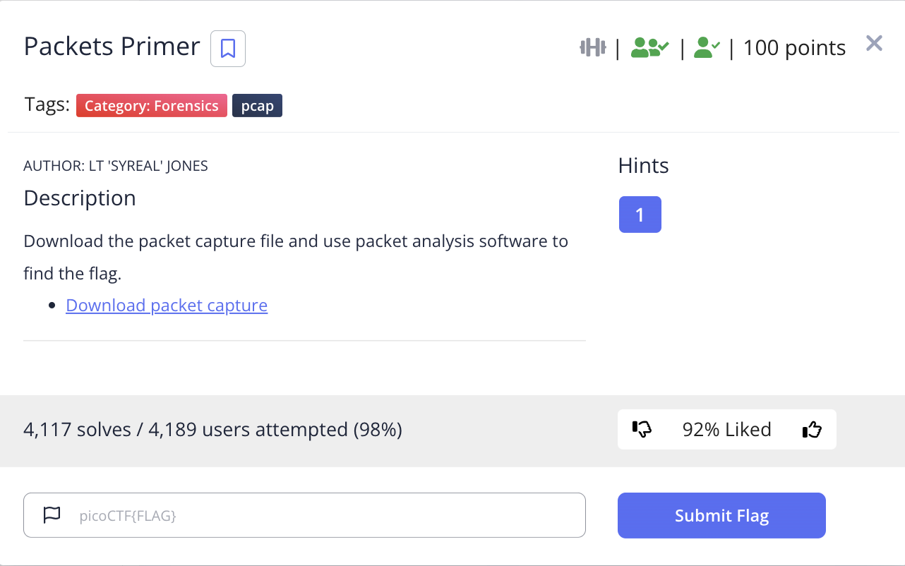
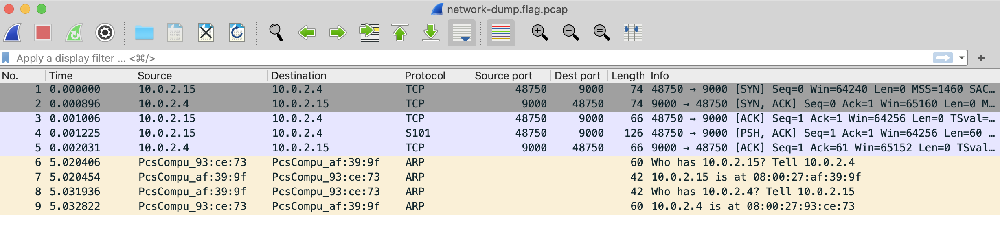
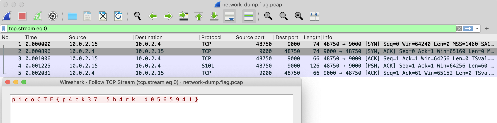

# picoCTF 2022 Packets Primer (Forensics 100 points)
The challenge is the following,

 

We are also given the file [network-dump.flag.pcap](./files/network-dump.flag.pcap). Opening this up on Wireshark showed the following,

 

I decided to `Follow TCP stream`, which revealed the flag

 

Therefore, the flag is,

`picoCTF{p4ck37_5h4rk_d0565941}`

