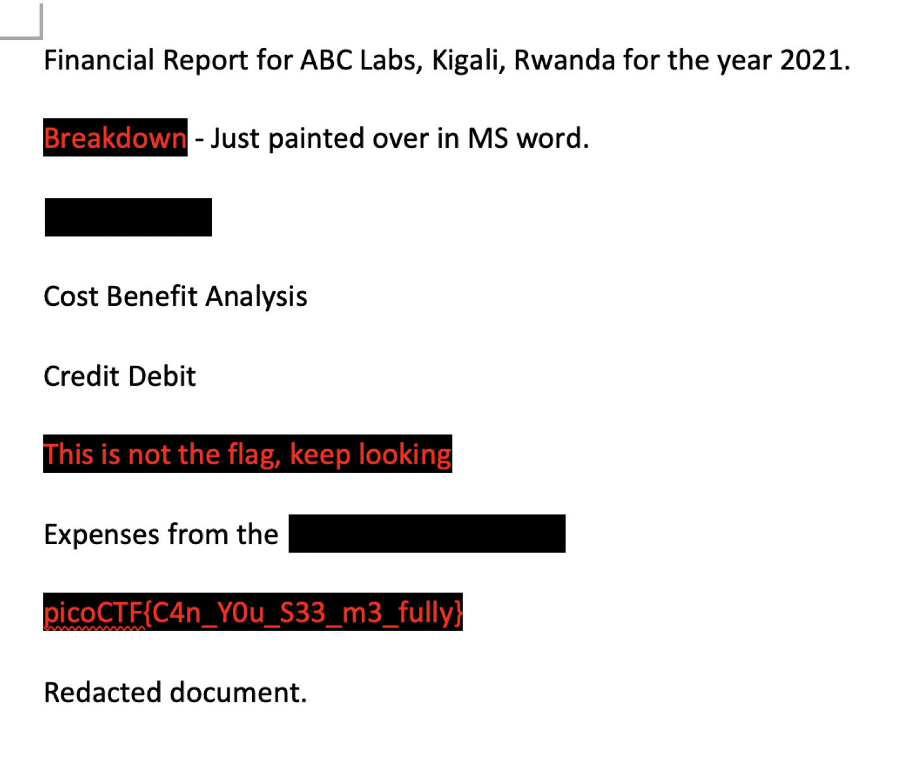

# picoCTF 2022 Redaction gone wrong (Forensics 100 points)
The challenge is the following,

 

We are also given the file [Financial_Report_for_ABC_Labs.pdf](./Financial_Report_for_ABC_Labs.pdf).

I opened it up in a PDF viewer,

 

I saw that some texts were covered in black highlight, so I opened it up on Word and changed the text color of the highlighted words to red, which revealed the flag.

 

Therefore, the flag is,

`picoCTF{C4n_Y0u_S33_m3_fully}`

