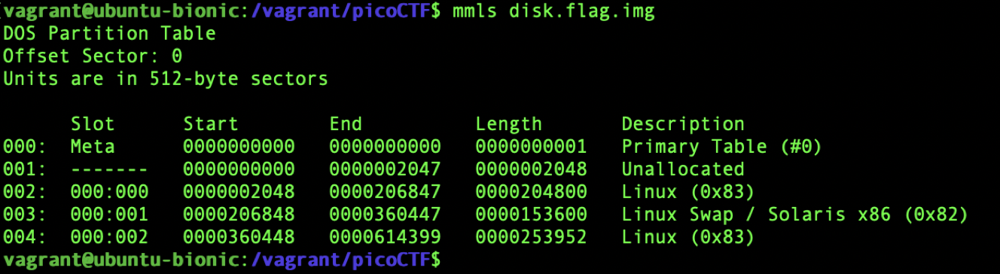
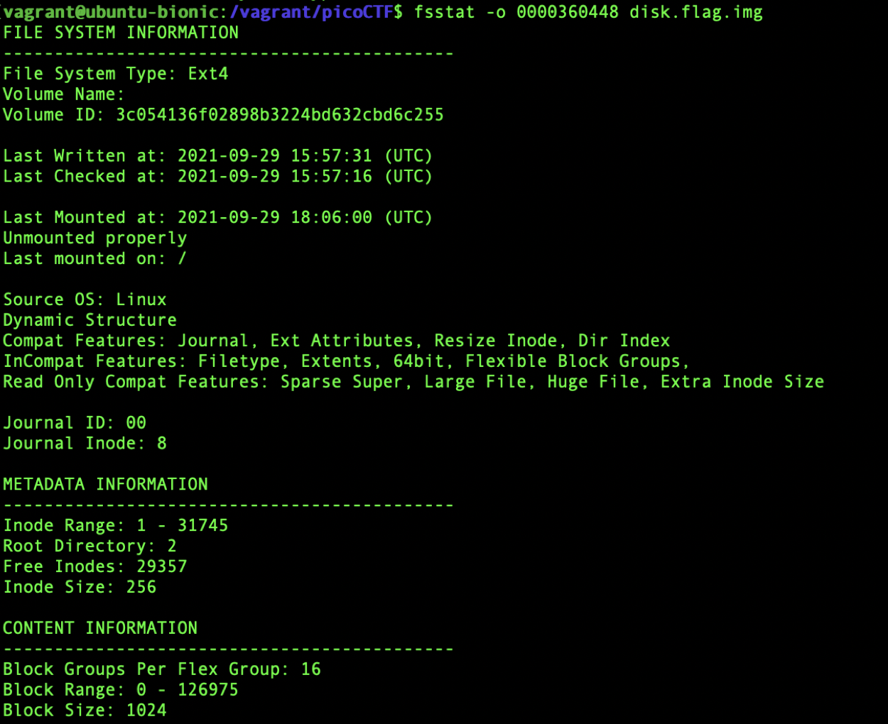
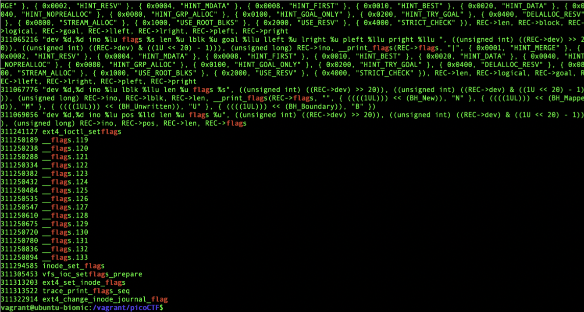
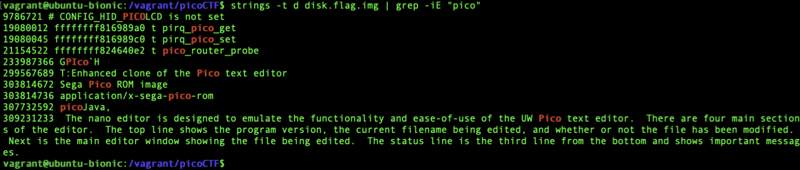
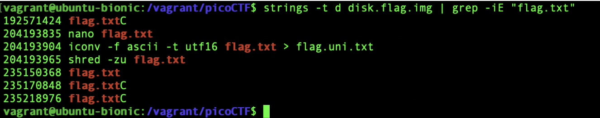
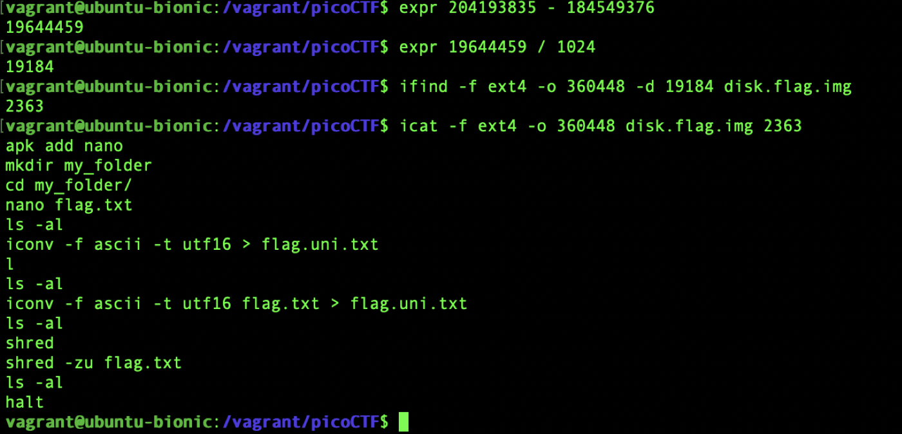
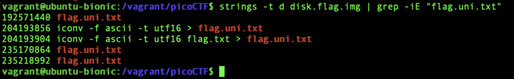
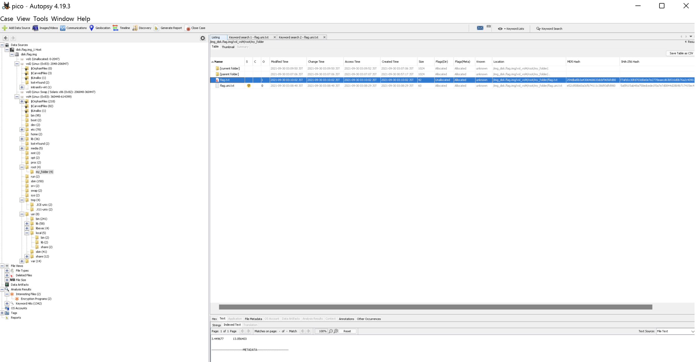
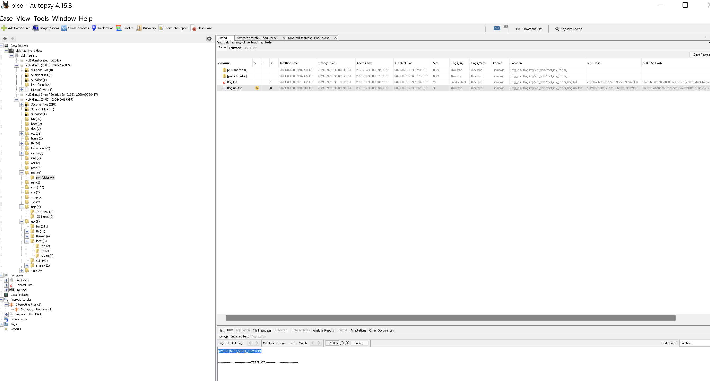

# picoCTF 2022 Sleuthkit Apprentice (Forensics 200 points)
The challenge is the following,

 

We are also given the file [disk.flag.img.gz](./disk.flag.img.gz). I downloaded the file, extracted it, and checked the partitions using 

`$ mmls disk.flag.img`.

 

I also checked the file system information for the Linux partition starting at `0000360448` using,


`$ fsstat -o 0000360448 disk.flag.img`

 

This showed that the Linux partition was using a `Ext4` partition with a block size of `1024 bytes`.


I wanted to check if there were any strings that could hint to a flag file, so I checked for the string `flag` using,


`$ strings -t d disk.flag.img | grep -iE "flag"`.

 

However, there were too many entries with the string `flag`, so I decided to narrow the string search down. Since the flag format is `picoCTF{xxx}`, I decided to search for the string `pico` using,

`$ strings -t d disk.flag.img | grep -iE "pico"`.

 

However, nothing useful came up. I assumed that the flag might be contained in a .txt file as that is the most common means of storing the flag in a disk forensics challenge. Therefore, I assumed that the flag might be contained in a file named `flag.txt`,

`$ strings -t d disk.flag.img | grep -iE "flag.txt"`.


 

This outputted some interesting entries, and the following caught my eye.

```
nano flag.txt
iconv -f ascii -t utf16 flag.txt > flag.uni.txt
shred -zu flag.txt
```

I decided to look further into this, so I took the offset for `nano flag.txt`, which is `204193835`, and subtracted `184549376` (which is `360448 * 512`) using,

`$ expr 204193835 - 184549376`

and divided `19644459` by the block size `1024` bytes using,

`$ expr 19644459 / 1024`

Then I used that result, `19184` to find the inode number of the file containing the string `file.txt` using,

`$ ifind -f ext4 -o 360448 -d 19184 disk.flag.img`

This returned `2363`, so I printed the contents of that file using,

`$ icat -f ext4 -o 360448 disk.flag.img 2363`

 

This showed the full command. I saw that a directory called `my_folder` was created, moved into the `my_folder` directory,  flag was written into `flag.txt`,  `flag.txt` was copied into `flag.uni.txt`, and the original `flag.txt` was deleted securely using `shred`, which would make it extremely difficult to recover. From this, I assumed that the flag is contained in `flag.uni.txt` in the `my_folder` directory, so I decided to search for that using,

`$ strings -t d disk.flag.img | grep -iE "flag.uni.txt"`.


 


Now that I know what file I am supposed to look for and what directory and partition it was in. I opened up Autopsy and searched for the directory that contained `flag.txt` and `flag.uni.txt` in the fourth partition of the disk, which is `Linux (0x83) 360448-614399`.

 

So I went to `/root/my_folder` directory, and I saw that `flag.txt` did not contain any relevant information because it was shredded. So I looked into `flag.uni.txt`, which contained the flag.


 


Therefore, the flag is,

`picoCTF{by73_5urf3r_152f373f}`
