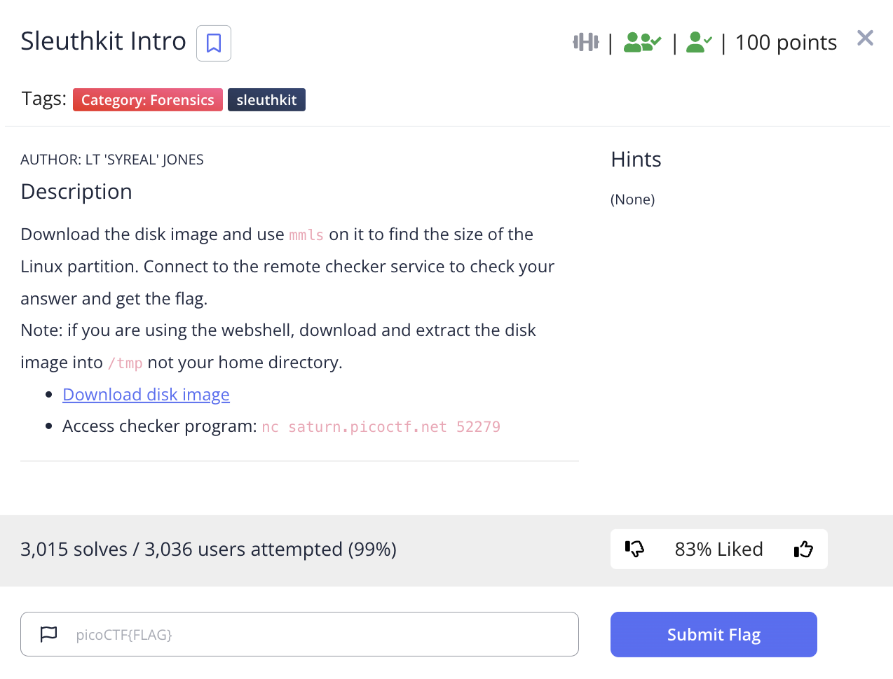
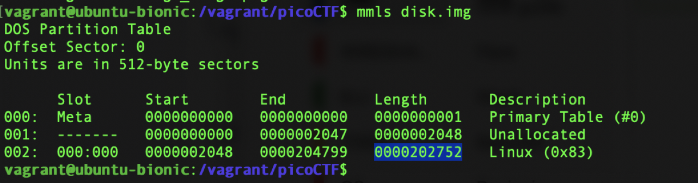
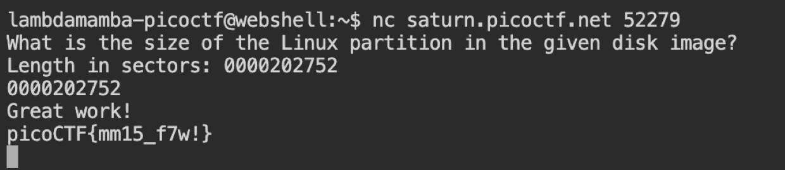

# picoCTF 2022 Sleuthkit Intro (Forensics 100 points)
The challenge is the following,

 

We are also given the file [disk.img.gz](./disk.img.gz)

I downloaded the file, extracted it, and used the following command,

`$ mmls disk.img`

Which showed the partitions and their size.

 

The challenge asks for the Linux partition size, which is `0000202752`. 

I inputted this Linux partition size to the remote access checker program, which gave me the flag.

 

Therefore, the flag is,

`picoCTF{mm15_f7w!}`
