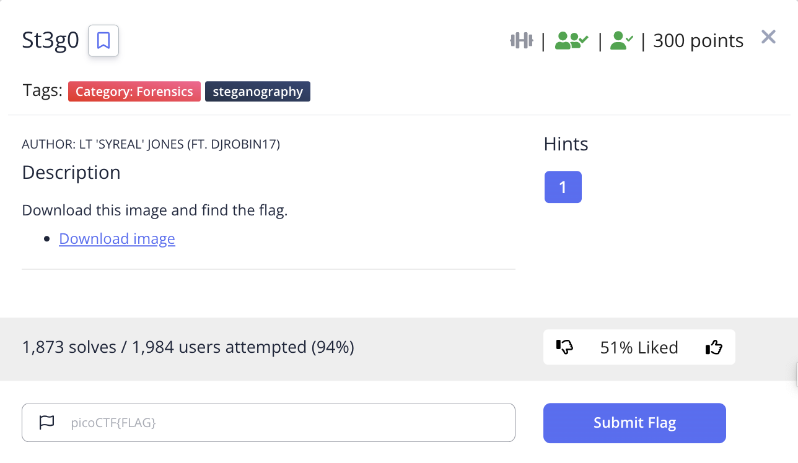
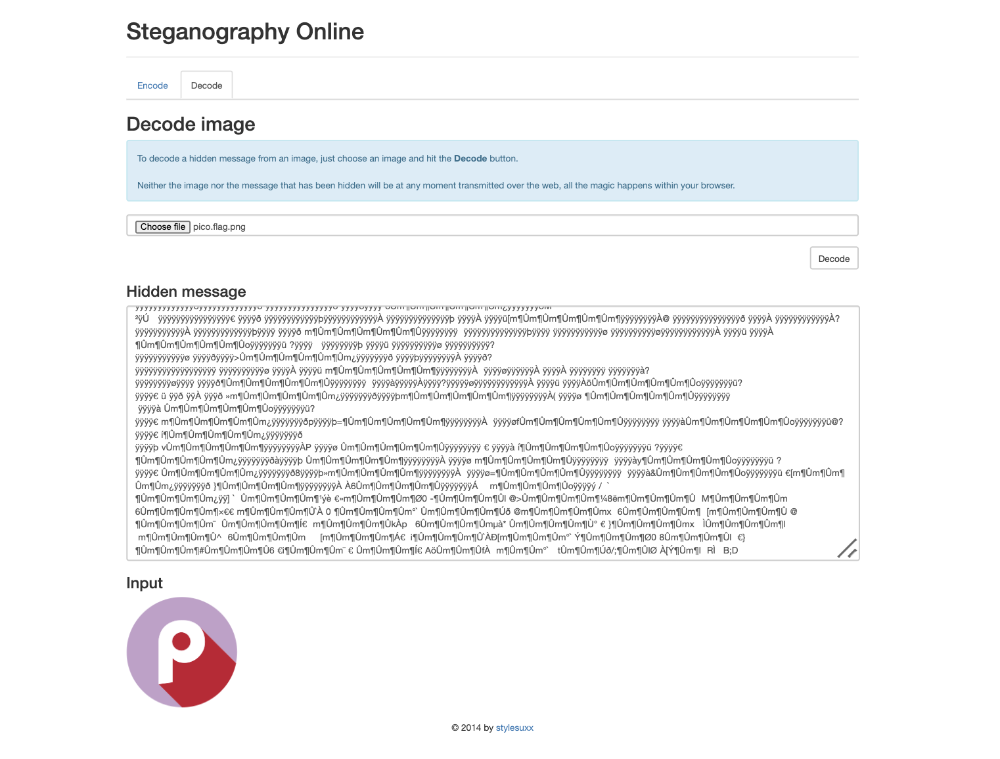
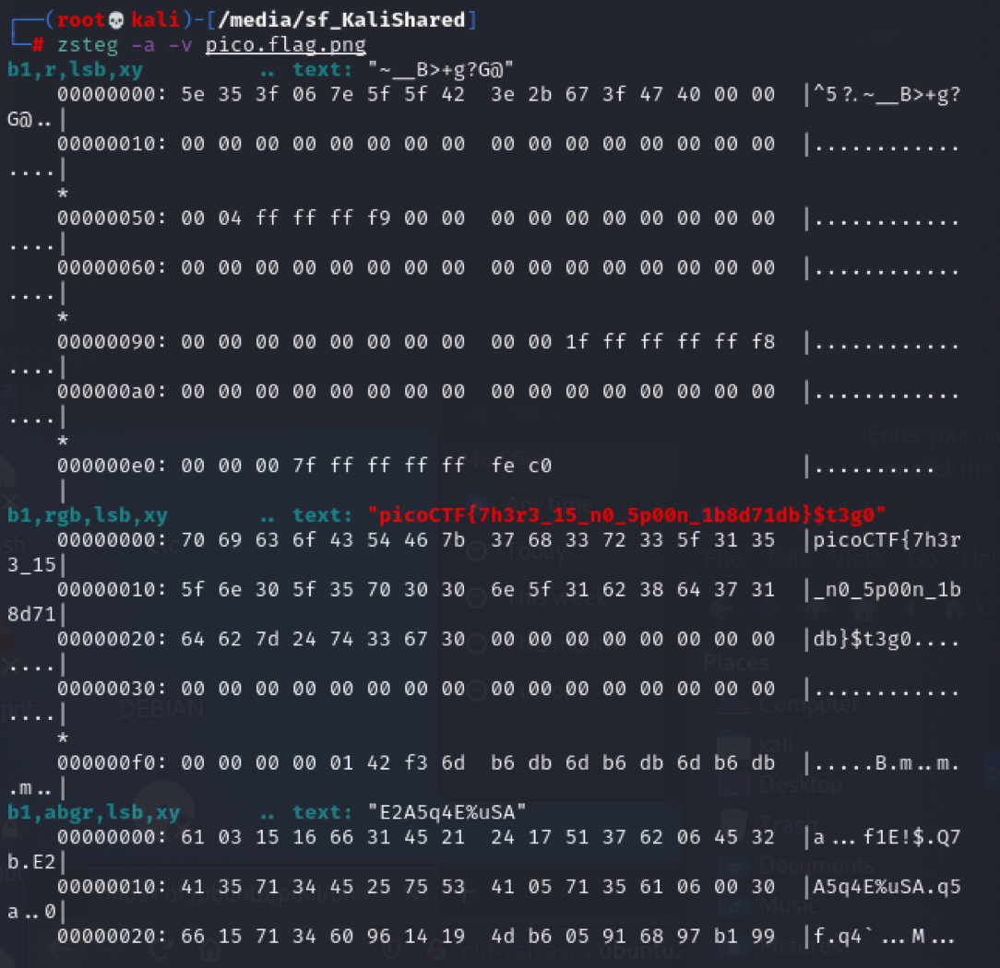

# picoCTF 2022 St3g0 (Forensics 300 points)
The challenge is the following,

 

We are also given the file [pico.flag.png](./files/pico.flag.png)

I went to [Steganography Online](https://stylesuxx.github.io/steganography/) to decode the image, but decoding the image did not reveal anything.

 

I decided to use [zsteg](https://github.com/zed-0xff/zsteg) instead, with the `-a` option to try all known methods, and the `-v` option to run verbosely,

`zsteg -a -v pico.flag.png`

This revealed the flag at `b1,rgb,lsb,xy`, where `rgb` means it uses RGB channel, `lsb` means least significant bit comes first, and `xy` means the pixel iteration order is from left to right.

 

Therefore, the flag is,

`picoCTF{7h3r3_15_n0_5p00n_1b8d71db}`

