# picoCTF 2022 Torrent Analyze (Forensics 400 points)
The challenge is the following,

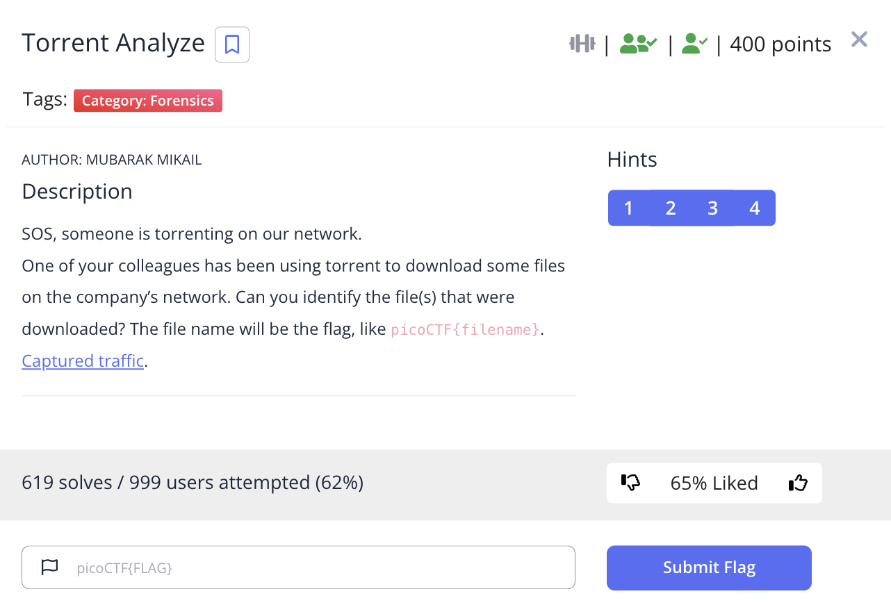 

We are also given the file [torrent.pcap](./torrent.pcap). As this is a torrent challenge, I went to Wireshark and enabled the BitTorrent DHT Protocol (BT-DHT) by going to `Analyze -> Enabled Protocol`.

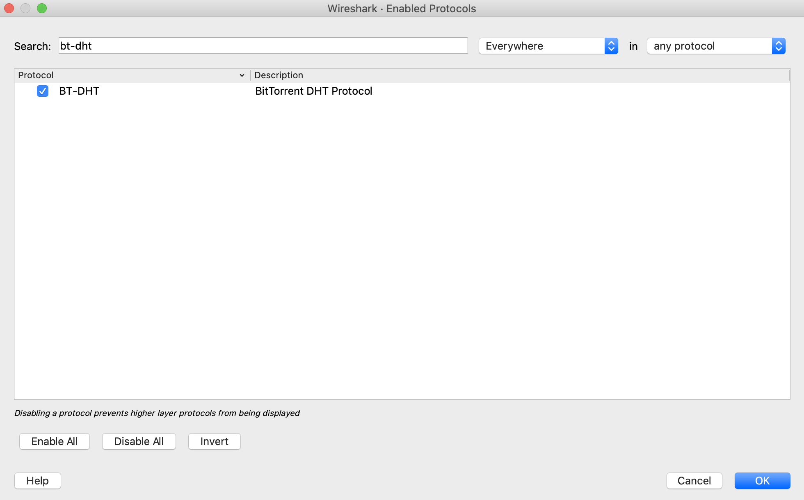 

The overall pacture capture looks like the following,

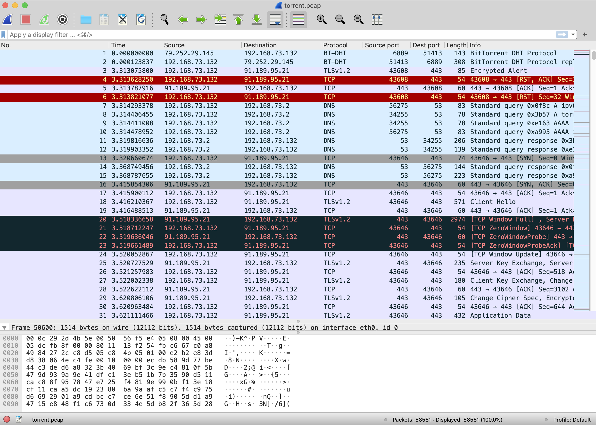 

I applied the `bt-dht` filter, and looked through the packets, and saw that some contained `info_hash`. 

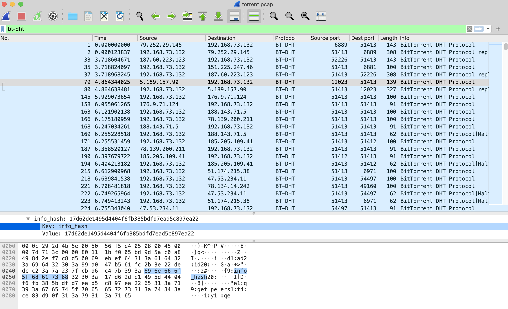 

The challenge only wants us to find the file name, and not reconstruct the file, so I knew that this `info_hash` information will be very important because it tells us the hash of the file. As `hash` is `68 61 73 68` in hex, I inputted this hex value into the Wireshark search to look for all packets that contained this hash information.

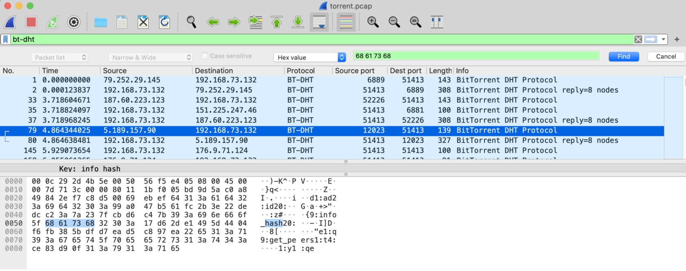 

The first packet that contained `info_hash` was packet 79 with a hash value of `17d62de1495d4404f6fb385bdfd7ead5c897ea22`

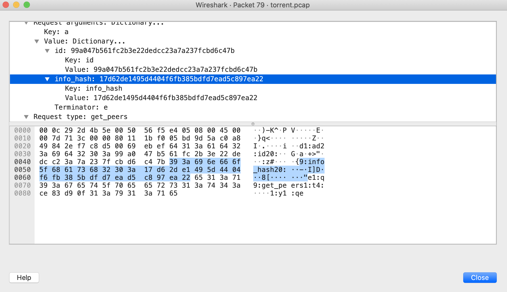 

So I looked up `17d62de1495d4404f6fb385bdfd7ead5c897ea22` on Google, and saw that it corresponded to `Awakened.2013.1080p.BluRay.X264-iNVANDRAREN`.

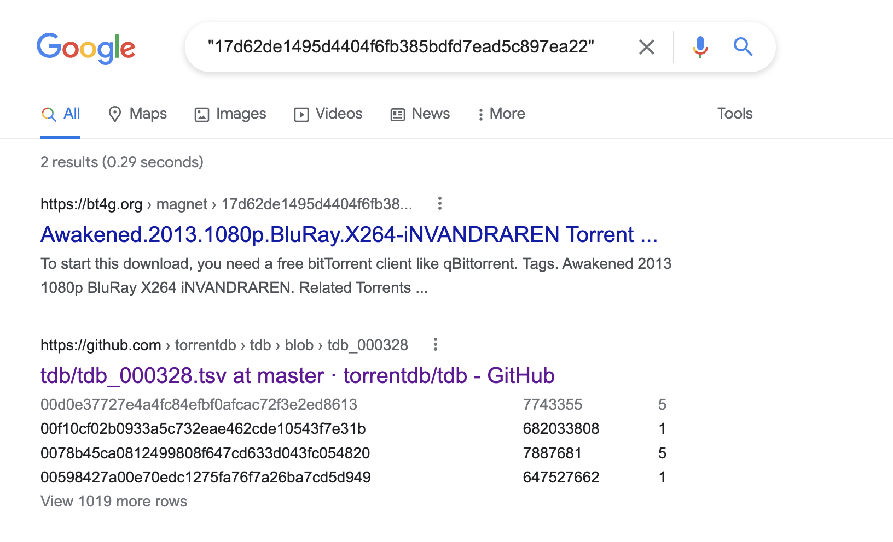 

The first packet that contained `info_hash` was packet 332 with a hash value of `17c1e42e811a83f12c697c21bed9c72b5cb3000d`

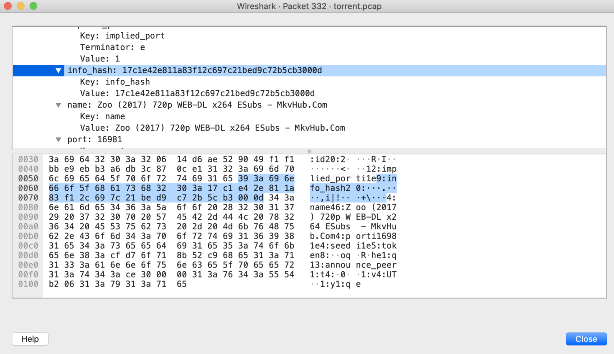 

This file corresponded to `name: Zoo (2017) 720p WEB-DL x264 ESubs - MkvHub.Com`.

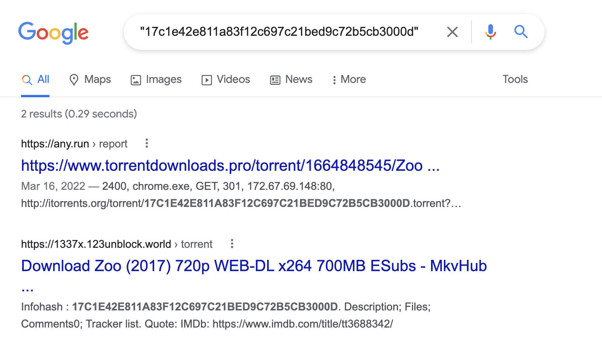 

I looked through a few more, and I was at packet 51080 which had a hash value of `e2467cbf021192c241367b892230dc1e05c0580e`. 

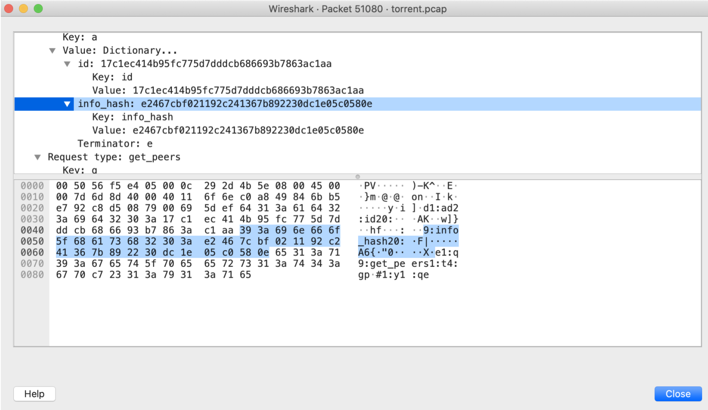 

I Googled this, and saw that it corresponded to `ubuntu-19.10-desktop-amd64.iso` from [LinuxTracker.org](https://linuxtracker.org/index.php?page=torrent-details&id=e2467cbf021192c241367b892230dc1e05c0580e).

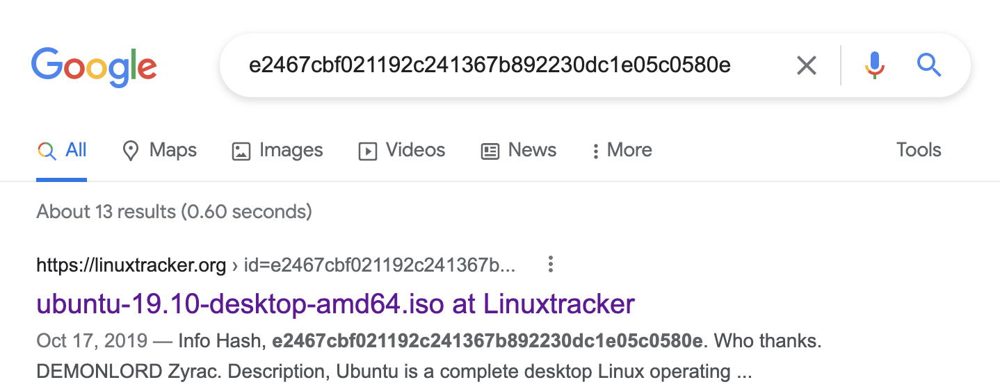 

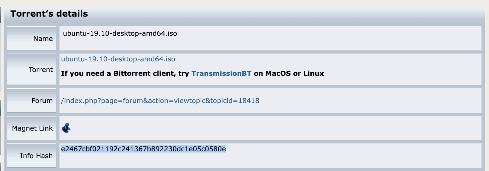 

Therefore, the flag is,

`picoCTF{ubuntu-19.10-desktop-amd64.iso}`

