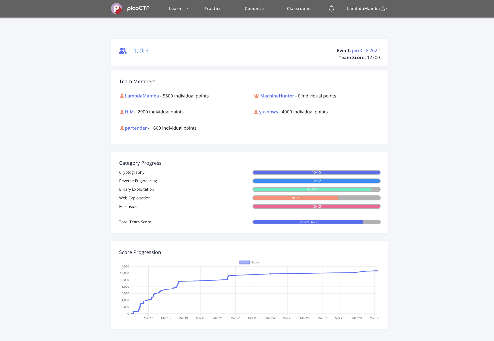

# picoCTF 2022

My team's category progress and score in picoCTF 2022 was,

 

The challenges I solved are the following.

## Forensics 

- [Enhance!](./Forensics/Enhance!): 100 points
- [File types](./Forensics/File_types): 100 points
- [Lookey here](./Forensics/Lookey_here): 100 points
- [Packets Primer](./Forensics/Packets_Primer): 100 points
- [Redaction gone wrong](./Forensics/Redaction_gone_wrong): 100 points
- [Sleuthkit Intro](./Forensics/Sleuthkit_Intro): 100 points
- [Sleuthkit Apprentice](./Forensics/Sleuthkit_Apprentice): 200 points
- [Eavesdrop](./Forensics/Eavesdrop): 300 points
- [Operation Oni](./Forensics/Operation_Oni): 300 points
- [St3g0](./Forensics/St3g0): 300 points
- [Operation Orchid](./Forensics/Operation_Orchid): 400 points
- [SideChannel](./Forensics/SideChannel): 400 points
- [Torrent Analyze](./Forensics/Torrent_Analyze): 400 points

## Cryptography

- [basic-mod1](./Cryptography/basic-mod1): 100 points
- [basic-mod2](./Cryptography/basic-mod2): 100 points
- [credstuff](./Cryptography/credstuff): 100 points
- [morse-code](./Cryptography/morse-code): 100 points
- [rail-fence](./Cryptography/rail-fence): 100 points
- [substitution0](./Cryptography/substitution0): 100 points
- [substitution1](./Cryptography/substitution1): 100 points
- [substitution2](./Cryptography/substitution2): 100 points
- [transposition-trial](./Cryptography/transposition-trial): 100 points
- [Vigenere](./Cryptography/Vigenere): 100 points
- [diffie-hellman](./Cryptography/diffie-hellman): 200 points

## Binary Exploitation

- [CVE-XXXX-XXXX](./Binary_Exploitation/CVE-XXXX-XXXX): 100 points
- [buffer_overflow_0](./Binary_Exploitation/buffer_overflow_0): 100 points
- [buffer_overflow_1](./Binary_Exploitation/buffer_overflow_1): 200 points
- [buffer_overflow_2](./Binary_Exploitation/buffer_overflow_2): 300 points
- [flag_leak](./Binary_Exploitation/flag_leak): 300 points

## Reverse Engineering

- [file-run1](./Reverse_Engineering/file-run1): 100 points
- [file-run2](./Reverse_Engineering/file-run2): 100 points

## Web Exploitation

- Includes: 100 points
- Inspect HTML: 100 points

