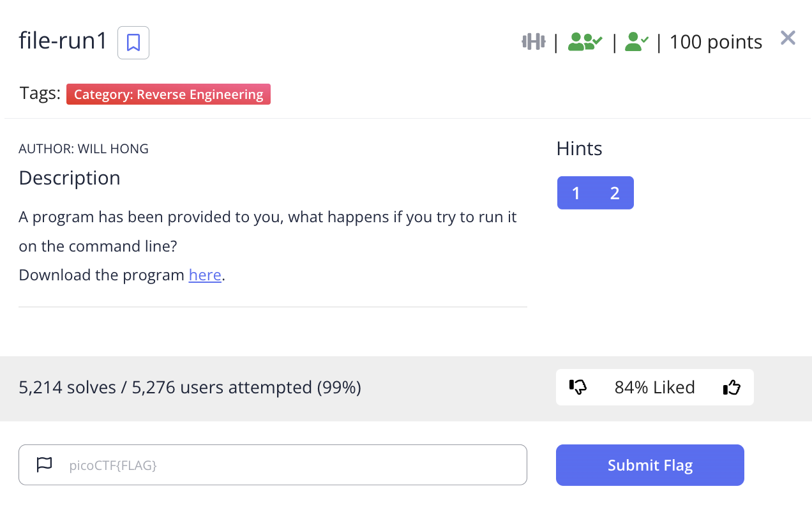
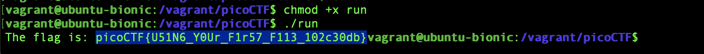

# picoCTF 2022 file-run2 (Reverse Engineering 100 points)
The challenge is the following,

 

We are also given the executable file [run](./files/run).

I added executable permissions using,

`$ chmod +x run`

And executed with `Hello!`

`$ ./run Hello!`

Which gave me, 

 

Therefore, the flag is,

`picoCTF{F1r57_4rgum3n7_4653b5f6}`
