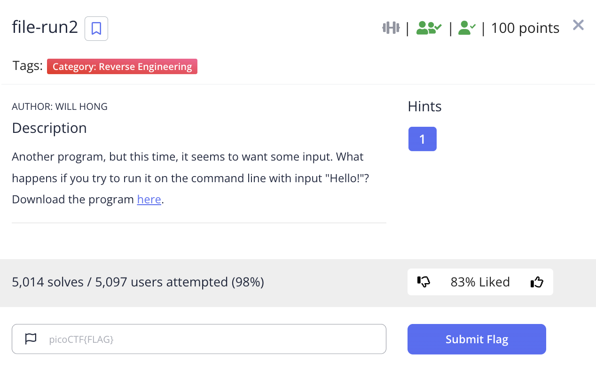
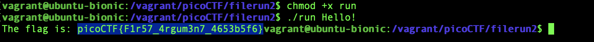

# picoCTF 2022 file-run1 (Reverse Engineering 100 points)
The challenge is the following,

 

We are also given the executable file [run](./files/run).

I added executable permissions using,

`$ chmod +x run`

And executed using,

`$ ./run`

Which gave me, 

 

Therefore, the flag is,

`picoCTF{U51N6_Y0Ur_F1r57_F113_102c30db}`
