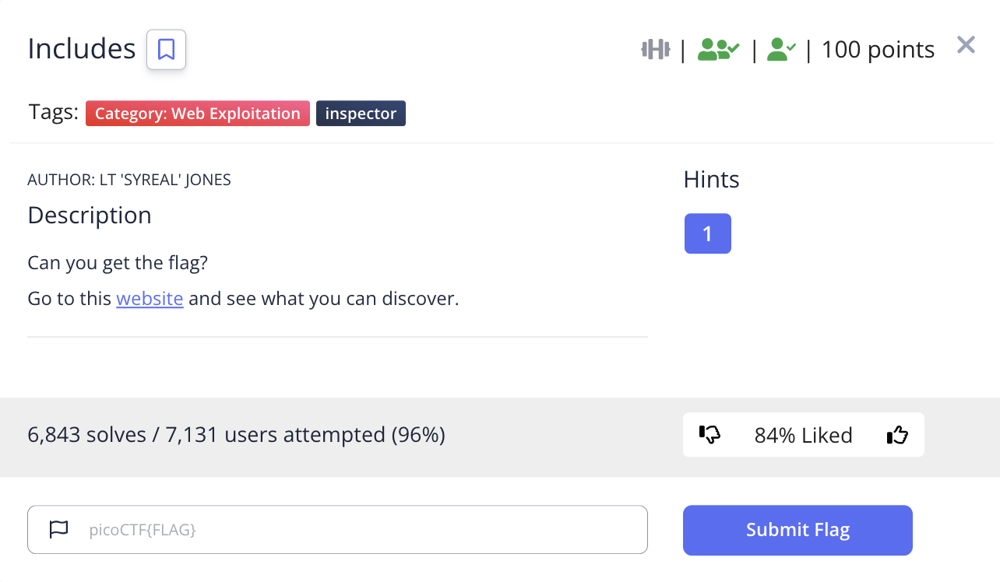
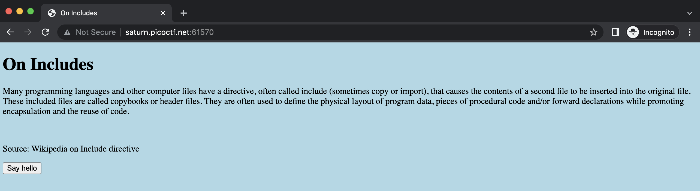

# picoCTF 2022 Includes (Web Exploitation 100 points)
The challenge is the following,

 

And the website looks like the following,

 

I viewed the source, which contained,

```

<!DOCTYPE html>
<html lang="en">
  <head>
    <meta charset="UTF-8">
    <meta name="viewport" content="width=device-width, initial-scale=1.0">
    <meta http-equiv="X-UA-Compatible" content="ie=edge">
    <link rel="stylesheet" href="style.css">
    <title>On Includes</title>
  </head>
  <body>
    <script src="script.js"></script>
  
    <h1>On Includes</h1>
    <p>Many programming languages and other computer files have a directive, 
       often called include (sometimes copy or import), that causes the 
       contents of a second file to be inserted into the original file. These 
       included files are called copybooks or header files. They are often used
       to define the physical layout of program data, pieces of procedural code
       and/or forward declarations while promoting encapsulation and the reuse
       of code.</p>
    <br>
    <p> Source: Wikipedia on Include directive </p>
    <button type="button" onclick="greetings();">Say hello</button>
  </body>
</html>
```

Here, `style.css` contained,

```
body {
  background-color: lightblue;
}

/*  picoCTF{1nclu51v17y_1of2_  */
```

and `script.js` contained,

```
function greetings()
{
  alert("This code is in a separate file!");
}

//  f7w_2of2_4d305f36}
```

Therefore, the flag is,

`picoCTF{1nclu51v17y_1of2_f7w_2of2_4d305f36}`
