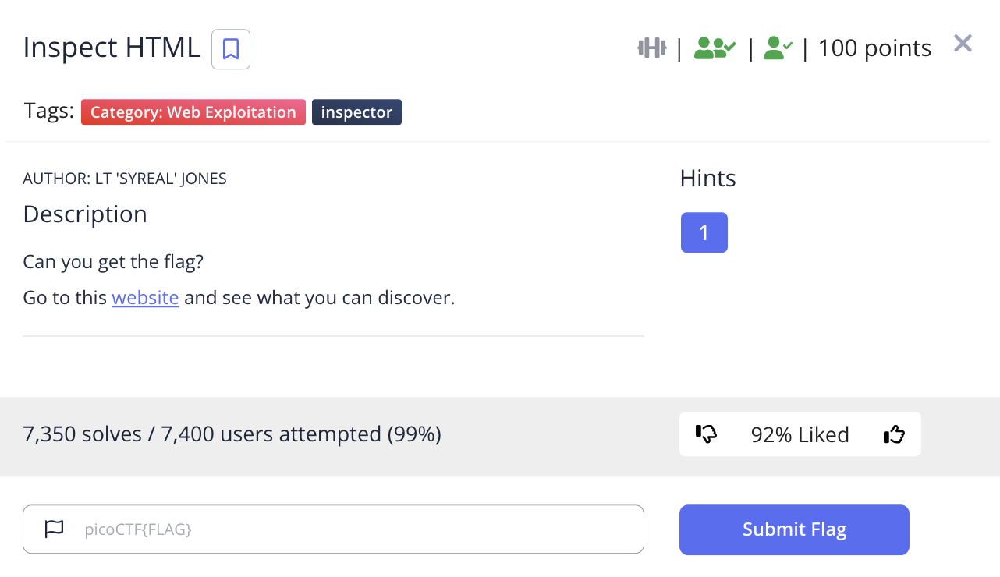
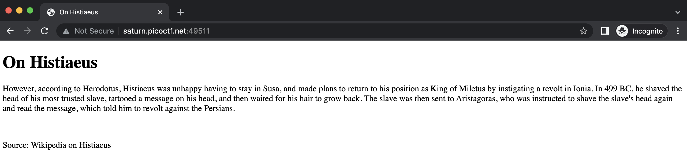
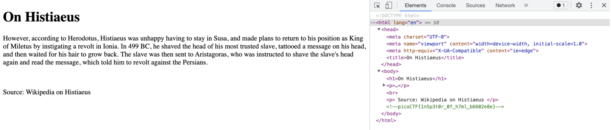

# picoCTF 2022 Inspect HTML (Web Exploitation 100 points)
The challenge is the following,

 

And the website looks like the following,

 

Inspecting element showed the following,

 

Therefore, the flag is,

`picoCTF{1n5p3t0r_0f_h7ml_b6602e8e}`
